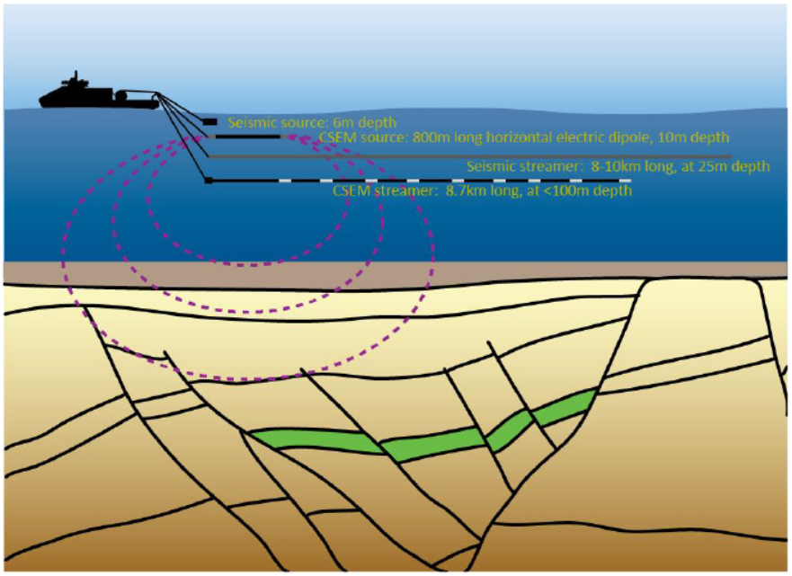

.. _hoop_region_norway_index:

Predicting Resevoir Properties using CSEM, Pre-Stack Seismic and Well Log Data
==============================================================================

.. .. raw:: html
..     :file: ../../../underconstruction.html

.. - **Authors**: :ref:``
.. - **Reviewer**: :ref:``

.. topic :: Prelude

**Include link to paper(s)**
 
 
We present an example from the Hoop area of the Barents Sea showing a sequential quantitative integration approach to integrate seismic and CSEM attributes using a rock physics framework.
The example illustrates a workflow to address the challenges of multi-physics and multi-scale data integration for reservoir characterization purposes.

A dataset consisting of 2D GeoStreamer® seismic and towed streamer electromagnetic data that were acquired concurrently in 2015 by PGS provide the surface geophysical measurements used in this study.
Two wells in the area: Wisting Central (7324/8-1) and Wisting Alternative (7324/7-1S) provide calibration for the rock physics modeling and the quantitative integrated analysis.

In the first stage of the analysis, we invert pre-stack seismic and CSEM data separately for impedance and anisotropic resistivity respectively.
We then apply the the multi-attribute rotation scheme (MARS) to estimate rock properties from seismic data.
This analysis verified that the seismic data alone cannot distinguish between commercial and non-commercial hydrocarbon saturation.
Therefore in the final stage of the analysis we invert the seismic and CSEM derived properties within a rock physics framework.
The inclusion of the CSEM-derived resistivity information within the inversion approach allows for the separation of these two possible scenarios.
Result show excellent correlation with known well outcomes. The integration of seismic, CSEM, and well data predicts very high hydrocarbon saturations at Wisting Central, and no significant saturation at Wisting Alternative, consistent with the findings of each well.
Two further wells were drilled in the area and used as blind tests in this case:  The slightly lower saturation predicted at Hanssen (7324/7-2) is related to 3D effects in the CSEM data, but the positive outcome of the well is correctly predicted.
At Bjaaland (7324/8-2), although the seismic indications are good, the integrated interpretation result predicts correctly that this well was unsuccessful.
 
    

    Survey schematic showing towed seismic and CSEM instruments over the Hoop fault region.
    
    
.. figure:: images/inversion_workflow.png
    :align: center
    :figwidth: 100%
    :name: fig_inversion_workflow

    Workflow for quantitative interpretation of well log, seismic and CSEM data and inversions.
    

.. toctree::
    :maxdepth: 1

    setup
    properties
    survey
    dataprocessing
    interpretation
    synthesis
..    lessons
