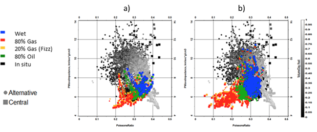

.. _hoop_region_norway_properties:

.. |lo| unicode:: 0xF8
   :ltrim:
.. |o| unicode:: 0xF8
   :trim:
.. |ao| unicode:: 0xE5
   :trim:

Properties
==========

Detailed petrophysical evaluation and rock physics analysis was carried out for the Wisting Central and Wisting Alternative wells. Lithology and fluid sensitivity of the elastic attributes were addressed in the rock physics analysis and the main results obtained are illustrated in :numref:`fig_poisson_acoustic_impedance`. This figure shows a cross-plot of the elastic attributes Poisson’s ratio versus acoustic impedance, color coded by four different fluid substituted saturations: 100% water, 80% oil, 80% gas, 20% gas (fizz saturation). Also shown is the in-situ saturation for the St |lo| Fm., which is a clean, blocky shallow-marine shoreface sandstone, as well as for the underlying Nordmela Fm, which is a coarsening upwards shaly sand.

Two important observations can be extracted from these plots. The first is the well-known inability of the seismic data alone to discriminate between commercial and non-commercial gas saturation: The 20% and 80% gas cases plot on top of each other, which is not the case for the combination of elastic and electric attributes (see :numref:`fig_resistivity_acoustic_impedance`). The second observation is the unexpected high Poisson’s ratio (or higher Vp/Vs) in the St |lo| Fm. compared to that observed in Nordmela Fm. for the same fluid saturation. It is worthwhile mentioning that the same observation was found in both the Wisting Central and Wisting Alternative wells, which suggests this unusual response is not a measurement problem. Moreover, the fact that the AVO inversion produced a Poisson’s ratio solution that also honors these slightly unusual well log observations of Poisson’s ratio for the St |lo| and Nordmela Fms. (:numref:`fig_inversion_initial_pwave_poisson`) validates these measurements.

a) *For the St |lo| Fm., multi-well cross-plot of Poisson’s ratio versus acoustic impedance color coded by fluid saturation with background colored by volume of clay for the full well.*
b) *For the Nordmela Fm., multi-well cross-plot of Poisson’s ratio versus acoustic impedance color coded by fluid saturation with background colored by volume of clay for the full well.*

.. figure:: images/resistivity_vs_acoustic_impedance.png
    :align: center
    :figwidth: 80%
    :name: fig_resistivity_acoustic_impedance

a) *For the St |lo| Fm., multi-well cross-plot of acoustic impedance versus resistivity color coded by fluid saturation with background colored by volume of clay for the full well.*
b) *For the Nordmela Fm., multi-well cross-plot of acoustic impedance versus resistivity color coded by fluid saturation with background colored by volume of clay for the full well. The induction in situ resistivity in Central is clipped at 1,000 Ωm in the St |lo| sands, for reference the laterolog shows a similar shape in this zone, but is clipped at 100,000 Ωm.*

There is significant variation between the resistivity measurements made with different tools in the well.  In order to calibrate the saturation model we have chosen to use the LWD P40H curve. This is from a phase shift induction tool, logged while drilling (which has the added benefit of reducing the impact of mud invasion). This tool has returned results that are closer in amplitude to the CSEM derived resistivity values, when compared to the wireline HRLT laterolog results (with resistivities in the tens of thousands Ωm). With the chosen induction curve resistivity values in the St |lo| Fm. at Wisting Central are in the 700-900 Ωm range. The water saturation was calculated from this using the rock physics model represented by the Simandoux equation (:cite:`Simandoux1963`), Eq. :eq:`eq_Simandoux`, due to the overall simplicity of the model and increased accuracy over Archie in shaly-sand systems. This gives predicted hydrocarbon saturations in excess of 90%.

.. (Simandoux, 1963)

.. math::
	\frac{1}{R_t} = \frac{\phi_e^m \times Sw^n}{a \times Rw} + \frac{Vsh \times Sw}{Rsh}
    :name: eq_Simandoux

where :math:`R_t` is the horizontal resistivity, :math:`Sw` is the water saturation, :math:`m` is the cementation exponent, :math:`n` is the saturation exponent, :math:`a` is the tortuosity exponent, Rw is the water resistivity at formation temperature, :math:`V \! sh` is the shale content, :math:`Rsh` is the resistivity of the shale, and :math:`\phi_e` is the effective porosity defined as:

.. math::
	\phi_e = \phi_T \times (1 - Vsh)
    :name: eq_Simandoux_phi
 

where :math:`\phi_T` is the total porosity. The parameters used in the Simandoux equation were calibrated to the measured data and are summarized in the following table.

+-----------+----------------------+
| Parameter | Value                |
+===========+======================+
| a         | 1                    |
+-----------+----------------------+
| m         | 1.8                  |
+-----------+----------------------+
| n         | 1.7                  |
+-----------+----------------------+
| Rsh       | 6 :math:`\Omega /m`  |
+-----------+----------------------+
| Rw        |0.18 :math:`\Omega /m`|
+-----------+----------------------+

Table 1. *Parameters used in the Simandoux equation.*

In the context of a CSEM analysis, the background resistivity and the contrast between background and reservoir is also important to understand. :numref:`fig_well_log_resistivity` a and :numref:`fig_well_log_resistivity` b show the resistivity variation with saturation calculated at the Wisting Central and Alternative wells using the Simandoux parameters from table 1. For each case, the calibrated Simandoux equation is used to calculate the resistivity at log scale for a range of values of Sw (:numref:`fig_well_log_resistivity` c). The log scale values are then up-scaled using an arithmetic average to give the bulk vertical resistivity (as would be measured by a CSEM survey) across the reservoir interval. The shaded area corresponds to the region of the curve where the resistivity is equal to or lower than the observed background vertical resistivity in the area (around 20-30 Wm). Only when the reservoir resistivity lies outside the shaded region is there a contrast between it and the background, allowing it to be detected by a CSEM survey. :numref:`fig_well_log_resistivity` c shows that this condition is met for values of Sw less than 30%. This provides a practical limit on the sensitivity to Sw, i.e. values greater than this will not be resolved. 

.. figure:: images/well_log_resistivity.png
    :align: center
    :figwidth: 100%
    :name: fig_well_log_resistivity

a) *Well log suite from the Wisting Alternative well, showing porosity, lithology, Sw and resistivity.*
b) *Well log suite from the Wisting Central well, showing porosity, lithology, Sw and resistivity.*
c) *The variation of resistivity with water saturation calculated from the Wisting Central and Alternative wells using the Simandoux equation. The shaded region shows the area in which the resistivity of the reservoir is less than the resistivity of the background structure, and will not be detected by a CSEM survey. Water saturations less than about 30% are required for the reservoir to be detected.*

