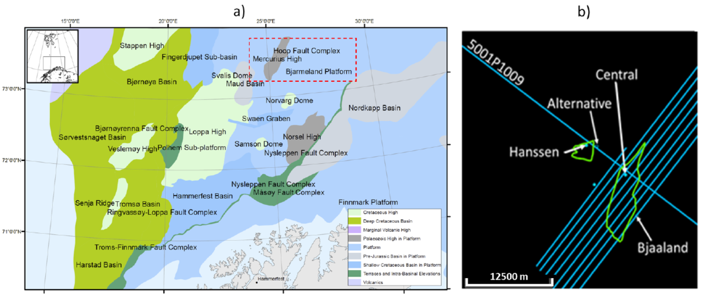

.. _hoop_region_norway_surveydata:

Survey and Data
===============

A densely sampled dataset consisting of six lines of 2D seismic and towed streamer CSEM data were acquired concurrently in 2015 by PGS in using the system depicted in Figure 3 (Englemark et al., 2014). The survey area lies in water depths of approximately 400m. Two public domain wells in the area provide calibration for the integrated analysis. Oil bearing sands were encountered in the Realgrunnen interval at well 7324/8-1 (Wisting Central), whereas the same interval was dry in nearby well 7324/7-1S (Wisting Alternative). Two additional wells have been drilled in the immediate vicinity: 7324/7-2 (Hanssen) yielded a small oil discovery, and 7324/8-2 (Bjaaland) was dry. The results from these wells were used to validate and corroborate the accuracy of the reservoir property predictions (Figure 2b).

.. figure:: images/survey_schematic.png
    :align: right
    :figwidth: 50%
    :name: fig_survey_schematic_2

    CSEM and 2D seismic data used in this project were acquired simultaneously using a towed source and receiver system. Further details of this acquisition approach can be found in Englemark et al, 2014.

In general, the 2D seismic data quality is good but varies significantly in different parts of the survey.  The velocity fields obtained from the fast track migration of the data available at the time of this study were not sufficiently accurate to completely flatten and position events properly. The data were therefore conditioned before use in the workflow described here following the approach described by Singleton, 2009.

For the CSEM data acquisition, a towed streamer consisting of 72 receivers collected data at source-receiver offsets ranging from 31 to 7755m. Overall, quality of the data used in the study was excellent, with good signal to noise ratios over a wide range of frequencies between 0.2Hz to over 3Hz. The remainder of this case study will address the analysis of the data from line 5001P1009, which provides the best calibration with the well information available in the area (Figure 2b). 

