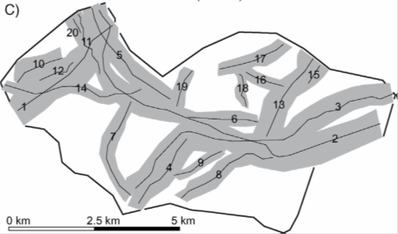
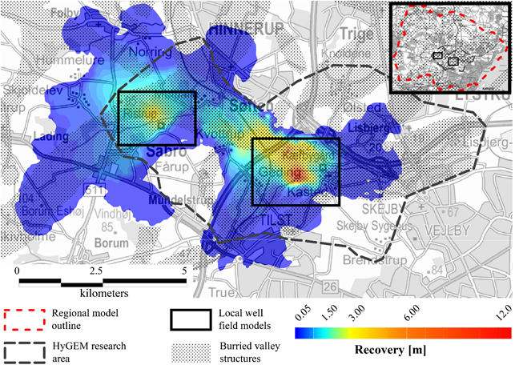

.. _kasted_interpretation:

Interpretation
==============

The resistivity data was subsequently used for setting up a 3D geological model covering the survey area. In total 20 buried valley structures were delineated. Some of these valleys crosscut each other making it possible to date the structures relative to each other. According to the relative dating of the structures, it is expected that the valleys constitute 8 different generations. 

    Delineation of the 20 different buried valley structures mapped

The geological model was used in a groundwater model, to evaluate the influence of groundwater abstraction from two of the major well fields in the area (:numref:`figrecovery_interp`). The groundwater model was derived by embedding the detailed geological model in a regional scale groundwater model setup in MODFLOW-USG. Two things are apparent from this study. First, the drawdown induced from groundwater abstraction at the well fields are highly dominated by the presence of the buried valley structures. This can be acknowledged by comparing the patterns in drawdown with the valley structures (shaded area in the figure). From the figure it is also apparent that groundwater models covering areas with buried valleys must have a large areal extent to avoid unwanted effects from the outer boundaries of the model domain.

    Drawdown induced by the two well fields located in the area. From the figure, it is evident that the valley structures dominate the estimated drawdowns. 

