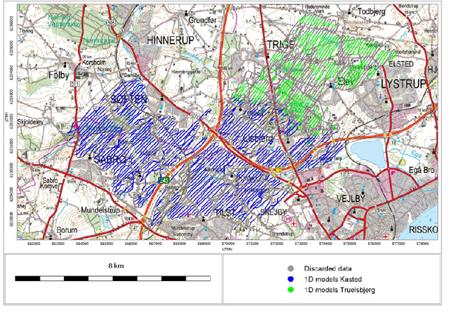
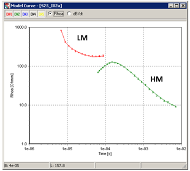
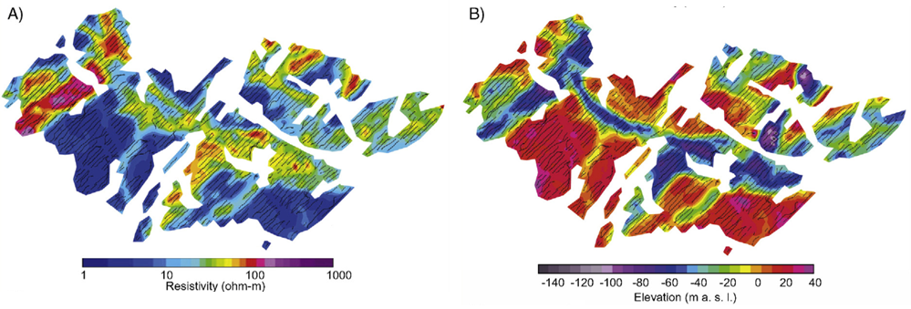

.. _kasted_processing:

Data and Processing
===================

Due to the dense infrastructure in the area, many of the soundings suffered from couplings to man-made conductors and were removed during the data processing, and prior to the inversion. Failure to eliminate these data would have inevitably resulted in artefacts in the resistivity models recovered. We estimate that approximately 30% of the acquired data had to be culled (:numref:`kasted_datalines_processing`).

    Location of the survey with a thematic map over a background image. The grey dots show the discarded SkyTEM data either affected by infrastructure or considered non-production at the turns near the end of the lines. The blue dots and the green dots show the inverted 1D models from the Kasted and Truelsbjerg areas.

    Example of averaged sounding from Kasted (transformed into late time apparent resistivity), with different time gates displaying different noise levels, for low (red) and high (green) moment.

Consequently, about 9500 soundings were used for the inversion. An example of a sounding curve is shown in :numref:`kasted_curve_processing`.

The inversion was based on the spatially constrained (SCI) quasi-3D approach: a local, 1D exact forward response, with model parameters spatially constrained in 3D. The inversion was performed with 25 layers that provided smooth transitions in the resulting models. The resistivity models were then further interpolated into horizontal grids and stacked, resulting in a 3D resistivity grid which can used to display the resistivity depth intervals or searching out the depth to the good conductor which in our case is the bottom of the buried valleys (:numref:`kasted_inversion`).

    Initial interpretations of the SkyTEM resistivity data. A) Horizontal slice through the 3D resistivity volume at the elevation = 5 m above sea level. B) Depth to the top of the deepest conductive layer the Paleogene clay. 

