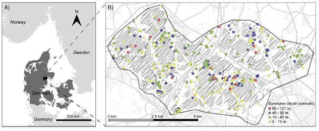

.. _kasted_setup:

Setup
=====

The investigated area is located northwest of the city of Aarhus, Denmark, and it covers ~470 km :math:`\!^2`. It has been subject to several geological and geophysical campaigns due to its interesting geological structures, and the rich groundwater resources located primarily in buried valley structures. The water utility company Aarhus Water, extracts drinking water from the area, which is used to supply the city of Aarhus with roughly 350,000 inhabitants. However, the city of Aarhus is rapidly growing, and the water company expect to have a lack of water in the near future and hence they are looking for new well-fields. One of the main goals for the Kasted case study was to find a suitable location for a new well field by means of a detailed hydrogeological model from boreholes and SkyTEM data (:numref:`kasted_location_setup`).

    Location of the Kasted survey area. (A) Study area. (B) Location of the data. Black dots markd the positions of SkyTEM soundings remaining after processing. Soundings are so closely spaced that they appear as black lines. Boreholes within the study area are shown with colours according to their depths.

Geology
=======

The hydrogeology in the study area is dominated by the presence of buried valley structures. Here, these valleys can be mapped effectively using the Transient Electromagnetic Method (TEM) because they are incised into low resistivity Paleogene clay deposits. Several mapping campaigns have been conducted in the area using conventional ground based TEM methods, PATEM, and the airborne SkyTEM system. Boreholes show that the buried valleys are primarily incised into Paleogene clay deposits and that the infill comprises Quaternary sand, gravel, and till deposits originating mainly from Weichsel and Saale glaciations. Locally, Miocene sandy units are overlying the Paleogene clay layers.

The importance of the valley structures for the drinking water supply is evident from the fact that approximately 70% of the screened boreholes in the area are located within known buried valley structures. Minor aquifers also exist locally on the plateaus between the buried valleys. However, these aquifers are mainly utilized for groundwater abstraction to single households or smaller communities.

The local focus area of this study is shown in :numref:`kasted_location_setup`. The area are of major interest due to the presence of existing well-fields. According to descriptions from boreholes in the east-west running valley, the aquifer here is made up of coarse sand and gravel. The bottom of the valley is located at approximately 100 meters below terrain. Despite the thick sequence of coarse grained deposits, the yield of the aquifer is limited by the valley structure. Similarly to studies performed on groundwater abstraction from valley structures in North America, the abstraction of groundwater is expected to induce a significant drawdown. It is also expected that the influence of the pumping will spread throughout the valley system, and to a lesser extent onto the aquifers located at the plateaus to the north and south. The hydraulic connection from the well-field towards the northeast through the valley structure is limited by the presence of a hydraulic barrier, which will further increase the drawdown.

Based on the findings of Høyer, et al. (:cite:`Hoyer2015`), at least five generations of valley structures are crosscutting in the area around the pumping wells. Some of these valleys are filled with coarse sediments, thereby acting as aquifers, and others are filled up with clay. The system of valleys connects the well-fields near Kasted, which leaves the important question how these two well-fields interact despite their distance of 5 km, and also how the expected pumping induced drawdown influences local streams and wetlands.

