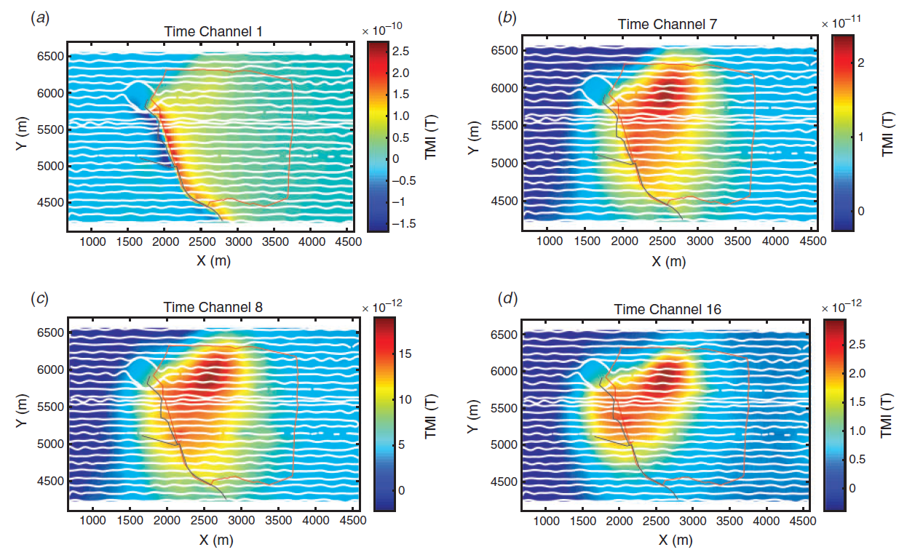

.. _lalor_data:

Data
====

The field data were acquired within a UTM coordinate system (easting-northing-elevation), but the flight lines are aligned with a local grid (x-y-z) for the mining activities. For the purpose of georeferencing, we rotate and reposition the HeliSAM survey to the local coordinate system. 

The data maps of four time channels (TC), 1, 7, 8, and 16, are presented in Figure ???. The dominant feature on early times is a linear trace of negative-positive with extremely high magnitude that correlates well with the road and power line. This linear feature decays rapidly in time and vanishes before TC 8. These observations imply that those signals are likely caused by the near-surface infrastructure, particularly the power line. The late times from TC 8 to 16 have consistent long-lasting anomalous signals in a compact shape that indicates the main deposit of interest.

    The field data were acquired within a UTM coordinate system (easting-northing-elevation), but the flight lines are aligned with a local grid (x-y-z) for the mining activities. For the purpose of georeferencing, we rotate and reposition the HeliSAM survey to the local coordinate system. 

The data maps of four time channels (TC), 1, 7, 8, and 16, are presented in Figure ???. The dominant feature on early times is a linear trace of negative-positive with extremely high magnitude that correlates well with the road and power line. This linear feature decays rapidly in time and vanishes before TC 8. These observations imply that those signals are likely caused by the near-surface infrastructure, particularly the power line. The late times from TC 8 to 16 have consistent long-lasting anomalous signals in a compact shape that indicates the main deposit of interest.The field data were acquired within a UTM coordinate system (easting-northing-elevation), but the flight lines are aligned with a local grid (x-y-z) for the mining activities. For the purpose of georeferencing, we rotate and reposition the HeliSAM survey to the local coordinate system. 

The data maps of four time channels (TC), 1, 7, 8, and 16, are presented in Figure ???. The dominant feature on early times is a linear trace of negative-positive with extremely high magnitude that correlates well with the road and power line. This linear feature decays rapidly in time and vanishes before TC 8. These observations imply that those signals are likely caused by the near-surface infrastructure, particularly the power line. The late times from TC 8 to 16 have consistent long-lasting anomalous signals in a compact shape that indicates the main deposit of interest.

