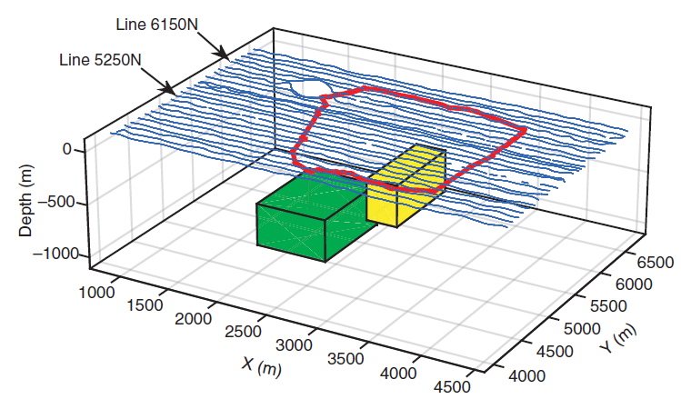
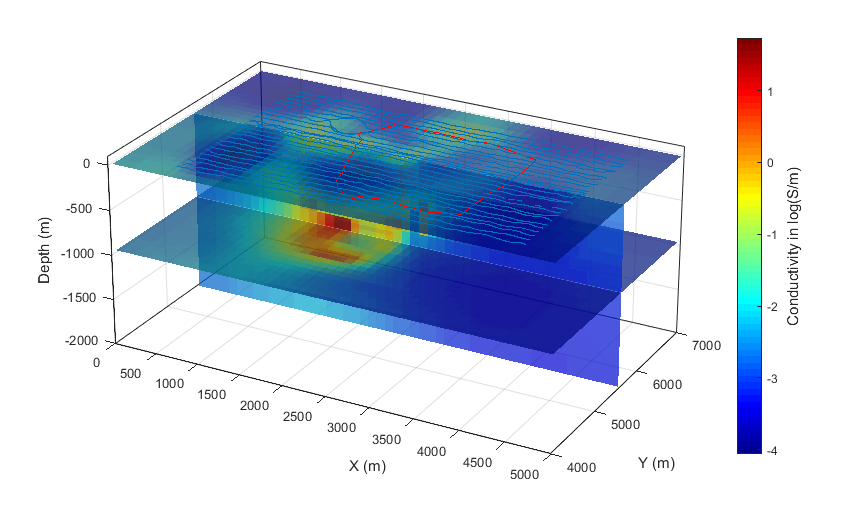
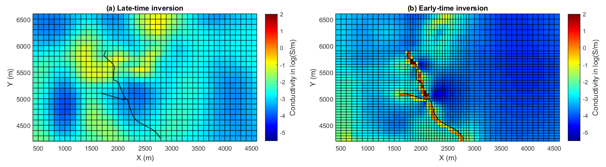

.. _lalor_processing_interpretation:

Processing and Interpretation
=============================

The Lalor HeliSAM dataset has been preliminarily interpreted by the contractor using plate modelling for the purpose of data quality control. The noticeable irregular shape of the anomaly,
and the peak on its northern tip, indicate that the target ore body can have complex geometry or orientation, or there is an undiscovered extension that we are not aware of. A full 3D voxel inversion is therefore considered necessary to extract more complete information about the deposit and its surroundings.

Inversion of Late-Times (TC 1-7)
--------------------------------

    Initial interpretations of the SkyTEM resistivity data. A) Horizontal slice through the 3D resistivity volume at the elevation = 5 m above sea level. B) Depth to the top of the deepest conductive layer the Paleogene clay. 

Because the early time channels are contaminated by cultural noise, the first step is to follow the common practice that only inverting the more reliable late-time data.
Determination of a uniform background. One location in the survey area is chosen in the region where no significant anomaly is present. The HeliSAM data at that location are used to calculate the best-fitting half-space value about 0.0014 S/m.
Assignment of data uncertainty. A synthetic HeliSAM data set was generated using the best-fitting half-space model. Then 30% of the magnitude of the simulated datum at each receiver and at each time is used as the uncertainty for that corresponding datum.
Initial and reference models. The inversion algorithm computes the model complexity with reference to the best-fitting half-space of 0.0014 S/m. However, achieving a good result requires a warm-start that initiates the inversion iteration with an initial guess of a two-prism model (:numref:`lalor_prisms`). 

After 18 iterations, the inversion achieves the desired data misfit and the observed data are reasonably fit in the end of inversion (:numref:`lalor_late_fit`). The recovered 3D conductivity model shows the presence of a highly conductive object below the depth of about 600 m (:numref:`lalor_late_model`).

.. figure:: images/lalor_late_fit.png
    :align: center
    :figwidth: 100%
    :name: lalor_late_fit

    Initial interpretations of the SkyTEM resistivity data. A) Horizontal slice through the 3D resistivity volume at the elevation = 5 m above sea level. B) Depth to the top of the deepest conductive layer the Paleogene clay. 

    Inversion results from late-time data. 

Inversion of Late-Times (TC 8-16)
---------------------------------

The late-time inversion successfully imaged a major conductors, but it also revealed other near surface conductive features of geologic interest (see the slice at depth = 0 in :numref:`lalor_powerline`). In order to better resolve those near-surface features, early-time data need to be included in the inversion. The early-time data are difficult to invert because they are heavily contaminated by the power lines. A refined mesh is then designed for the early-time inversion to capture the fine-scale variation of conductivity associated with the power lines. With constraints from the early-time data, the inversion resolves the fine-scale near surface features at a higher resolution compared to only using the late-time data (:numref:`lalor_powerline`). 

    Surface conductivity from (a) late-time inversion on a 100-m cell mesh and (b) early-time inversion on a refined mesh of 50-m cell around the power line.

Inversion of All-Time Data
--------------------------

Separate inversions of late-time and early-time data reveals that the HeliSAM data contain information about both deep geologic target and near surface features. Then it is desired to invert all time channels together for a complete image. The initial model new contains two sets of object: (1) The high conductivity cells on the surface representing the power lines and (2) the two prisms used in the warm-start inversion of late-time data. The recovered final conductivity model in :numref:`lalor_model_all` is a combination of the results from the late-time and early-time inversions.

.. figure:: images/lalor_alltc_model.png
    :align: right
    :figwidth: 50%
    :name: lalor_model_all

    Conductivity model of the inversion using all time channels.

Final Interpretation
--------------------

The interpretation suggests:

    1) The confined high-conductivity cells on the surface in linear patterns are the representation of metallic power line cables.
    2) The larger and deeper features represent a plausible image of the sought mineralization. The mineralization zone may consist of at least two targets. The large conductor is below 600 m and has a horizontal extent of more than 1 km with a small dip. The small conductor is nearly vertical and close to the surface.  

