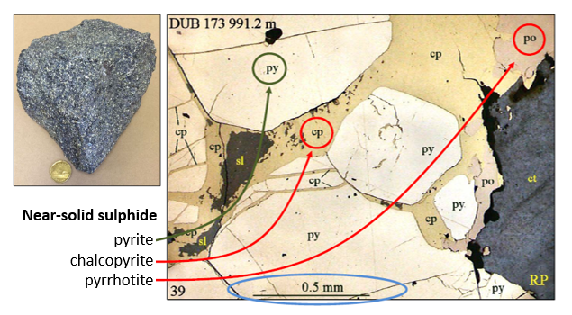
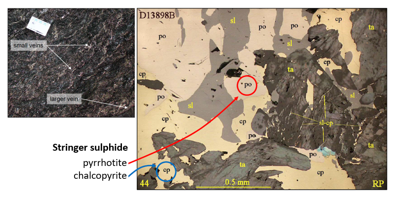
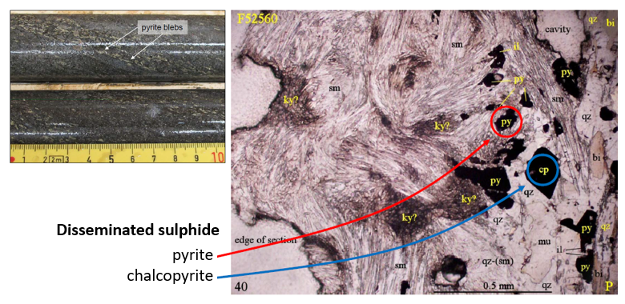

.. _lalor_properties:

Properties
==========

Because of the abundance of sulphide in the ore body, Lalor is geophysically characterised as a deeply buried good conductor that exhibits electrical responses that are distinct from the relatively resistive background. The table below summarizes some typical conductivity values of common sulphide minerals.

The specific electrical conductivity of mineralized rocks at Lalor depends on the type, content and size of sulphides. Given the possible variation in the conductivity of ore bodies, we analyse the expected relative conductivities of the three mineralization types based on the rock sample information from HudBay (Taylor et al., 2014, BCGS Symposium). 

+----------------------+----------------------------+----------------------------+
| Ore-bearing minerals | :math:`\sigma_{min}` (S/m) | :math:`\sigma_{min}` (S/m) |
+======================+============================+============================+
| Pyrite               | 0.003                      | 1                          |
+----------------------+----------------------------+----------------------------+
| Chalcopyrite         | 1                          | 10,000                     |
+----------------------+----------------------------+----------------------------+
| Pyrrhotite           | 4500                       | 71,000                     |
+----------------------+----------------------------+----------------------------+

Near-Solid Sulphide
--------------------

	- **Mineralogy:** dominantly pyrite and sphalerite, lesser amounts of chalcopyrite and pyrrhotite.
	- **Sulphide Content:** > 40%
	- **Abundance**: 1 ~ 10 mm diameter, 5 ~ 30 m thick layers.
	- **Conductivity:** very high due to the content and size.

Stringer Sulphide
-----------------

	- **Mineralogy:** dominantly chalcopyrite and pyrrhotite, lesser amounts of pyrite, sphalerite, and galena.
	- **Sulphide Content:** more than 50% in veins.
	- **Abundance:** veins 0.5 cm ~ 1 m thick, zones up to 10 m thick.
	- **Conductivity:** very high due to the type and content.

Disseminated Sulphide
---------------------

	- **Mineralogy:** pyrite and lesser amounts of pyrrhotite, sphalerite, chalcopyrite and galena.
	- **Sulphide Content:** less than 10 ~ 20%.
	- **Abundance:** isolated grains in a halo zone 10 ~ 100 m thick.
	- **Conductivity:** moderately high due to the size.

