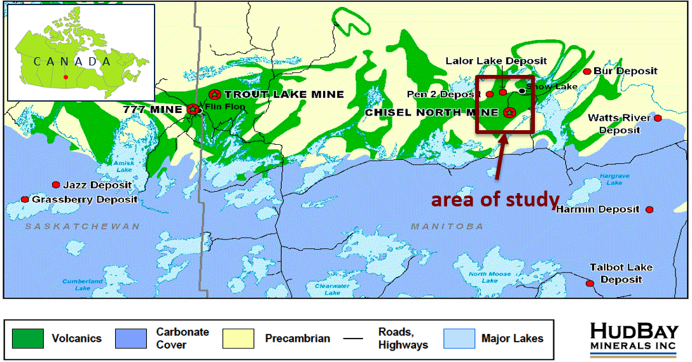
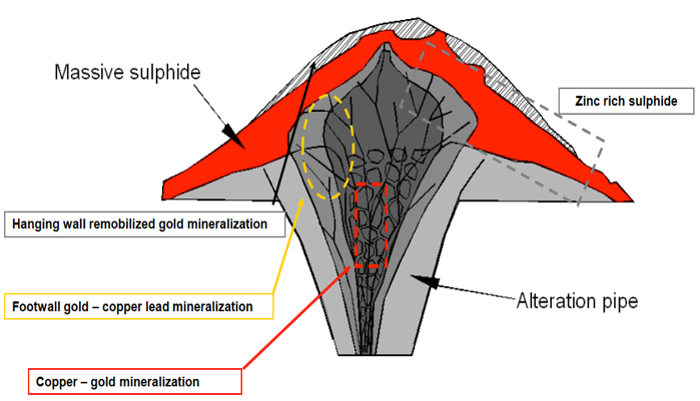
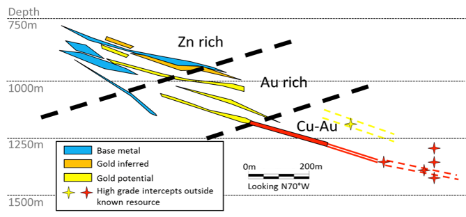

.. _lalor_setup:

Setup
=====

Lalor is a VMS deposit in the Flin Flon Greenstone Belt near the border of Saskatchewan and Manitoba, Canada. Specifically, the deposit is located within the meta-volcanics, metasediments and granitoids of the Churchill province, and is ~8 km west of Snow Lake in central Manitoba, Canada. During the mineralization, three types of sulphides were formed:

	1) Near-solid: zinc-rich massive mineralization cap ()
	2) Stringer: copper-gold bearing stringer sulphides within the intrusive pipe
	3) Disseminated: an alteration halo of disseminated sulphides around the deposit

    Location of the Lalor VMS deposit.

    Generic mineralization model of Lalor VMS deposit (courtesy of HudBay Minerals).

The mineralization system was then buried, metamorphosed, rotated, flattened and folded over 1.8 billion years to form many discrete ore lenses stacked together and dipping about 30 degree to north.  The upper lenses, from 600 to 1000m deep, are zinc-rich, and have high concentrations of pyrite in the form of near-solid sulphide. The lower lenses, below 1000 m deep, are mostly stringer sulphides with a high grade of gold and gold-copper concentration. 

Given its world-class reserves, the development of the Lalor was fast-tracked after its discovery in 2007. The construction of infrastructure at Lalor started in 2009, and full-scale development was committed in 2010. Extensive drilling during the development has delineated many details of the ore bodies, but prospectors still have questions regarding the deep extension of the mineralized zone and whether there are other economically interesting targets nearby. As a result, geophysics was considered a viable approach to evaluate the mineral potential of Lalor deposit.

    Drilled ore lenses at Lalor.

