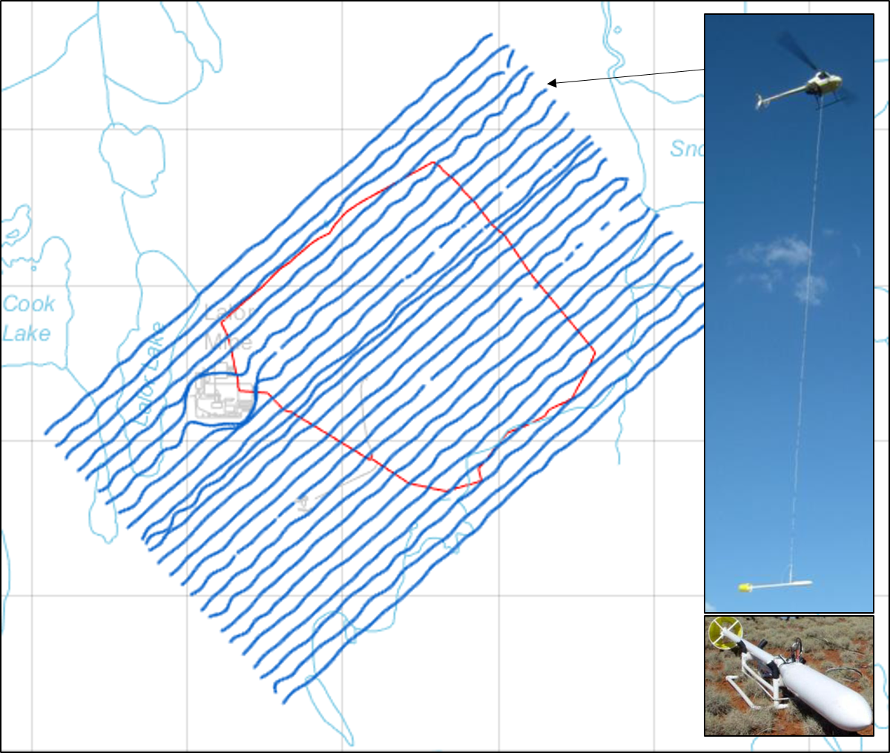

.. _lalor_survey:

Survey
======

Since the initial discovery by deeply penetrating electromagnetic (EM) surveys, the Lalor deposit has been surveyed by more than 15 different EM systems/methods from the air, on the surface and in boreholes. The controlled source EM surveys at Lalor fall into two streams:

	1) The airborne coincident loop EM provides great regional coverage but the data may suffer from low signal-to-noise ratio (SNR), especially for the late-time channels, because of relatively small transmitter moment and the movement of the platform.
	2) The ground large-loop surveys can generate a much greater primary field, yielding signals of good quality, but the receiver locations are usually confined to a few lines on the surface or down the boreholes.

    The HeliSAM flight line (blue) and the large loop source (red) at Lalor. Insert: SAM magnetometer and the HeliSAM system in flight.

The helicopter sub-audio magnetics (HeliSAM) system (Gap Geophysics Australia) is configured to address those issues. HeliSAM employs a large ground loop fixed on the surface as the transmitter to enhance the strength of signals, and flies a caesium vapour magnetometer (B-field SAM sensor) over the area to collect the transient total magnetic intensity (TMI) data. The scalar TMI data are insensitive to the orientation of the towed bird, so the data quality of HeliSAM is higher than in the conventional airborne EM.

The TMI data measured by a SAM sensor is a vector combination of the Earth’s regional magnetic field (:math:`B_0`), the local magnetic anomaly due to the magnetic susceptibility (:math:`B_a`), and the magnetic field from the EM induction (:math:`B_{em}`). By using a bipolar source excitation and stacking, (:math:`B_0`) and (:math:`B_a`) can be canceled out, and the final HeliSAM data is only (:math:`B_{em}`) projected onto the direction of the Earth’s magnetic field (:math:`B_0`).

The following summarizes the specification of the HeliSAM survey at Lalor

	- Transmitter loop: single turn, approximately 1.7 km on the side.
	- Transmitter current waveform: bipolar square wave of 50% duty cycle at a base frequency of 7.5 Hz.
	- Transmitter:  Phoenix TXU30, peak current 20 A, turn-off ramp of 0.4 ms.
	- Receiver: TM-7 SAM, 16 time channels of TMI data from 0.42 to 27 ms after the end of the ramp-off.
	- Measurement spacing: 100 m cross-line, ~5 m in-line.
	- Flight: R44 positioned using GPS, nominal bird height of 40 m above the surface.

