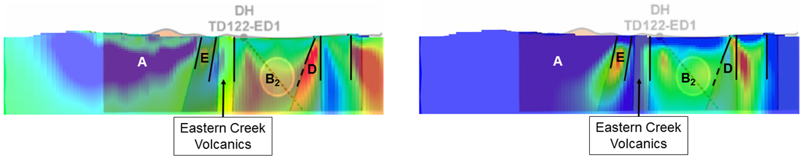

.. _mt_isa_interpretation:

Interpretation
==============

In this section, we interpret the physical property models recovered through
inversion, in terms of geologic units. The basis of our interpretations comes
from the :ref:`physical properties table <MIMgeoTable>` and the :ref:`geologic
cross-section <Geology_Section>`. The cross-section is most appropriate for
line N12200.

General
-------

The animations for :ref:`conductivity <MIMconMovie>` and :ref:`chargeabilty <MIMchgMovie>` were presented in the previous section and iso-surface images are provided in :numref:`MtIsa_3D_Model_Interp`. We use the two iso-surface images for our "general" or "first-order" interpretation. Labels A through G have been added to the figures and these are explained below. 

.. figure:: images/MtIsa_3D_Model_Interp.png
    :align: center
    :figwidth: 90%
    :name: MtIsa_3D_Model_Interp

    : Perspective view of the recovered 3D conductivity (left) and chargeability (right) models. Interpreted geological units (black) are shown for reference.

A: Surprise Creek Formation: A volcanic unit that is highly resistive
and non-chargeable. It has a steeply dipping contact with the Moondarra Siltstones.

B: The predominant rocks in this region are the Moondarra and Native Bee
siltstones. They cannot be distinguished on the basis of conductivity and
chargeability. These rocks may contain an Eastern Creek Volcanics Quartzite unit
that is resistive and non-chargeable and appears as a vertical contact 
between the Moondarra and Native Bee siltstones. We address this in more
detail in the "enhanced" portion of this interpretation.

C: Breakaway Shales: This is a highly conductive unit that dominates the
conductivity model. Conductivities in the inversion exceeded 10 S/m. The black
line D, which denotes the horizontal location of the near surface portion of
the unit, will be used in other images. We note that the shale unit does not
appear to be chargeable. This is most evident in the plan-view section in
:numref:`MtIsa_3D_Model_Plan` (right). The trace of the high conductivity is
associated with chargeability lows.

E and F: Mt Novit Horizon: This is characterized by a zone of moderately high
conductivity and high chargeability. The line E has been drawn to reflect that
correlation and it corresponds to a similar trajectory presented in the
initial paper by :cite:`rutley2001`. The chargeability along this trajectory
is not uniform. There is variation in amplitude and there are breakages.

G: Other regions of chargeability, and potentially mineralization, within the
siltstone complex. Much of this seems to be "in-board" (west) of the Breakaway
shale.

Enhanced
--------

We continue with a finer resolution interpretation using
horizontal sections at 125 m below topography (:numref:`MtIsa_3D_Model_Plan`).
The labels are the same as in the general section, but here the siltstones are
divided into two subsections: B1 and B2. The easterly located Moondara
Siltstone (B1) is separated from the Native Bee Siltstone (B2) by the
resistive Eastern Creek volcanics. The sequence of "Moondarra siltstone -
Eastern Creek Volcanics - Native Bee" is clear in the southern part of the
inversion and consistent with the cross-section located at line N12200. In the
north, the resistive volcanics between the siltstones disappears, while the
chargeability low is continuous throughout the section. Using both physical
properties enables the separation of the Moondarra and Native Bee rocks.  The
two sub-regions of B contain the highest target potential based on high
chargeability within the moderate conductivity of the siltstones.

.. figure:: images/MtIsa_3D_Model_Plan.png
    :align: center
    :figwidth: 90%
    :name: MtIsa_3D_Model_Plan

    : Sections through the recovered 3D conductivity (left) and chargeability (right) models. Interpreted geological units (black) are shown for reference.

.. .. figure:: images/MIMrec.png
..    :align: right
..    :scale: 125%
..    :figwidth: 50%
..    :name: Iso_surf

..    : Iso-surfaces of high conductivity (red) and chargeability (green) recovered from the 3D inversions overlayed by the geological cross-section interpreted from drilling.

.. The previous image presented plan-view slices of a 3D model. In order to view
.. the results in 3D, :numref:`Iso_surf` shows iso surfaces for conductivity (1
.. S/m) in red and chargeability (35 msec) in green. The iso surfaces highlight
.. that the Eastern Creek volcanics are neither chargeable nor conductive to its
.. neighbours. Furthermore, comparing the geologic section on the right-side of
.. the figure shows that the inversion recovered the dip of the Moondarra
.. Siltstone and the top of the Breakaway shale. Finally, the inferred
.. mineralization within the Native Bee Siltstone is not a discrete body. Likely,
.. however, this is an inversion artefact as anticipated by our simulation shown
.. in the top of :numref:`MIM_PDP_Simulation_Model`. The field results confirm
.. the simulation that the P-DP / DP-P survey configuration lacks the resolution
.. to properly resolve the vertical extent of the mineralization.

Summary
-------

In this section, inversion results are interpreted to bring the final recovered physical property models back into the realm of geology. :numref:`MIM_x_section` shows a cross-section view through both the recovered conductivity model (left) and chargeability model (right) along with the final interpretatation of the units. The units line up well with the geo-rectified geologic cross-section (:numref:`Geology_Section`) and allow a high-level of confidence of the interpretation to the north. The Breakaway shale unit has very large conductivities (higher than expected); the Novit Horizon appears as a low to moderate conductor. The Moondarra Siltsone breaks around line N14700, most likely due to faulting. The 3D inversion shows more detail than the 2D inversions and attempts to connect features from line to line. Yet, the results confirm the presence of a "2D" geology in general. 

    : Coincident cross-section through the conductivity (left) and chargeability (right) models with the interpreted units and super-imposed. The units line up well with the geo-rectified geologic cross-section.

