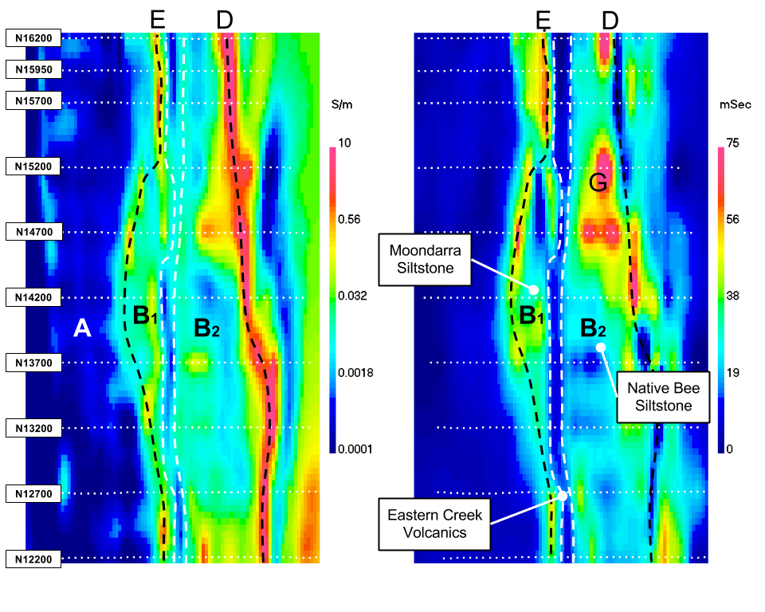

.. _mt_isa_interpretation:

Interpretation
==============

In this section, we interpet the physical property models recovered through inversion, in terms of geologic units. The basis of our interpretations comes from the :ref:`physical properties table <MIMgeoTable>` and the :ref:`geologic cross-section <Geology_Section>`. The cross-section is most appropriate for line N12200. We also provide two plan view sections (:numref:`MtIsa_3D_Model_Plan`) that aid the discussion.

The animations for :ref:`conductivity <MIMconMovie>` and :ref:`chargeabilty <MIMchgMovie>` were presented in the previous section and iso-surface images are provided in :numref:`MtIsa_3D_Model_Interp`. On those images the following features are incorporated in the interpretation.

A: Eastern Creek Volcanics: The quartzite unit is resistive and non-chargeable. It appears as a vertical contact between the Moondarra and Native Bee siltstones.

B: The predominant rocks in this region are the Moondarra and Native Bee siltstones. They cannot be distinguished on the basis of conductivity and chargeabilty. The easternly located Moondara rocks may be separated from the Native Bee siltstones by the resistive Eastern Creek volcanics. There is some indication that we may be seeing the sequency of "Moondarra siltstone - Eastern Creek Volcanics - Native Bee" in the southern part of the inversion, near 12200 where the cross-section is situated. However, as we proceed north, the resistor disappears and so does any way of separating Moondarra and Native Bee rocks.

C: Breakaway Shales: This is a highly conductive unit that dominates the conductivity model. Conductivities in the inversion exceeded 10 S/m. The black line D, which denotes the horizontal location of the near surface portion of the unit, will be used in other images. We note that the shale unit does not appear to be chargeable. This is most evident in the plan-view section in :numref:`MtIsa_3D_Model_Plan` (right). The trace of the high conductivity is associated with chargeabilty lows.

E and F: Mt Novit Horizon: This is characterized by a zone of moderately high conductivity and high chargeabilty. The line E has been drawn to reflect that correlation and it corresponds to a similar trajectory presented in the initial paper by Rutley. The chargeability along this trajectory is not uniform. There is variation in amplitude and breakages.

G: Other regions of chargeability, and potentially minerization, within the siltstone complex. Much of this seems to be "in-board" (west) of the Breakaway shale.

    : Sections through the recovered 3D conductivity (left) and chargeability (right) models. Interpretated geological units (black) are shown for reference.

.. figure:: images/MtIsa_3D_Model_Interp.png
    :align: center
    :figwidth: 90%
    :name: MtIsa_3D_Model_Interp

    : Perspective view of the recovered 3D conductivity (left) and chargeability (right) models. Interpretated geological units (black) are shown for reference.

.. .. figure:: images/MIMrec.png
..    :align: right
..    :scale: 125%
..    :figwidth: 50%
..    :name: Iso_surf

..    : Iso-surfaces of high conductivity (red) and chargeability (green) recovered from the 3D inversions overlayed by the geological cross-section interpreted from drilling.

.. The previous image presented plan-view slices of a 3D model. In order to view
.. the results in 3D, :numref:`Iso_surf` shows iso surfaces for conductivity (1
.. S/m) in red and chargeability (35 msec) in green. The iso surfaces highlight
.. that the Eastern Creek volcanics are neither chargeable nor conductive to its
.. neighbours. Furthermore, comparing the geologic section on the right-side of
.. the figure shows that the inversion recovered the dip of the Moondarra
.. Siltstone and the top of the Breakaway shale. Finally, the inferred
.. mineralization within the Native Bee Siltstone is not a discrete body. Likely,
.. however, this is an inversion artefact as anticipated by our simulation shown
.. in the top of :numref:`MIM_PDP_Simulation_Model`. The field results confirm
.. the simulation that the P-DP / DP-P survey configuration lacks the resolution
.. to properly resolve the vertical extent of the mineralization.

Summary
-------

The inversion has imaged, in 3D, the highly conductive Breakaway Shale unit, the western boundary of the siltstones that host the mineralization, a linear moderately conductive and chargeable feature identified as the Mt Novit Horizon, and chargeable regions of moderate conductivity between the Mt Novit Horizon and the Breakaway shales.

In this section, inversion results are interpreted to bring the final recovered physical property models back into the realm of geology. :numref:`MtIsa_3D_Model_Plan` shows a plan-view slice of the recovered conductivity model (left) and chargeability model (right). The Breakaway shale unit has very large conductivities (higher than expected); the Novit Horizon appears as a low to moderate conductor. The Moondarra Siltsone breaks around line N14700, most likely due to faulting. The 3D inversion shows more detail than the 2D inversions and attempts to connect features from line to line. Yet, the results confirm the presence of a "2D" geology in general.

