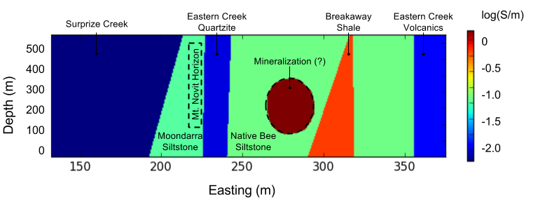

.. _mt_isa_properties:

Properties
==========

Conductivity
------------

Generally the mineralisation has a much higher conductivity than the host stratigraphy. The exception is the graphitic and weakly
pyrrhotitic Breakaway Shale unit which is quite conductive as shown in :numref:`Cond_Section`. 

    Vertical cross section of conductivity (log10) 

Units
-----

+-----------------------+-----------------------------------+---------------------------------------+
|       Rock Unit       |   Conductivity (:math:`mS/m`)     |  Resitivity  (:math:`\Omega \cdot m`) |
+-----------------------+-----------------------------------+---------------------------------------+
| Native Bee Siltstone  |  80                               | 12.5                                  |
+-----------------------+-----------------------------------+---------------------------------------+
| Breakaway Shale       |  625                              | 1.6                                   |
+-----------------------+-----------------------------------+---------------------------------------+
| Moondarra Siltstone   |  67                               | 15                                    |
+-----------------------+-----------------------------------+---------------------------------------+
| Mineralization        |  1430                             | 0.7                                   |
+-----------------------+-----------------------------------+---------------------------------------+

Table of physical properties for few rock units found at Mount Isa.

The electrical properties of the conductive 
geological units are listed in Table 1. Other rock units, such as the Surprise Creek and Eastern Creek Volcanics have low conductivities. The conductivity for the mineralization is appropriate for the expected bulk copper mineralisation (av 4.8%) as measured throughout the Mt Isa region. 

*DWO: Table 1:   Maybe a column for Resistivities, Conductivities (mS/m), chargeabilty; Include other units from the Geological Section and assign values as per Fig 3 of the paper.*

Chargeability
-------------

The minerals xxx are chargeable (Link to Physical Properties table). Thus the mineralization unit as well as the Breakaway Shales might be distinguishable from their hosts because of their chargeability. 

Summary
-------
Overall we expect the mineralization unit to be conductive and chargeable with respect to the host rocks. The problematic unit is expected to be the Breakaway shales which are expected to be conductive and may be associated with chargeable minerals.  

