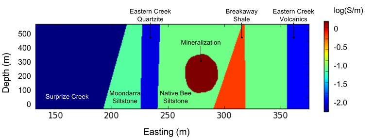

.. _mt_isa_properties:

Properties
==========

The main physical properties for this case history are electrical conductivity and chargeability. Below is a summary of the expected values for these physical properties in the Mt Isa region.

Conductivity
------------

Figure :numref:`Cond_Section` is a synthetic model generated on the geologic cross-section shown in :numref:`Geology_Section`. Generally, the zone of mineralisation (dark red) has a higher conductivity than its host stratigraphy (green). The exception to this is the graphitic and weakly pyrrhotitic Breakaway Shale unit (orange) which is quite conductive. The volcanics to the east (blue to right) have low conductivity as does the Surprise Creek Formation (dark blue, left). The Moondarra Siltstone (left-most green) is moderately conductive.

    Simplified (log) conductivity distribution expected at Mount Isa (N:12200m).

Chargeability
-------------

The Mt Novit Horizon has a high chargeability. This unit, along with the Breakaway Shales might be distinguishable from their hosts due to the difference in chargeability. The Mt Novit Horizon is important because it hosts the mineralisation. The remaining rocks, such as the Native Bee siltstone and Surprise Creek Formation, have low, to no, chargeability.

Summary
-------
Overall we expect any mineralization unit in this area to be **conductive and chargeable** with respect to the host rocks. The problematic unit is expected to be the Breakaway shales which are expected to have the highest conductivivity and may be associated with chargeable minerals. The conductivity for the mineralization is appropriate for the expected bulk copper mineralisation (average 4.8%) as measured throughout the Mt Isa region. A summary table is given below.

.. _MIMgeoTable:

+---------------------------+-------------------+------------------------------------------+-------------------+
|       **Rock Unit**       | **Conductivity**  | **Resistivity** (:math:`\Omega \cdot m`) | **Chargeability** |
+---------------------------+-------------------+------------------------------------------+-------------------+
| Native Bee Siltstone      |  Moderate         | Moderate  (~10)                          |  Low              |
+---------------------------+-------------------+------------------------------------------+-------------------+
| Moondarra Siltstone       |  Moderate         | Moderate  (~10)                          |  Low              |
+---------------------------+-------------------+------------------------------------------+-------------------+
| Breakaway Shale           |  High             | Low (~1)                                 |  Low-None         |
+---------------------------+-------------------+------------------------------------------+-------------------+
| Mt Novit Horizon          |  High             | Low (~1)                                 |  High             |
+---------------------------+-------------------+------------------------------------------+-------------------+
| Surprise Creek Formation  |  Low              | High (~1000)                             |  None             |
+---------------------------+-------------------+------------------------------------------+-------------------+
| Eastern Creek Volcanics   |  Low              | High (~1000)                             |  None             |
+---------------------------+-------------------+------------------------------------------+-------------------+

Table of the physical properties for the geologic units in the Cluny survey area.

