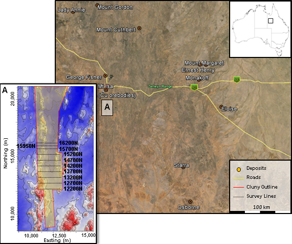

.. _mt_isa_setp:

Setup
=====

The Mount Isa region (:numref:`Location_map`) hosts numerous deposits (Lead,
Zinc, Silver, Copper, and Gold) within an area under continuous exploration.
This region is found in west Queensland, Australia. Within this region, ten
lines of :ref:`direct current resistivity <dcr_index>` (DCR) and induced
polarization (IP) data were acquired over what is now referred to as the Cluny
Mine (Copper), 22 km south of the city of Mt Isa. Two primary questions that
motivated the initial study were:

- Can geophysical data and 3D inversion delineate the various units shown in the geologic section?
- Can conductive and chargeable units, which would be potential targets within
  the siltstones, be identified?

In addition, we have an opportunity to re-invert the same data as Rutley et al
:cite:`rutley2001`, but use improved algorithms and higher performance
computers. Thus, a secondary set of questions is introduced as further
motivation:

- Are improved results obtained by using updated algorithms and higher performance computers?
- Are there any lessons worth highlighting that arose within this case history
  that were not delineated in the initial case history paper?

    Location map of the Mount Isa area and (a) inset over the Cluny Prospect
    study area. Neighboring mineral deposits are shown for reference.

Geological Background
---------------------

.. figure:: ./images/Geological_Section_Paper.png
    :align: right
    :figwidth: 50%
    :name: Geology_Section

    Vertical cross section of geology from Mount Isa. The mineralisation
    occurs within the Native Bee Siltstone as shown by the circle.

The geology of the Cluny region and the southern extent of the Mt Isa lease is
dominated by fault-repeated, steeply dipping stratigraphy of Native Bee
Siltstone, Breakaway Shale, Moondarra Siltstone that incorporates the Mt Novit
Horizon, Surprise Creek Formation, and Eastern Creek Volcanics as shown in
:numref:`Geology_Section`. The Mt Novit Horizon consists of a sequence of mica
schists, phyllites and metasiltstones containing gossanous material of coarse
grained pyrite, pyrrhotite, and magnetite, with variable sphalerite, galena,
marcasite, chalcopyrite, arsenopyrite and accessories :cite:`russel1978`.
Exploration along this horizon has occurred over a 40 year period. The best
drilling intersection recorded is from a 4 m interval containing 100 g/T Ag,
7.6% Pb and 11.6% Zn :cite:`poole1981`.

At Cluny, copper mineralisation is frequently expected in conjunction with
lead/zinc mineralisation. The Native Bee Siltstone and Moondarra Siltstone are
considered to be favourable host stratigraphy for mineralisation. An
exploration target in this area is a unit that is  conductive and chargeable.
In the geologic section :numref:`Geology_Section`  the exploration target is
denoted by the circle within the Native Bee Siltstone.

