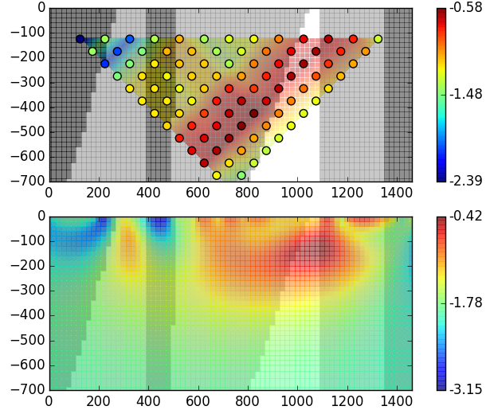

.. _mt_isa_survey:

Survey
======

From the :ref:`Property<mt_isa_properties>` segment of the case history, it is expected that the mineralization is both conductive and chargeable. A DCIP survey is therefore appropriate. Other factors that suggest this is a good choice is that there is minimal topography in the area and DCIP surveys have been successfully carried out in other areas of the Mt. Isa region.

DC Resistivity (DCR)
--------------------
The fundamentals for a DCR survey can be found :ref:`Geophysical Surveys: DCR<DCR_index>`. Many choices are possible for electrode layouts and the final choice is motivated by the following factors:

(a) MIM, the company who was exploring the property, had developed their own data acquistion system `MIMDAS`_.  The cable had xxxx connections, each of which could serve as a current electrode or potential electrode.

.. _MIMDAS: http://www.smedg.org.au/Sym01NS.htm

(b) The area of interest is approximately 5km x 5km. Although full 3D coverage was desireable, the field acquistion was limited to 10 east-west lines. A full set of xxx electrodes were deployed along each line.

(c) The choice of a pole-dipole was motivated by past experience that this was an effective survey for deep targets. The layout shown in {figure} indicates a current electrode at postion 1 with potentials measured across all other dipoles. The current electrode is then moved one electrode to the right. {Verify whether potentials to the left are recorded.} This produces a pseudo-section as shown in :numref:`Pseudo_PDP_East`.

.. figure:: ./images/Pseudo_PDP_East.gif
	:name: Pseudo_PDP_East

  	Data for pole moving east to west.

(d) It is desireable to illuminate the target bodies from as different directions as possible. This motivates the second acquistion with the current pole on the right as seen in :numref:`Pseudo_PDP_West`.

.. figure:: ./images/Pseudo_PDP_West.gif
	:name: Pseudo_PDP_West

  	Data for pole moving west to east.

Survey Design
-------------
The geologic structures are primarily striking north-south and a cross-section of the geologic units and their resistivities is shown in. The unit of interest is the Mt. Novit Horizon which is conductive compared to the host Moondarra Siltsone. Two forward modellings are generated. The first is without the conductor, the second is with.  The pole-dipole pseudo-sections obtained with 15 electrodes spaced 100 meters apart is shown in :numref:`DC2D_Inv`.

.. figure:: ./images/MtIsa_DCIP2D_Inv.png
	:scale: 75%
	:align: center
	:figwidth: 75%
	:name: DC2D_Inv

  	(Top) Pseudo conductivity section (log10) along the geologicalsection. (Bottom) Recovered 2D conductivity model from the inversion of DCR data. The true conductivity model is shown in grey scale for reference.

  	(Top) Pseudo conductivity section (log10) along the geologicalsection. (Bottom) Recovered 2D conductivity model from the inversion of DCR data. The true conductivity model is shown in grey scale for reference.

To determine if the survey is well designed we use the criteria in {link:general  basics of survey design where we look at the absolute difference and relative difference  ?Sarah} The difference sections are shown in {figure}. They show xxx
If errors are assigned as 5% + floor 0.0001 V then the secondary signal from the target is detectable.

Inversion of Synthetic data
Following the work {link: general basics of survey design} we invert the synthetic data using 2D algorithm.  The parameters used in the inversion were:  xxxxx. The Mt. Norvit Horizon is evident.

Using 2D forward modelling, we can also visualize where current flows and
where charge buildup occurs in our single pole source experiment. The
interactive figure below shows how current flows through the earth for a given
source location. Note in particular how current is channelled into the
conductive circular unit and away from the steeply dipping resistive units. We
can also clearly see charge buildup occuring at the interfaces between units.

.. raw:: html
  :file: ./images/Mt_Isa_Current_Anim.html

Current density (arrows) and charge density (color) for a range of source
locations (Powered by: `SimPEG <http://www.simpeg.xyz/>`_).
