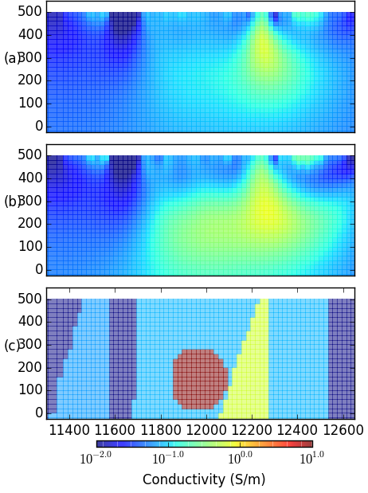

.. _mt_isa_survey:

Survey
======

It is expected that the mineralization is both  :ref:`conductive and chargeable <mt_isa_properties>`. A DC/IP survey is therefore an appropriate (and desired) choice for geophysical exploration. In this section, we explore the survey design used at the Cluny property.

DC Resistivity (DCR)
--------------------

The fundamentals for a DCR survey can be found in the :ref:`Geophysical Surveys <DCR_index>` section. Many choices are possible for electrode layouts, but the final choice at Cluny was motivated by the following factors:

(a) MIM, the company who was exploring the property, had developed their own data acquisition system `MIMDAS`_. The system had a 100-channel capacity distributed acquisition system, which means it each electrode could serve as a current or potential and it could acquire both DCR and IP data.

(b) The area of interest is approximately 2 km by 5 km. Although full 3D coverage was desirable, the field acquisition was limited to 10 east-west lines. The reason for this was two fold. Firstly, the 2D lines could be laid out across the East-West boundaries of Cluny region. Secondly, the fault structures were known to strike north-south, so it is natural to have the survey perpendicular to strike in order to generate the most physical property contrast along line. Most lines consisted of 21 current electrode locations (the three to the north had 19) with each current electrode having a maximum of 20 potential readings.

(c) The choice of a pole-dipole was motivated by past experience that this was an effective survey for deep targets. This produces a :ref:`pseudo-section<dcr_pseudosection>`. Furthermore, with the MIMDAS system, a :ref:`pole-dipole (P-DP)<PDP_survey>` and a :ref:`dipole-pole (DP-P)<DPP_survey>` could be acquired along each line at no additional cost. The system spaced each potential electrode 100-m apart.

.. Second sentence: The layout shown in Figure :numref:`MIM_PDP_EX` indicates a current electrode (red) at position 1 with potentials (black) measured across all other dipoles.

.. _PDP_survey:
.. figure:: ./images/MIM_Arrays.png
    :align: center
    :figwidth: 80%
    :name: MIM_PDP_EX

    (Left) Pole-dipole survey configuration with remote source electrode to the right. (Right) Dipole-pole survey configuration with remote source electrode to the left.

.. _MIMDAS: http://www.smedg.org.au/Sym01NS.htm

Survey Design
-------------

The :ref:`detectability <surveyDetectability>` property of a given survey
depends mainly on its ability to inject electrical currents into the
mineralization. The geologic structures at Mount Isa are primarily steeply
dipping geological units striking north-south. The unit of interest is the Mt.
Novit Horizon which is conductive compared to the host Moondarra Siltsone. We
also expect a large conductive contrast between the Breakaway Shale unit
and the Native Bee siltstone, which may also be a host for mineralization.
This alternating sequence of high and low conductivity may be an important
factor to consider during survey design. To better understand this particular
setting, we :ref:`simulate<Mt_Isa_Simulation>` the flow of current through the
expected geology. It is important to note the current channeling of the source
through the Breakaway Shale and the expected mineralization. Indeed for the dipole-pole case where the current electrode is beyond the Breakaway Shale, the current flows directly into the Breakaway Shale and any potentials measured to the west of the shale would be small. We will see this problem arise in the :ref:`next chapter <mt_isa_data_ip>`.

.. _Mt_Isa_Simulation:
.. list-table:: : DCR simulation over a synthetic Mt. Isa conductivity model with (top) and without (bottom) the conductive mineralized zone. Positive (red) and negative (blue) charge built-ups are shown.
   :header-rows: 0
   :widths: 10
   :stub-columns: 0

   *  - .. raw:: html
            :file: ./images/Mt_Isa_Current_Anim.html
   *  - Current density (arrows) and charge density (color) for a range of source locations (Powered by: `SimPEG <http://www.simpeg.xyz/>`_).

We generate synthetic data for the pole-dipole configuration from the numeric simulation above in order to test the resolving power of our DCR experiment. To asses if this configuration is sensitive to the mineralization at depth, we examine two scenarios; one with and one without the deep conductor. These two pole-dipole pseudo-sections using 15 electrodes spaced 100 meters apart are shown in :numref:`MIM_PDP_Simulation`. At first glance, both pseudo-sections look almost identical. Therefore, we invert these section to examine the differences in the recovered models.

  : Log10 pseudo-conductivity section along the geological section (top) with and (bottom) without a deep conductor. The section was created by simulating a pole-dipole survey.

The synthetic data are :ref:`inverted <inversion>` with a 2D algorithm. A mesh of 20-m by 20-m cells discretized the subsurface. A reference and initial model of 0.05 S/m was used. The recovered models with and without the deep conductor are show in Figure :numref:`MIM_PDP_Simulation_Model`.  The results show that the deep conductor can be resolved, albeit it does not look like a confined conductor. Rather, due to the current channelling, a horseshoe shape appears. This make sense when looking at the :ref:`current density <Mt_Isa_Simulation>` above. There is not enough sensitivity in the inversion to differentiate the bottom of the mineralized body, but the current does channel into it and affects the inversion result. The differing units such as the Mt. Norvit Horizon located within the Moondarra can be also detected with this configuration.

  : The recovered 2D conductivity models from the inversion of the pole-dipole data shown in :numref:`MIM_PDP_Simulation`. The top figure contains the deep conductor and the bottom lacks a deep conductor. In both figures, the true conductivity model is shown in grey scale for reference.

