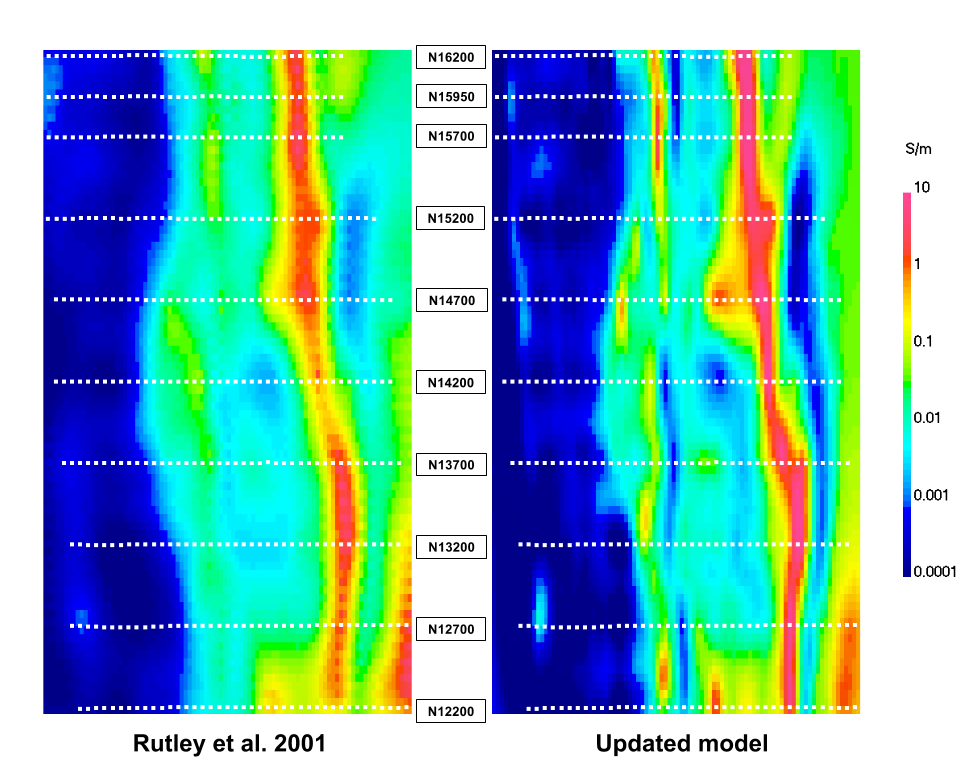
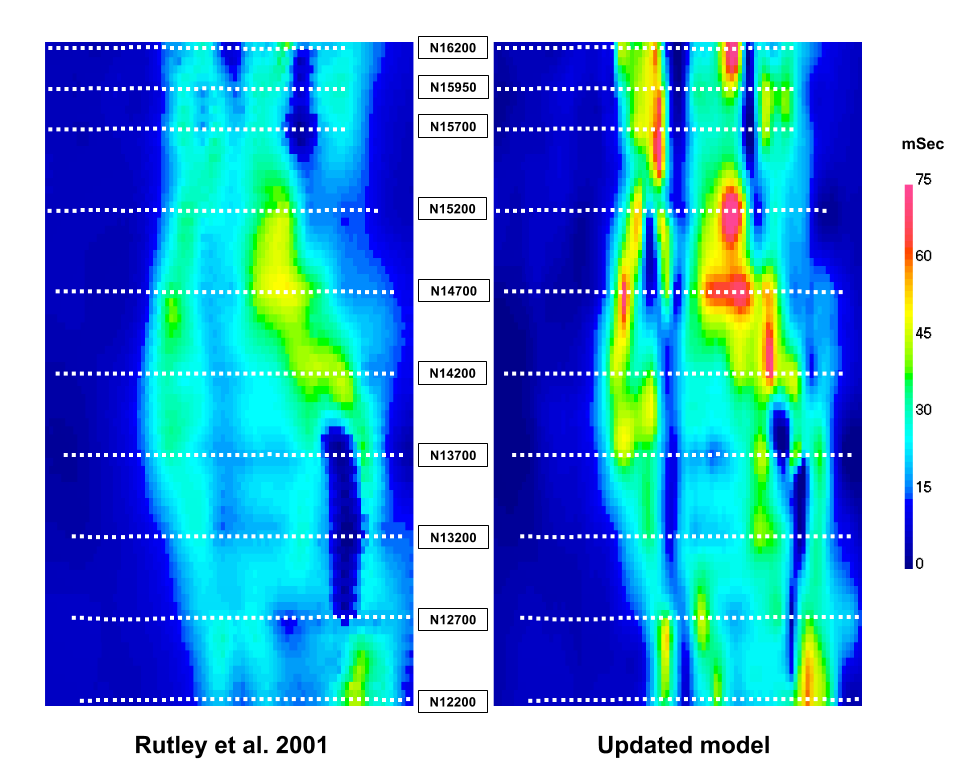

.. _mt_isa_synthesis:

Synthesis
=========
Two primary questions that motivated the initial study were:

- Can geophysical data and 3D inversion delineate the various units shown in the geologic section?

  The use of 3D inversion for interpreting with multiple physical properties was successful. Here, the Breakaway shale was a major conductor and the Moondarra siltstone a moderate one. However, the shale is unimportant for exploration in this region when compared to the Moondarra that hosts the Mt Novit Horizon. Once the induced polarization was introduced, it highlighted the Mt Hovit Horizon within the Moondarra and the mineralized zone in the Native Bee Siltstone. The shale is then exposed as just conductive and the main feature in the conductivity model is delineated as non-mineral bearing.

- Can conductive and chargeable units, which would be potential targets, within the siltstones be identified?

  The Mt Novit Horizon is characterized by a zone of moderately high conductivity and high chargeability. There is variation in amplitude and breakages, which could be a proxy to mineralization grade. The mineralization within the Native Bee Siltstone is also present in the model, albeit not as pronounced as the Mt Novit Horizon.

Additional questions were asked with the opportunity to re-invert the same data, but use improved algorithms and higher performance computers:

- Are improved results obtained by using updated algorithms and higher performance computers?

  The answer to this question is summarized using :numref:`MtIsa_DC3D_Old_vs_New` and :numref:`MtIsa_IP3D_Old_vs_New`. These compare the recovered conductivity (:numref:`MtIsa_DC3D_Old_vs_New`) and chargeability (:numref:`MtIsa_IP3D_Old_vs_New`) models presented in :cite:`rutley2001` with the updated model presented in this study. Both studies used identical datasets and inversion parameters, but finer horizontal cell-size discretization was 25 x 50 m compared to 40 x 100 m in the original study. 

- Are there any lessons worth highlighting that arose within this case history that were not delineated in the initial case history paper?

  One interesting feature in the recovered model is the conductor at the south-east edge of the model, which can be seen in :numref:`MtIsa_DC3D_Old_vs_New`. This feature is present in both the previous inversion and this case history. We further explore this conductor in the :ref:`next section <mt_isa_lessons>`.

    : Comparative sections through the recovered 3D conductivity model presented in :cite:`rutley2001` (left) and this study (right).

    : Comparative sections through the recovered 3D chargeability model presented in :cite:`rutley2001` (left) and this study (right).  

.. This example demonstrates the two important lessons. The first highlights the ability for modern inversion capabilities to distinguish subtleties in the subsurface.

.. This is highlighted further when interpreting with multiple physical properties. Here, the Breakaway shale was a major conductor and the Moondarra siltstone a moderate one. However, the shale is unimportant for exploration in this region when compared to the Moondarra that hosts the Mt Novit Horizon. Once the induced polarization was introduced, it highlighted the Mt Horvit Horizon within the Moondarra and the mineralized zone in the Native Bee siltstone. The shale is then exposed as just conductive and the main feature in the conductivity model is delineated as non-mineral bearing. This was available in the original inversion presented in the case study. However, the Eastern Quartz Volcanics is much more evident as a resistive feature separating the Moondarra and Native Bee siltstones.

.. The second lesson here is the importance of a 3D inversion even in the presence of 2D geology :numref:`MtIsa_DC2D_vs_3DModel`. The 2D inversions, in general, reproduce the large-scale features of the subsurface. However, when the geology becomes more complex, the 3D inversion can show the changes in strike cause by folding and faulting, or where mineralisation grade changes. This is most evident in the Mt Novit Horizon, where the chargeability is north-south in general yet has variability along strike.

.. .. figure:: images/MtIsa_DC2D_vs_3DModel.png
..    :align: center
..    :figwidth: 100%
..    :name: MtIsa_DC2D_vs_3DModel

..    : Comparative sections through the recovered 2D (left) and 3D (right) inversion.

