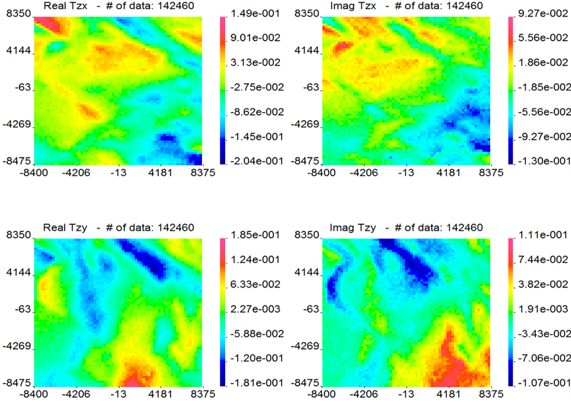

.. _noranda_data:

Data
====

        Forward modelled ZTEM data at 90 Hz using a synthetic conductivyt modle representing the geology of the Noranda district in Canada.

"The data were corrupted with noise to form the observed synthetic data." The data at 90 Hz are shown in :numref:`noranda2`. The data are composed of two :ref:`tipper functions <ztem_data>`, each which has a real and imaginary component.

Quoted text from :cite:`holthamoldenburg2012`.
