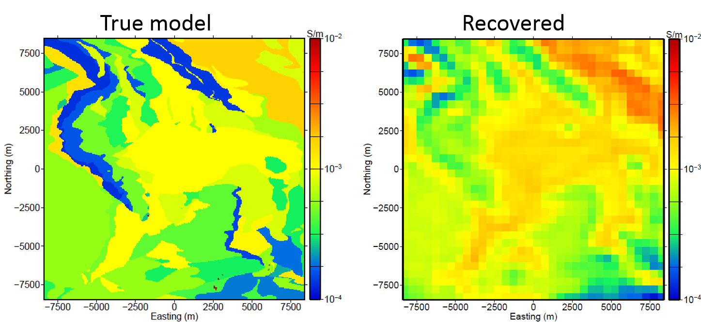
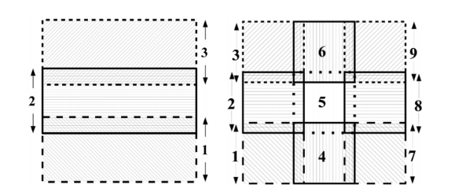

.. _noranda_processing:

Processing
==========

The ZTEM data can be difficult to interpret directly and therefore, we invert the data in 3D. An additional challenge in this case is that the dataset is very large and spans a large geographic region.

"The first step is to perform a coarse inversion to determine the large-scale structure that will be used to compute the primary fields and starting models for subsequent finer inversions. The earth is discretized into relatively large cells such that the total number of cells in the mesh is small and the inverse problem can be solved quickly. In this example, the coarse mesh contained 42 x 42 x 73 cells. The cell lengths in the x- and y-directions was 500 m. For this synthetic example, the data can be inverted in approximately 30 minutes. The coarse inversion result can be seen in :numref:`noranda3` " and is compared to the true model.

        True model (left) and the recovered coarse model (right).

"Because of the large cell dimensions, some geologic structures such as accurate body boundaries and fine-scale features may not be recovered by the discretization. Therefore, it is important not to overfit the data and risk adding discretization artifacts into the inversion result. This is particularly true for higher frequency data that will have smaller skin depths and contain more information about fine-scale features."

"In fact, because the initial goal of the coarse scale inversion is to quickly determine the large-scale conductivity features, some data, particularly the higher frequency data, may be omitted to reduce the computational cost and prevent the large cell sizes of the coarse mesh from violating the shorter skin depths at the higher frequencies. In this example, the 360 and 720 Hz data were omitted for the coarse inversion."

"The coarse inversion result can be used to generate an initial starting model and to compute the primary fields for subsequent finer discretized inversion. Once the initial models and primary fields have been computer, the subdomain meshes must be designed." Designing the subdomains is not trivial and further explained by :cite:`holthamoldenburg2012`. "Continuity of the conductivity structure across domain boundaries is accomplished by using data and mesh overlap. Generally, the core regions of the meshes are chosen to overlap by slightly less than a skin depth (additional padding cells are added outside this overlap region) at the lower frequencies. Here, a tradeoff must be achieved between increased overlap and increased computational requirements. Another tradeoff that must be considered is the number of tiles used to decompose the domain."

        "Mesh layouts for the example using (left) three and (right) nine overlapping domains. Each subdomain mesh contained approximately (left) 3.5 million and (right) 1.4 million cells. The central core region of each domain in both cases overlapped by 20 cells, each with dimensions of 50 m, in the x- and y- directions."

"For this synthetic example, two different sets of meshes, one with three tiles and the other with nine tiles, are used to demonstrate the scalability and robustness of the methodology. For the three tiles examples, each subdomain contained approximately 3.5 million cells. Each mesh in the nine tile subdomain example contained approximately 1.4 million cells. The three and nine tile examples contained the same sized cells (50 x 50 m cells in the x- and y-directions) in the core and overlapping regions. In the vertical direction, the cell dimensions started at 25 m and then expanded with depth. Both sets of meshes used 20 overlapping cells on each mesh boundary. The mesh layouts and overlaps for the three and nine tile examples can be seen in :numref:`noranda4`."

"Generally, our methodology is to select the largest tile size that can be inverted in an acceptable time. For the nine tiles example, each beta iteration took around 36 hours while for the three tiles example, each beta iteration took around 145 hours."

"Once the subdomain inversions have been completed, a full model update can be obtained by merging the inverted tiles. A simple merging technique is used to mitigate discontinuities across tile boundaries by averaging schemes that assign the conductivity of the update cell to to be the weighted average of the overlapping conductivity cells. From our practical experience, this method works quite well; however, we can improve on this method by trying to incorporate some estimate of each cell's sensitivity to the individual tiles. More details on this are provided by :cite:`holthamoldenburg2012`."

"The final inversion models from the three and nine tiles examples are shown" and interpreted on the :ref:`next page <noranda_interpretation>`.

Quoted text from :cite:`holthamoldenburg2012`.

