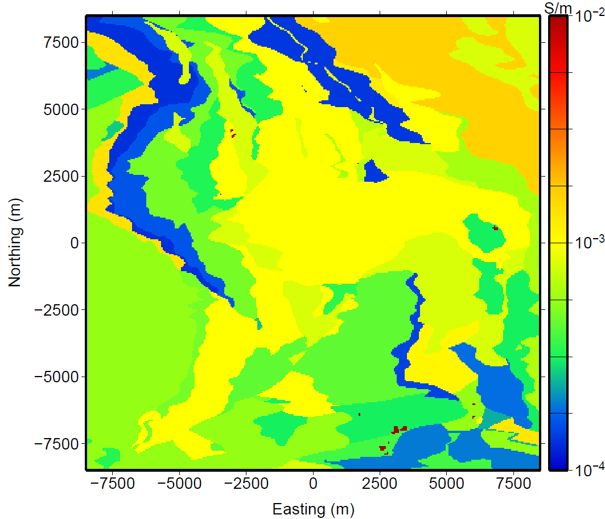

.. _noranda_properties

Properties
==========

        "Depth Depth slice at -275 m above mean sea level (AMSL) of the true model. The topography for the synthetic model ranges from -25 to -250 AMSL. The conductivity of the ore was chosen to be 0.2 S/m; however, the color scale on the model has been clipped at 0.01 S/m to improve the visualization of the other geologic units."

A geologic model, "provided courtesy of the Xstrata mining group, contained 12.7 million cells covering an area of almost 20 by 20 km. The 38 geologic units in the model were converted into expected conductivities." 

"The conductivity of the ore was chosen to be 0.2 S/m" while the geology units vary between 0.0001 and 0.002 S/m. A depth slice through the conductivity model is shown in :numref:`noranda1`.

Quoted text from :cite:`holthamoldenburg2012`.
