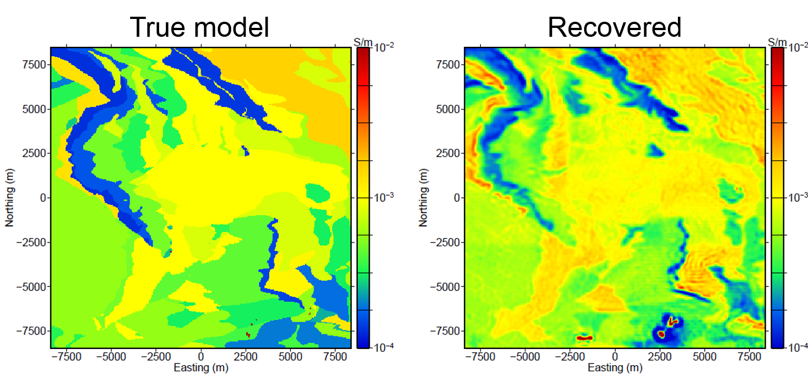

.. _noranda_synthetis:

Synthesis
=========

:numref:`noranda7` compares the true and recovered fine model and shows that large-scale structures are nicely recovered in both shape and amplitude. In addition, the recovered model shows the highly conductive ore bodies in the southern portion of the region.

        Comparison of plan view slices of the (left) true model and (right) the recovered model.

":numref:`noranda8` compares the recovered high conductivity regions (mineralized zones) with the true mineralized zones in the region outlined in black in :numref:`noranda7`. Although one cannot expect to recover the exact complex geometry of these relatively small mineralized zones, the inverted model does a good job of recovering the general geometry of the ore bodies."

.. figure:: images/synthesis.png
        :name: noranda8
        :align: center
        :figwidth: 100%

        "Comparison of the larger southern mineralized region. Recovered bodies more conductive than 0.01 S/m that correspond to the mineralized bodies in the southern section of the inverted model are compared to the true mineralized bodies from the synthetic model."

This case history presents an example of how large ZTEM surveys can be used to characterize regional large-scale geologic structures as well as recover small, localized mineralized ore bodies. 
The data were inverted in multiple steps to first produce a coarse model that showed the regional geology, followed by a finer inversion on multiple meshes to recover the more localized structures and bodies within the Noranda district in Canada.

Quoted text from :cite:`holthamoldenburg2012`.
