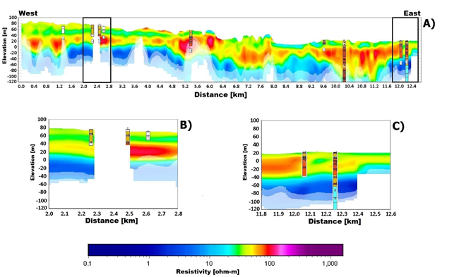

.. _norsminde_interpretation:

Interpretation
==============

The geophysical models are presented as average  resistivity maps at various elevation or depth intervals (:numref:`figresistivity_interp`) or in profiles (:numref:`figprofile_interp`). :numref:`figresistivity_interp` shows a middle resistance map for a depth of 15-20 metres. In general, there is a good correlation between resistivity and deposits of clay or sand. Clayey sediments typically have a resistivity of less than 50 Ωm, whereas gravel and sand have a resistivity above 60 Ωm. The paleogene clay in the catchment is characterized by a very low resistivity of approximately 2 Ωm.

As shown in the average resistivity map, the level of detail is very high, and large variations in local resistivity are seen and are representative of the distribution of sand and clay. Information about the three-dimensional distribution of these local deposits of clay and sand is vital in order to model the nitrate reduction in the near- surface aquifers.

.. figure:: images/fig_thumbnail.png
    :align: center
    :figwidth: 70%
    :name: figresistivity_interp

    The mid resistivity map for a depth of 15-20 metres. The position of the profile in :numref:`figprofile_interp` is marked in a black line. The map also shows the contours, in many places with a direct correlation with the geology.

Comparison with Drillings
-------------------------

In order to examine and validate the near-surface resolution of the SkyTEM system and the data processing system, the geophysical results were compared with both new and existing data from drillings in the Norsminde area. All drillings within 15 metres from a flight line are included in the validation. A total of 54 drillings were within this interval however, data was only available for 46 drillings. All available data from these drillings was analyzed and a detailed comparison with the geophysical models was made.

The method of comparison was to plot the geo¬physical models in profile together with the lithological information from the drilling and then evaluate their consistency and correlation. In the comparison, the quality of drilling data was carefully assessed by reviewing drill test descriptions, well drilling reports, and drill site locations. The quality of drilling data can be affected by factors such as lack of sampling or less than adequate description of the sampling, the drilling method used and not least, incorrect coordinates.

Upon comparison of the drilling data and airborne geophysical models the results were divided into four categories of consistency: “very good correlation” “good correlation”, “poor correlation” and “no correlation”.

In areas of “very good correlation” the criteria was that geophysical models should display low resistivities (i.e. <50-60 Ωm) where drilling data shows clayey sediments - typically moraine clay, meltwater clay and mica clay. In areas with Paleogene clay deposits resistivities are very low the resistivity measurements should be <10 Ω-m. When the drillings contain sand or gravel, high resistivities should be seen in the models (i.e. > 50-60 Ωm). Furthermore, there must be a consistency regarding the exact positioning of layer limits and hence the thickness of the individual layers. The assessment “good correlation” typically denotes small inaccuracies in the consistency between the positioning of layer limits.  Examples are an inaccuracy of 3 metres in a layer limit of 15 metres depth, or a single thin layer of 2-3 metres not resolved in the top 10 metres.  The assessment “poor correlation” denotes that there is some consistency and usable data can be extracted from the SkyTEM :math:`\!^{101}` data, whereas in case of “no correlation” no detectable correlation could be made. 
Of the 46 drilling locations in the comparison, the consistency was distributed as follows:

    - 43.5% “very good correlation”
    - 32.6% “good correlation ”
    - 17.4% “poor correlation ”
    - 6.5% “no correlation ”

Consequently, for 76% of the drillings the correlation is either very good or good, which is a promising result. This means that in only 11 drillings of 46 exhibit poor or no correlation.  Subsequently, the causes of these inconsistencies were assessed, and the reasons identified were (1) bad drilling quality, (2) erroneous localization of the drilling, (3) couplings to electrical installations or data noise, (4) increased saline content in the pore water, and (5) 3D effects and limitations in the resolution of the system. The assess¬ment proved that about one third of the cases of poor or no consistency were related to erroneous or poor drilling data (1+2), whereas two thirds of the cases are due to factors that are related to the mapping method (3+4+5). The most predominant reason (5) is 3D effects and limitations in the resolution of the system.

Most cases of poor or no correlation were located in the northern part of the area where the geology is strongly deformed by glacial tectonics. It is not surprising then that the system is unable to resolve the geology and reproduce drilling data since the heterogeneity is far below the horizontal resolution that can be expected from geophysics.

    SkyTEM results form the Norsminde catchment. A) Geophysical profile with drillings. B) and C) zoom of profile. Legend: S = Sand, ds = meltwater sand, dg = meltwater gravel, rl = Røsnæs clay, ll = Lillebælt clay, l = clay and ml = moraine clay. 

:numref:`figprofile_interp` shows a profile of the geophysical results compared with drillings in the area. The correlation is either very good or good. The position of the profile is shown in :numref:`figresistivity_interp`. The profile in :numref:`figprofile_interp` A illustrates the complex geological structure in the Norsminde catchment with glacial beds, buried valleys and paleogene clay. Furthermore, it is worth noting the good correlation between resistivities and drilling information in both the top 30 metres of the subsurface as well as in the deeper soil layers. There is obvious correlation where the clayey sediments have a resistivity below 50 Ωm, and the sandy and gravelly meltwater beds have a resistivity above 60 Ωm. 

:numref:`figprofile_interp` B is an enlarged area profile with three near-surface drillings at a depth of 23-40 metres. The near-surface moraine clay is well resolved, and the depth to the meltwater sand is clearly identifiable in the geophysical models. In :numref:`figprofile_interp` C the focus is on an area in the profile with a more than 140 metres deep drilling.

