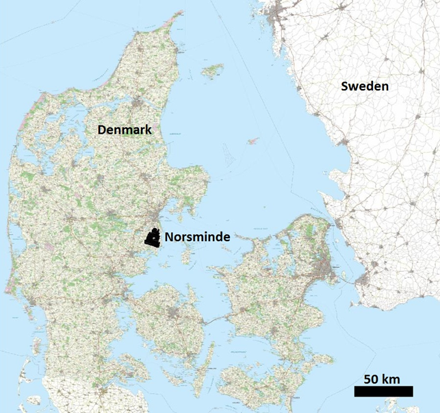

.. _norsminde_setup:

Setup
=====

    Location of the Norsminde survey area.

The survey area is located 20 km south of Aarhus, Denmark and covers the Norsminde catchment area of about 120 km :math:`\!^2` (:numref:`figlocation_setup`). The geology of the catchment is complex and can be divided into units consisting of glacial beds, Miocene beds, Eocene beds, buried valleys and glacial tectonic complexes. The complex geology settings high demands to the survey design ad resolution of the ATDEM data. The entire catchment was flown with a SkyTEM system to resolve the upper 30 meters of the soil at a farm scale resolution.

Geology
=======

The geology in the study area is sedimentary complex and dominated by glaciotectonics.  In the northeastern part of the study area Paleogene clay is found almost at surface, whereas in the southeast buried valleys, incised in the Paleogene clay, of different age and size are the norm. The buried valleys are of high importance with respect to water flow and consequently transport of nitrate. In the northwestern part of the survey area the sediment are highly glaciotectonially deformed where sand and clay layers have been thrusted and folded. In the western to southwestern part of the study area buried subglacial melt-water eroded tunnel valleys are found at different scales. The valleys have been filled with younger sediments. Typical infill is meltwater sand and gravel, which composed good water reservoirs.  

