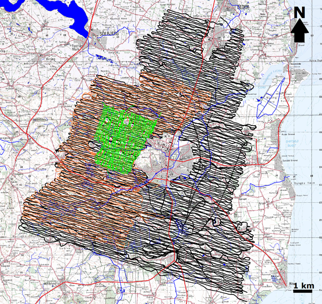

.. _norsminde_survey_data:

Survey and Data
===============

.. figure:: images/fig_instrument.png
    :align: right
    :figwidth: 45%
    :name: figinstrument_survey

    Configuration of the SkyTEM system.

The survey was conducted by SkyTEM Surveys ApS and the HydroGeophysics Group, Aarhus University by means of a SkyTEM system specially designed for near-surface acquisition. The used SkyTEM system is shown in :numref:`figinstrument_survey`. The main feature of this system is the capability to measure very early times at only a few :math:`\mu s` from the end of the turn-off, which to our knowledge has not been measured by any other transient AEM system before. The system has a small transmitter loop area of only 130 m :math:`\!^2` and uses two transmitter moments the low moment (LM) with an injected current of 7 A and the high moment (HM) with a larger current of 55 A. The LM is meant for very short turn-offs of the current in the order of ~ 3 :math:`\mu s` and makes it possible to measure very early times a few :math:`\mu s` after the end of the ramp. Low-pass filters of 300 and 450 kHz are introduced by the receiver coil and the transmitter, respectively. In contrast, the HM with a turn-off time of ~ 12 :math:`\mu s` allows later times measurements, resulting in a deeper depth of investigation. The recorded times span from 2-3 :math:`\mu s` to slightly more than 1 ms after the end of the turn-off ramp, giving a depth of investigation slightly more than 100 m for an average ground resistivity of 50 Ωm.

    Norsminde survey lines.

The small size and weight of the system allows the use of a smaller and more cost effective helicopter. The frame is made from a composite material and the aerodynamics profile allows the system to be flown at a speed of 100 to 140 km/h. In our case it took one week to fly the pilot survey of ~ 2000 line km over an area of 120 km :math:`\!^2` with a line spacing of 50-100 m. This time includes refueling of helicopter, check and small repairs of the system, delays due to weather conditions etc.
In the acquisition settings of the present survey, each moment, SLM and HM, had a stack size of 80 transients with a repetition frequency of 400 Hz resulting in a full sounding for each 0.6 s. With an average flight speed of 30 m/s, this gives a full SLM+HM sounding for each 15 m. An additional stacking window is applied to the data during processing to improve the signal-to-noise ratio at late times. The width of the stacking filter varies and increases with gate times in order to obtain the best lateral resolution possible; it is shorter at earlier gate times, starting with 1 s for gates until 20 µs. The final best lateral resolution of the top 30 m is estimated at ~ 20-40 m, considering the diffusivity of the method, the frame altitude close to 30 m, and a conductive ground. For a more resistive ground, the footprint of the system becomes larger, and a larger volume of the ground is averaged. 

    

