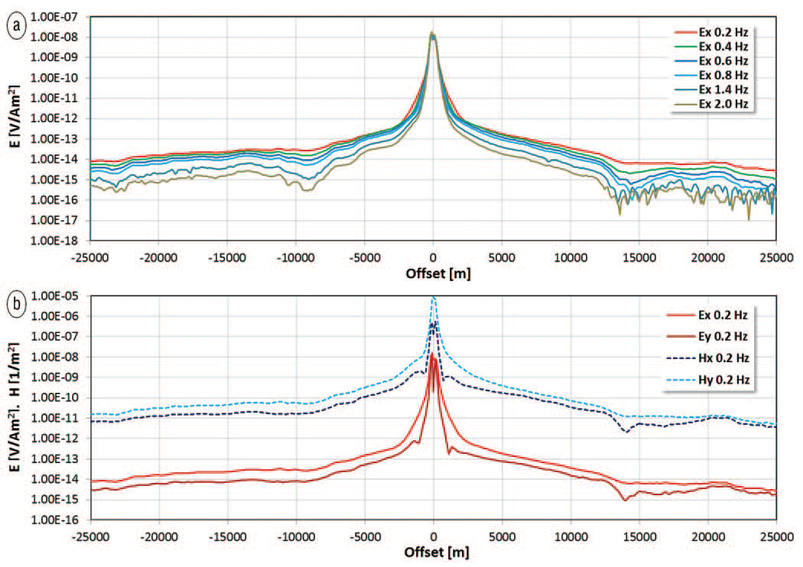
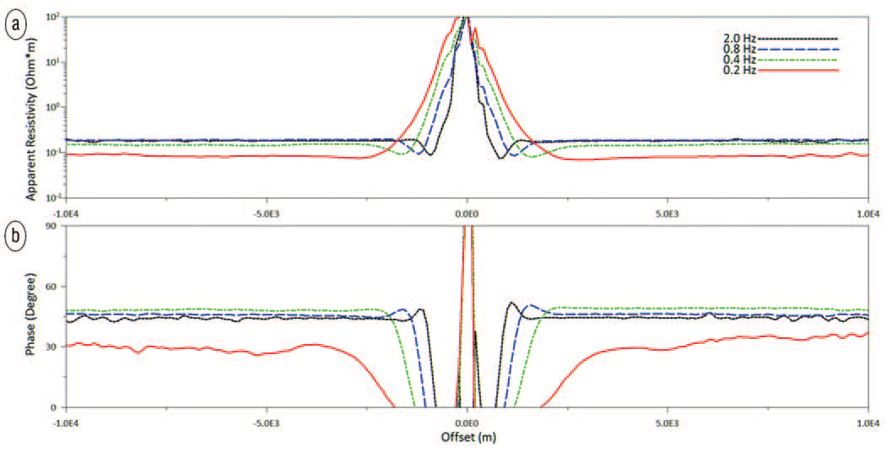
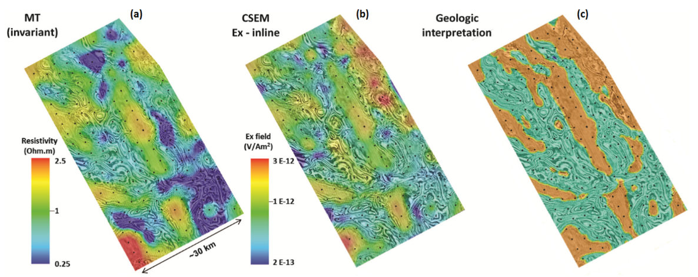

.. _red_sea_dataCSEM:

Data-Driven CSEM Inversion
==========================

Data
----

CSEM data plotted as a function of transmitter-receiver offset is shown in :numref:`fig_rea_sea_sensMVO`. Here, subscripts x and y are used to denote inline and perpendicular components, respectively. A preliminary look at the recorded CSEM data suggests that features such as submarine canyons and mountains introduce noticeable distortions in the recorded fields; implying the existence of 3D structures. This observation underlies the need for an appropriate representation of the sea-bottom topography during the data interpretation and inversion phases. The first four frequencies (0.2, 0.4, 0.6, and 0.8) show good signal-to-noise at offsets of 25 km or more, whereas the higher harmonics (1.4 and 2.0 Hz) were less likely to show good signal-to-noise at offsets exceeding 20 km. The magnitude vs. offset (MVO) plots in :numref:`fig_rea_sea_sensMVO` show a remarkable level of signal for the :math:`E_y` and :math:`H_x` components, which should be absent for 1D geologies or 2D geologies which are symmetric to the source orientation; this behaviour further supports the presence of 3D structures.

    CSEM data. (a) Inline components of the electric field (Ex) as a function of offset. (b) Perpendicular measurements of the electric and magnetic field at 0.2 Hz.

The CSEM data exhibits both near-field and far field behaviours. The plane wave behaviour of the far field can be confirmed by calculating the phase and apparent resistivities from the :math:`Z_{xy}` impedance tensor component at various frequencies and offsets along a particular acquisition line; where :math:`Z_{xy} = E_x/H_y`. This is shown in :numref:`fig_rea_sea_sensMVO2`. The transition from the near-field to the plane wave behavior is marked by stable estimates for the apparent resistivity and phase; i.e. the phase approaches 45 degrees and estimates of the apparent resistivity no longer change with respect to an increasing offset. As we can see, a larger offset is required before responses at lower frequencies exhibit plane wave behaviours. This transition generally takes place at offsets between 1 km to 2.5 km.

    Near and far-field behaviours in CSEM data (a) Apparent resistivities as a function of offset, obtained from the Zxy component of the impedance tensor. (b) Phase difference between Ex and Hy components as a function of offset.

There is a significant overlap in the frequency content (0.2 Hz to 2 Hz) contained within both the MT and CSEM datasets. In addition, the results summarized in :numref:`fig_rea_sea_sensMVO2` tell us that CSEM data exhibits similar propagation behaviour to MT at sufficient offset distances. As a result, we expect that MT and CSEM data are similarly sensitive to common geological features. A cursory example of this is shown in :numref:`fig_rea_sea_res_map_interp`. In this figure, we see that both the MT apparent resistivity attribute and Ex (inline) data from CSEM correlate reasonably well to subsurface geological structures (i.e. top of halite and the top of the LES).

    MT and CSEM data comparison to interpreted geological map (a) MT apparent resistivity attribute at 0.1 Hz (invariant mode). (b) the CSEM Ex field (inline direction) at 0.4 Hz. (c) Reference interpretation map of the top of the LES (orange) and halite (teal) surfaces.

Processing
----------

Because the MT and CSEM data are sensitive to common geological structures, we expect independent inversion of MT and CSEM data to yield resistivity models with strong similarities. The data-driven inversion of CSEM data was carried out in a similar manner to that used to perform the 3D data-driven inversion of MT data. Relevant parameters for the inversion are summarized in :numref:`fig_red_sea_model`. Once again, the salt flood model obtained through the initial interpretation of WAZ data was used as a starting model. 3D CSEM inversion was also performed using the results from the 3D MT inversion as a starting model.

For each starting model, the CSEM inversion begins by inverting the Ex (inline) component only, at a single frequency of 0.4 Hz. After obtaining a preliminary 3D resistivity model, the CSEM inversion progresses by adding additional frequencies as well as inline and broadside offset data. By running the inversion with two different starting models, we are able test the robustness of the data-driven 3D CSEM inversion approach to starting models.

Interpretation
--------------

The results of the data-driven CSEM inversion approach ultimately validate the conclusions made during the synthetic modeling study. As expected, the CSEM inversion is able to resolve the base of the LES, however, it does not exhibit a significant sensitivity to the basement. The sensitivity to uplifted basement blocks is very important for exploration in the Red Sea because such structures represent primary drilling targets for the initial exploration phase. Additionally, the resistivity cross-sections displayed in :numref:`fig_rea_sea_WellLog_CSEM` show that the final resistivity model depends significantly on the starting model. Using the MT inversion results as a starting model, we see that the CSEM inversion locates a conductor below the LES.

Unlike the data-driven MT inversions, the CSEM inversions were unable to converge effectively to a global minimum of the solution and instead tended to stall in some local minima. Nevertheless, data-driven 3D CSEM inversions were able to provide first-order sensitivity to the geologic structures as shown by well results in Area-1 (:numref:`fig_rea_sea_WellLog_CSEM`). The sharp resistivity increase at the top LES interface strongly impacts the performances of the data-driven CSEM inversion. For this reason, any improvement in the definition of the shallow resistivity model would benefit the inversion results and the convergence performances. 

Areas characterized by the prevalence of LES (i.e., mini-basins) exhibit complex CSEM responses. The alternating layers of conductive clastics (e.g. shales) with resistive evaporites generate effective anisotropy. This was proved using synthetic model responses and inversions, where the response of thin layering of isotropic materials with alternating high/low resistivities could be explained only by anisotropic CSEM inversion using two average resistivities Rh and Rv (Colombo and McNeice, 2017, personal communication). The study ultimately showed that such responses could be justified only by introducing anisotropic resistivity models. As a result, CSEM inversion which assumes isotropic resistivity may be insufficient for characterizing the subsurface geology and resistivity structure.

.. figure:: images/dataCSEM_well_compare.png
    :align: center
    :figwidth: 90%
    :name: fig_rea_sea_WellLog_CSEM

    Comparison of well log data to data-driven CSEM inversion results for two different starting models. (a) Salt flood model from interpretation of WAZ data. (b) Model from 3D data-driven MT inversion.

