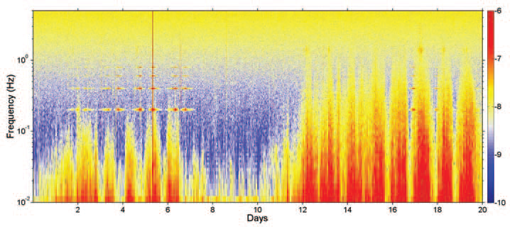
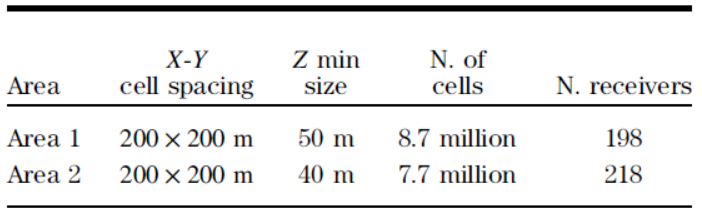

.. _red_sea_dataMT:

Data-Driven MT Inversion
========================

Data
----

EM data were recorded for 12 days up to 20 days in some cases. The frequencies measured by the receivers (0.2 mHz to 2.0 Hz) span several decades and are shown in the spectrogram in :numref:`fig_red_sea_spectrogram`. Each vertical slice of the spectrogram can be thought of as the amplitude of the frequency response at a particular time. Notice the diurnal variations in the MT signals and the variations of solar activity over the recording period. Because data are recorded continuously, we observe spectral lines at 0.2 Hz and at higher harmonics from the horizontal electric dipole (HED) transmitter used for CSEM. We can also see that CSEM was collected throughout multiple days.

    Spectrogram showing MT data.

A visual examination of the data quality throughout the survey area is achieved by calculating pseudosections for the MT data set, where the frequency dependent apparent resistivity and phase for each polarization mode (i.e., transverse magnetic [TM] and transverse electric [TE]) are represented in attribute cubes. Given the diffusive nature of the EM signal, the apparent resistivity and phase attributes should display consistent smooth variations in the space and frequency dimensions. To generate the attribute cubes, MT soundings were processed with robust reference methods using extra-long time series; which were typically more than 12 days of continuous recording of MT and CSEM signals. Nearly four complete decades of usable MT impedance data were recovered.

:numref:`fig_red_sea_apparent_res` compares the MT apparent resistivity attribute at 0.1 Hz (invariant mode) to a reference interpretation map of the top LES and top halite surfaces. It should be noted that the MT data at this frequency displays 1D behavior. As a result, the TM and TE polarization modes are equal and their average (invariant mode) is a good representation of the EM impedance. Within :numref:`fig_red_sea_apparent_res`, we see a high level of correlation between the MT response and subsurface geological structures (top of halite and top of the LES). The strong correlation suggests MT data are capable of assisting in velocity model building. 

.. figure:: images/apparent_res_map.png
    :align: center
    :figwidth: 90%
    :name: fig_red_sea_apparent_res

    Comparison of apparent resistivity map from MT data to geological interpretation map. (a) MT apparent resistivity attribute at 0.1 Hz (invariant mode). (b) Reference interpretation map of the top of the LES (orange) and halite (teal) surfaces.

Processing
----------

MT data were inverted using two independent data-driven approaches, both of which use minimal a priori information. For the first inversion approach, 1D inversions were performed independently at each location for the invariant mode and the results were interpolated onto a 3D mesh. This was made possible by the fact the invariant mode locally demonstrated 1D-like responses.

A full 3D inversion of MT data was also performed. A salt flood model, in which the earth below the top of the LES horizon was replaced by salt, was used as the starting model. The top of the LES was obtained through the initial interpretation of WAZ data. The 3D MT inversion was based on a finite difference forward modeling algorithm for EM field simulation (Alumbaugh et al., 1996) and used a nonlinear conjugate gradient (NLCG) approach for minimization of the data misfit functional (Newman and Alumbaugh, 2000). Relevant parameters for the 3D inversion are summarized in :numref:`fig_red_sea_model`.

    Model parameters for 3D MT and CSEM inversion.

Interpretation
--------------

Both 3D and interpolated 1D inversions yielded very similar results; which re-enforces our assessment that MT responses in this region locally exhibit 1D behaviours. Results from the data-driven 3D inversion of MT data are shown in :numref:`fig_red_sea_dataMT_inv` and display excellent sensitivity to the main salt body (LES + halite). Accurate location of the main salt body was confirmed by a newly drilled well which was used to create a resistivity log (shown at the intersection of both planes). Data-driven MT inversion results were also able to recover the deep basement. Note that a portion of the basement appears to be uplifted on the northeast side of the survey area.

.. figure:: images/thumbnail.png
    :align: center
    :figwidth: 75%
    :name: fig_red_sea_dataMT_inv

    Resistivity structure obtained through data-driven inversion of MT data

