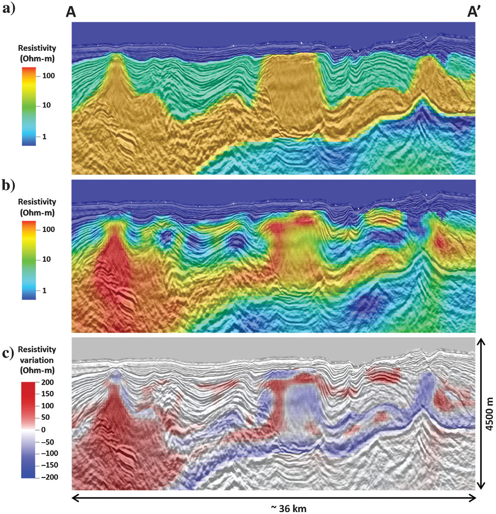

.. _red_sea_modelCSEM:

Model-Driven CSEM Inversion
===========================

Data
----

Data corresponding to the model-driven MT inversion were discussed in the :ref:`data-driven CSEM inversion <red_sea_dataCSEM>` section.

Processing
----------

The large velocity contrast that occurs at shallow depth between halite and the surrounding sediments largely affects the propagation of seismic waves and the consequent reconstruction of migrated seismic events at depth. It is therefore extremely important to sufficiently resolve the details of salt structures in the shallow overburden to obtain reliable seismic images at depth. 

To improve the results of the CSEM inversion, the final results from the model-driven MT inversion are modified and used as a starting model. The MT model is modified by introducing an additional interpretative surface to distinguish between the top LES and the interpreted top of the halite layer; both surfaces are typically picked with some level of confidence by seismic interpreters. The interval between the top LES and top of the halite layer is set to a constant resistivity value. As done for the 3D MT inversion, the only constraint introduced in the model-based approach consists of a more elaborate starting model, as all the model cells (except for the water layer) are free to vary during the inversion. 

The 3D CSEM inversion was run using the Ex component along the inline and for one broadside line on each side of the towline (i.e., three lines of receivers for each tow line) with maximum inline offsets of 15 km and a frequency of 0.4 Hz. Tests performed by adding the frequencies of 0.8 and 2.0 Hz did not show significant variations in the inversion results. Recall from “data-driven CSEM inversion” that the complex CSEM responses due to the prevalence of LES (i.e., mini-basins) can only be properly characterized by introducing an anisotropic resistivity. As a result, model-driven inversion of CSEM was performed by introducing both a horizontal and vertical resistivity.

Interpretation
--------------

The comparison between the depth slice at ~1800 m (m.s.l.) through the CSEM (Rh) resistivity volume with the corresponding depth slice through the velocity volume derived from current seismic interpretation (:numref:`fig_red_sea_mod_driven_CSEM`) shows the capability of CSEM inversion to map the main geologic features; including the main halite bodies and the bounding mini-basins in the LES. The velocity structures in the LES mini-basins are the main source of uncertainty in the velocity model building. This is also the area where significant discrepancies occur between the CSEM results and the current velocity models (:numref:`fig_red_sea_mod_driven_CSEM`). The whole northeastern side of the Area-1 block (i.e., coast side/right part of the figure) indicates relatively high velocity from seismic interpretation and relatively low resistivity (Rh) from CSEM inversion, suggesting that initial seismic interpretation might have overestimated the velocity in the mini-basins; as we expect very high seismic velocities to correspond to significantly resistive evaporites. The opposite effect is observed in the southwestern corner of the resistivity image, where the CSEM inversion is introducing high resistivity in the shallow section of the deformed LES package. In this case, CSEM inversion results suggest the possibility of high velocities due to evaporite concentrations which does not corresponding to the current seismic interpretation.

.. figure:: images/CSEM_mod_driven_inv.png
    :align: center
    :figwidth: 90%
    :name: fig_red_sea_mod_driven_CSEM

    Area 1 horizontal cross section at −1800 m (m.s.l.) comparing: (a) the model-driven 3D CSEM inversion with (b) the corresponding depth slice through an interpretation-based velocity volume. The depth slice indicates the position of the well and of the vertical cross sections displayed in :numref:`fig_red_sea_mod_driven_CSEM`. The arrows on the resistivity image indicate areas of discrepancy of the resistivity and seismic velocity patterns.

The 3D CSEM resistivity inversion results are also displayed by means of cross section along the crossline direction and through the main halite body (:numref:`fig_red_sea_mod_driven_CSEM2`). The inverted horizontal resistivity (Rh) is displayed co-rendered with the 3D reverse time migration (RTM) depth image together with the start model and the model updates. Although the overall inversion result is quite similar to the starting model, the close analysis of the resistivity distribution reveals the presence of fine layering resistive structures consistent with the top Messinian unconformity. The thin high-resistivity top LES layer corresponds to under-corrected residual moveout on depth migrated seismic image gathers which require an increase in velocity consistent with the position of the high resistivity layer. CSEM inversion is also able to refine the structure of the main halite bodies and make their shape more consistent with the reflections off the flanks of the structures as imaged by RTM. The analysis of the model updates is even more revealing because the CSEM inversion adds resistivity to features that can be visually interpreted as halite concentrations (e.g.,main salt bodies and salt concentrations above the interface with the conductive sediments underneath), and in general subtracts resistivity from parts of the model where the fine layering would suggest a larger clastic content. CSEM also shows sensitivity to the underlying conductive sedimentary section where the inversion tends to update the base of salt all over the model to make it more consistent with the seismic image. It should be noted once more that no constraints are imposed during the inversions and all the cells of the model are free to vary except for water.

    Model-driven 3D CSEM inversion results from Area-1 for the salt overburden along the crossline direction. (a) Starting model using the modified 3D MT inversion where an additional interpretive surface is added to mark the top of the LES and top of the halite (b) Horizontal resistivity (Rh) from CSEM inversion. (c)  Model updates due to the inversion. The 3D CSEM inversion provides a refined description of the main halite bodies and identifies a thin highly resistive layer consistent with the position of the top LES unconformity. The white spots on the bathymetric surface represent the projection of the CSEM tow-lines onto the plane of the section (i.e., perpendicular to the plane of the figure).

It should be noted that the acquisition parameters used in the current MT/CSEM acquisitions are suboptimal for imaging the details of the shallow LES structures as the spatial sampling especially in the crossline direction is unsatisfactory. The imaging of the shallow structures in the LES can be obtained effectively only in the inline direction where the sparse spatial sampling of the EM receivers is compensated by a dense source spacing. This doesn’t occur in the crossline direction, where a gap of 3 km exists between each subsequent row of receivers. The result is that the thin resistive layer representing the top LES can be reconstructed mostly in the inline direction, while it appears as patches of high resistivity below the towlines when observed in the crossline direction

