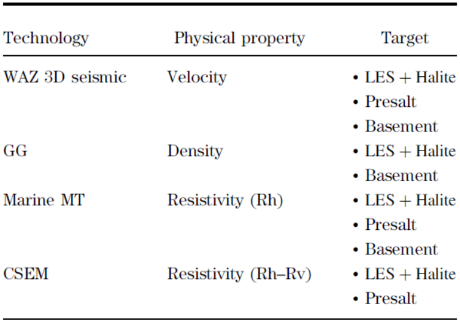

.. _red_sea_properties:

Properties
==========

The physical properties relevant to this case history are: seismic velocity, density and electrical resistivity (horizontal and vertical). Geological structures within the Red Sea basin are each characterized by a specific set of physical properties. As a result, these structures are sensitive to one or more geophysical survey methods. Geophysical methods employed for this case study, and the structures which are expected to be sensitive to each method, are tabulated below. As we explained in the setup however, WAZ 3D seismic was not overly sensitive to subsalt structures due to a large reflector at the base of the LES.

    Table showing the combined seismic and nonseismic technologies deployed for the exploration of the Red Sea together with the geologic/geophysical targets identified for each methodology.

