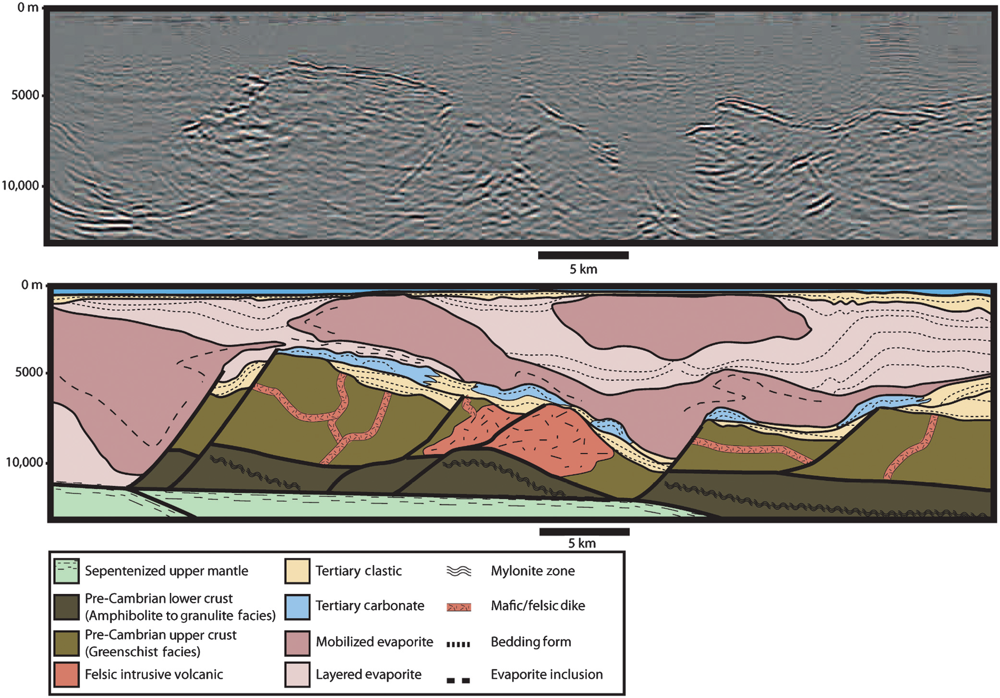

.. _red_sea_setup:

Setup
=====

The Red Sea is marked by thick salt sequences which act as a seal for potential hydrocarbon accumulations within Tertiary sedimentary units (:numref:`fig_red_sea_geology`). Unfortunately, the use of seismic methods alone is unable to sufficiently constrain the regional geological setting. This is primary due to the presence of layered evaporite sequences (LES) which contain mobilized salt bodies interbedded with clastic deposits. Sedimentary packages such as these are responsible for generating significant vertical and lateral velocity variations, which distort acoustic energy. It is therefore extremely difficult to constrain the near-surface geology with standard seismic practices. The top of the LES is also characterized by a high velocity anhydrite zone, which acts as a strong reflector and creates a significant velocity inversion below. As a result, seimic methods are not very sensitive to subsalt structures within the Red Sea rift basin. The basement lithologies are also variable and highly deformed, complicating seismic interpretation such that it is difficult to accurately determine a lower bound for the hydrocarbon-bearing sedimentary sequence with seismic alone. 

.. These challenges are illustrated in :numref:`fig_red_sea_geology`. The complicated geologic structure and associated velocity model makes it difficult to obtain high quality images from seismic data (the top image is an uninterpreted seismic depth image). Note the presence of up to 6000 m of mobilized salt and layered evaporite that lies almost directly beneath the sea bed and overlies a relatively thin section of pre-evaporite sediments of mixed lithology.

    (Top) Uninterpretted seismic image. (Bottom) Regional geology of the eastern Red Sea. Basement consists of Pre-Cambrian lower and upper crust, felsic intrusive volcanics and serpentinized upper mantle. PrES unit consists of Tertiary clastic and carbonate sediments overlying the Pre-Cambrian basement. Layered and mobilized evaporites within the LES are explicitly labelled in the legend. PoES unit consists of Tertiary clastic and carbonate sediments which extend from the surface to the top of the layered and mobilized evaporite sequence. Note the presence of up to 6000 m of mobilized salt and layered evaporite that lies almost directly beneath the sea bed and overlies a relatively thin section of pre-evaporite sediments of mixed lithology.

Geology
-------

Our current understanding of the regional geologic setting is derived from literature as well as an extensive 2D seismic program run in 2007-2008. The geologic setting of the eastern Red Sea is characteristic of a rift-basin. The continuous subsidence and faulting associated with rifting has resulted in complicated and dynamic structures within the overlying layered sedimentary sequence. The regional geology has been divided into four tectonostratigraphic units and one  significant, regionally extensive unconformity; these are described below and shown in :numref:`fig_red_sea_geology`.

**Post-Evaporite Sediments (PoES):** The post-evaporite sedimentary unit consists of interbedded, deep-marine siltstones, mudstones, and siliceous ooze which has been deposited since the Pliocene. The PoES unit is generally flat-lying, except where it is locally deformed, thickened and/or thinned by the movement of underlying mobilized evaporites. Locally, the well-layered structure of the PoES can be disrupted by carbonate pinnacles. The PoES unit ranges in thickness from <100 meters over actively rising salt diapirs to over 500 m within subsiding mini-basins.

**Messinian Unconformity:** The Messinian unconformity separates PoES from the layered evaporite sequence (LES).  The top of the LES  is marked by an abrupt increase in seismic velocity (2,000 m/s to 5,000 m/s). This increase in seismic velocity is due to an anhydrite layer and it manifests itself as a low-frequency, high-amplitude seismic event. 

**Layered Evaporite Sequence (LES):** The mid to late-Miocene layered evaporite sequence comprises most of the Tertiary stratigraphic thickness within the survey region. The LES contains thick halite sequences which act as a seal for potential hydrocarbon accumulations. The thickness of the LES varies between 1 km and 10 km. The LES consists of both layered and mobilized evaporite sediments, whose initial deposition occurred in three stages: an early evaporite-prone phase, a clastic-prone phase, and a late evaporite-prone phase. Mobilization of LES sediments is due to the extension, subsidence and faulting associated with ongoing tectonic rifting. The earliest depositional phase is the primary source of the mobilized evaporites.
 
**Pre-Evaporite Sediments (PrES):** Knowledge of the pre-evaporite sediments in the deep water portion of the Red Sea, including its thickness, is limited to a very small number of well penetrations. These wells suggest that most of the early to mid-Miocene PrES consists of fine-grained sand, silt, and shale. Nevertheless, tectonic and kinematic reconstructions of the Red Sea suggest the earliest portion of the unit (late Oligocene to early Miocene) consists of mixed carbonate and clastic facies with rapid lateral transitions. These sediments are deposited within fault bounded mini-basins resulting from tectonic rifting. If present, the mixed carbonate and clastic facies would be responsible for significant lateral variations in seismic velocity, density, and resistivity.

**Pre-Cambrian Basement:** The Pre-Cambrian basement is characteristic of a rift-basin. This unit is highly deformed and comprised mainly of metamorphosed intrusive and extrusive volcanics and metasediments. The basement has been intruded or overlain by Tertiary dykes, sills and basalts. The depth to the basement varies North to South within the Red Sea. The structure of the rift basin topography varies according to the rate of extension, the composition of the crust prior to extension, and the presence of additional geodynamic processes such as mantle plumes.

Goal
----

In this case history, we detail the use of magnetotelluric (MT) and controlled-source electromagnetic (CSEM) methods for imaging the described main geologic features. We assess the ability of MT and CSEM methods to recover subsurface structures independently. By using MT and CSEM methods as well as wide-azimuth seismic (WAZ), we are able to carry out a comprehensive set of surveys which are collectively sensitive to all geologic structures. The results of data driven and model driven EM inversions are then compared to results from the inversion of gravity gradiometry (GG) data.

The ongoing work on seismic depth imaging takes advantage of the derived resistivity parameter distribution to guide velocity model building of the complex evaporitic overburden from the point of view of interpretation-driven workflows (unpublished) and from the point of view of data-driven seismic-CSEM joint inversion (Colombo et al., 2017).

