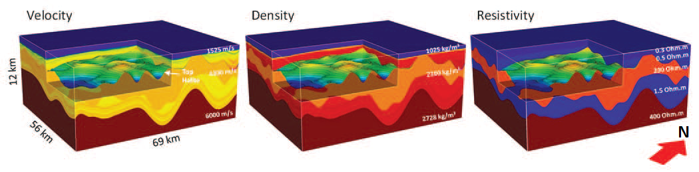
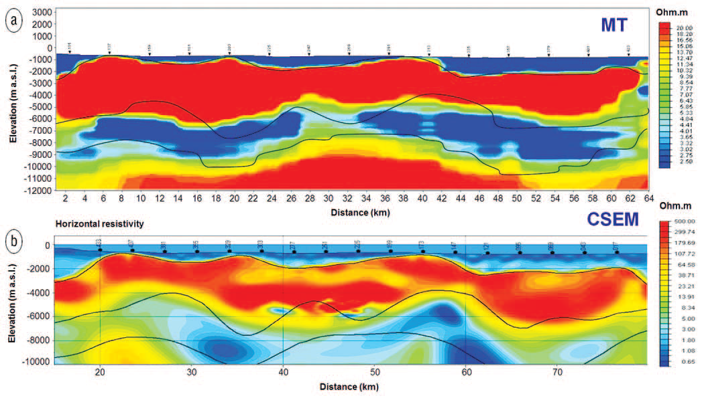
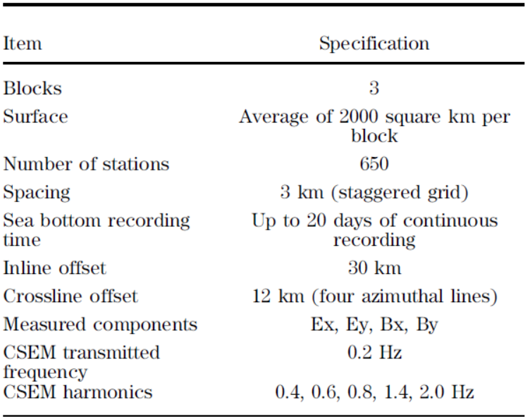

.. _red_sea_survey:

Survey
======

Pre-Survey Modelling Studies
----------------------------

Although the geology of the Red Sea rift basin is poorly constrained, we have a general understanding of its composition, physical properties and structure. In this exercise, a synthetic model is used to predict field data for a particular survey method. The field data are then inverted in order to try and recover the synthetic model. By inverting synthetic field data, we can determine whether or not the survey method is sensitive to particular geological structures. This approach can ultimately be used to determine the set of geophysical methods best-suited for resolving all geological structures within the survey region.

The synthetic 3D model (:numref:`fig_red_sea_3synthmodel`) was constructed using a-priori information from off-shore 2D seismic, aeromagnetic, aerogravity, well-log and other geological data. The top and bottom margins of the LES were obtained from the interpretation of a grid of depth-migrated 2D seismic lines, followed by interpolation into a 3D volume. The top margin of the basement geology was inferred from the interpretation of 2D seismic, aeromagnetic and aerogravity data; each of which included forward modeling and/or inversion. The bulk resistivity parameters for each layer were derived from the combined analysis and upscaling of available well logs. The interval velocity was derived mainly from depth-imaging velocity analysis. Density distributions for sedimentary sections were obtained by using Gardner’s relation to convert imaging velocities. The density distributions for evaporites were determined based on existing literature and other geologic considerations.

    Synthetic model for assessment of various geophysical survey methods.

Inversion results for both MT and CSEM are shown in :numref:`fig_red_sea_synthMTinv`. For each inversion, the top of the LES was fixed, as it is assumed to have been correctly derived from seismic interpretation. Inversion results indicate that both the MT and the CSEM data can resolve the base of the LES sequence (top of the PrES), with CSEM obtaining the highest resolution. Only the MT data were able to resolve the geometry of the basement. Ultimately, the results suggest that a combination of broadband MT and long-offset/ low-frequency CSEM would be able to help in deep subsalt exploration in the Red Sea. 

    Inversion results for the synthetic MT (a) and CSEM (b) data sets. Both inversions resolve the base of salt, while only MT resolves the basement (black lines are used to indicate from top to bottom: top LES, base of salt and top of basement surfaces).

Survey Details
--------------

.. figure:: images/geography.png
    :align: right
    :figwidth: 50%
    :name: fig_red_sea_geography

    Multi-geophysics acquisition in the Red Sea where high-resolution marine electromagnetics (MT and CSEM) and gravity gradiometry (GG) were acquired on the seismic wide azimuth (WAZ) 3D surveys. In this case history, we focus on the interpretation of surveys associated with Area 1.

MT and CSEM data acquisition was carried out in the summer of 2011 for three survey blocks (:numref:`fig_red_sea_acquisition`). In this region, the ocean bottom lies at depths which exceed 250 m. Some parameters relevant to the surveys are detailed in :numref:`fig_red_sea_acquisition`. The area occupied by the combined MT and CSEM acquisition coincides with the full fold area of the wide azimuth (WAZ) seismic acquisition and full tensor gravity gradiometry (GG) acquisition. As a result, the volume of each WAZ block is equally sampled by three dense and high-resolution geophysical data sets, which provides a unique opportunity for multi-geophysics data integration. At the time of the data acquisition, the survey was reported to be the world’s largest combined marine EM (MT+CSEM) project ever undertaken. For this case history, we will focus primarily on results related to Area-1.

EM receivers were deployed on the sea floor in a staggered grid with a 3-km nominal offset between stations. For each deployment, the EM receivers remained on the sea floor for a total average time of about 12 days and up to 20 days in a few cases, where both CSEM and natural MT signals were recorded. This extended deployment period allowed for the processing of long time-series windows for the estimation of the magnetotelluric impedance tensor components.

    Acquisition parameters for the combined MT/CSEM survey in the Red Sea.

Each survey block was acquired by performing multiple deployments of the receiver patches. This was done to allow data acquisition for offsets of more than 30 km in the inline direction and 12 km in the crossline direction (i.e. perpendicular to the source), with four azimuthal receiver lines actively recording on each side of the source lines. Large cross-line (or broadside) offsets enabled the measurement of EM fields which are more sensitive to the horizontal resistivity (Rh), as opposed to inline measurements which are more sensitive to vertical resistivity.  Ultimately, this survey geometry enables a better discrimination of electrical anisotropy (Newman et al., 2010) and enhances the data sensitivity to the conductive subsalt section.

