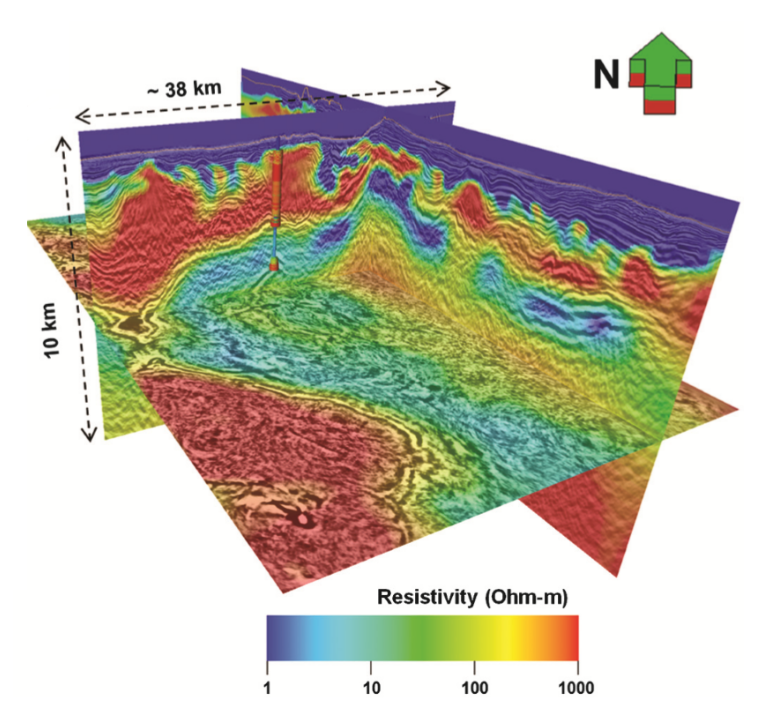
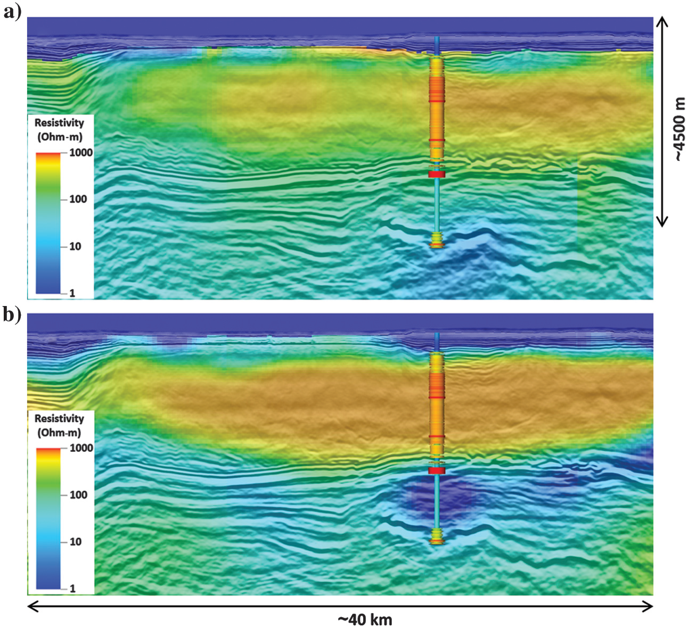
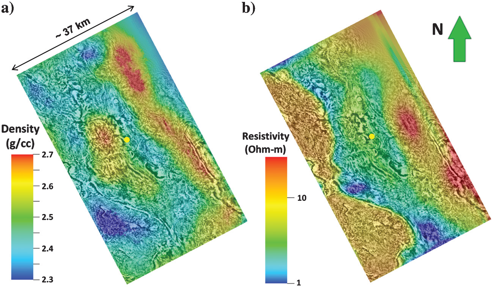
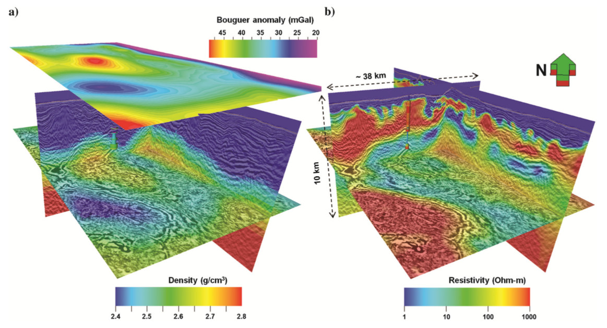

.. _red_sea_synthesis:

Synthesis
=========

MT and CSEM Results
-------------------

The analysis of the EM datasets demonstrates excellent sensitivity to the main geologic/structural units (:numref:`fig_red_sea_synthesis`). Starting from the MT data set, we observe that a simple 3D data-driven inversion of the data is capable of deriving the main geologic features and specifically the base of the salt, the thickness of the conductive subsalt sediments, and the main basement structures. The inclusion of interpretation for the definition of the starting model further boosts the resolution of the MT inversion by enhancing the imaging of the pre-salt sediment package and by sharpening the basement. Depth positioning errors deriving from the analysis of the resistivity images and well data are estimated to be within 8% for the base of salt to about 12% for the basement. Although the more accurate depth estimate for the base of salt can be justified by the presence of a major geoelectric contrast between the resistive salt overburden with the underlying conductive sediments, the less accurate result obtained for the basement should be interpreted in the context of two key factors: first, the size of the structure targeted by the well is smaller in the structural dip direction (i.e., the expected TM polarization) than the station spacing, and second, the lithologic nature of the basement (e.g., weathered volcanics are considered to be expression of the basement) is consistent with a gradual increase of resistivity, which lack the sharp contrast observed at the base salt level. Given the extensional tectonic regime, we can expect that different volcanic episodes, intercalated by periods of sedimentation would constitute a transitional geologic interval overlying a deeper crystalline basement. Intrusions such as sills can also be part of the geologic framework. These considerations lead to the conclusion that the basement depth and structures imaged by MT are a satisfactory representation of this uncertain geologic horizon.

    Final resistivity model for Area-1.

The applicability of CSEM in a subsalt exploration scenario has been carefully evaluated during the planning phase because applications of CSEM for subsalt structural imaging are rarely reported in literature: the work by Vöge et al. (2010) represents one of the few published cases. Extensive presurvey modeling has been performed for this purpose to determine the sensitivity of long offset CSEM data to the expected subsalt structures (Colombo et al., 2013). The described inversion workflows implemented for 3D CSEM imaging clearly illustrate the sensitivity of the method to the base of salt (i.e., estimated 8% depth error) and high sensitivity to the internal LES and halite structures. The resistivity images of the main halite bodies and mini-basins in the salt overburden, as well as the details of a thin high resistivity horizon in proximity of the Messinian unconformity (top LES), are consistent with the geologic interpretation and well results. Well data confirm the presence of a thin anhydrite crust (and other evaporites, e.g., salt) at the Messinian unconformity followed by mobilized halite, while clastic-prone mini-basins (not intersected by the well) are consistent with the geologic interpretation.

The results obtained from the CSEM modeling were used by interpreters to enhance the velocity structure for pre-stack depth migration. This interpretative approach (unpublished) was recently followed by the development and application in Area-1 of joint inversion of seismic travel times and CSEM. This resulted in enhanced velocity for the LES package and improved depth imaging for the base of salt and basement, when compared with the results of a seismic-only workflow (Colombo et al., 2017).

Comparison to Gravity Gradiometry
---------------------------------

Gravity gradiometry data were also collected during the survey. Here, the density structure recovered through gravity inversion is compared to the resistivity structure recovered through MT and CSEM inversion.

Gravity gradiometry data are sensitive to the distribution of subsurface densities. Whereas pre-evaporite (PrES), post-evaporite (PoES) and the layered evaporite sequence (LES) have similar average densities, the Precambrian basement is significantly denser; although deeply buried anhydrites, pre-salt clastics and halites within sedimentary units have distinct densities. As a result, we expect the inversion results for gravity gradiometry data to be most sensitive to the structure of the basement (:numref:`fig_red_sea_dataCSEM_well_compare`).

    Comparison of MT and CSEM derived results to gravity gradiometry (a) 3D gravity inversion showing primary sensitivity to the basement structures. (b) 3D CSEM inversion from the MT starting model detailing the internal structures of the LES and halite.

The inversion of gravity gradiometry data was performed according to the method proposed by Li and Oldenburg (1996). In :numref:`fig_red_sea_synthesis_gravity` we compare the density distribution at 5,200 m depth (consistent with basement) with a resistivity depth slice from model-driven 3D MT inversion results. The results of the gravity inversion provide additional information regarding the depth of the basement and can be used to confirm the uplifted basement structures recovered through MT inversion. The resistivity distribution for the eastern and central parts of the block indicates a strong correlation (positive-positive) with the density distribution in the basement from 3D gravity inversion. The seaward side of the block shows the presence of negative density anomalies that correlate to high-resistivity lobes in the MT inversion. The southwest high-resistivity areas are bounded by bright reflections and represent the thickening of the salt in this side of the block. The low-density distribution in this area correlates perfectly with this model but also records the deepening basement topography. The basement structure drilled by the well and expressed by an increase of the density and resistivity log values is not mapped by the gravity and MT inversion results.

Density and resistivity distributions in the center and the coast side (northeast) of the block confirm the presence of basement highs (:numref:`fig_red_sea_synthesis_density_resistivity`). In the same areas, salt structures are mainly evidenced by the resistivity volume confirming the low sensitivity of the gravity measurements to structures within the LES. On the seaward side of the block (southwest) the density and resistivity distributions are anticorrelated. Here, the thickening of the salt, evacuated from proximal areas to distal areas along decollement planes, results in low-density anomalies and in high resistivity values.

    Comparison of basement and salt related structures at −5200 m (m.s.l.) from Area-1. (a) Density distribution from 3D gravity inversion. (b) Resistivity distribution from 3D MT inversion.

    Final density-resistivity integrated model for Area-1 derived from independent 3D inversions. (a) Density. (b) Resistivity.

In Closing
----------

The interpretation of such a complete and multi-parameter data set for a common Earth model is an evolving task where the introduction of new information, such as new well logs, inevitably leads to the adjustment and partial re-interpretation of the model. The results obtained to date, based primarily on 3D geophysical inversion (EM-gravity) with interpretation and well control, provide a comprehensive representation of a multi-parameter geophysical model honoring at the same time the data measurements and the expected geology. Recent development and application of geophysical joint inversion between seismic and EM, followed by depth imaging (Colombo et al., 2017) have further strengthen the importance of multi-physics integration for the successful exploration of complex geologic structures such as the subsalt plays in the Red Sea.
