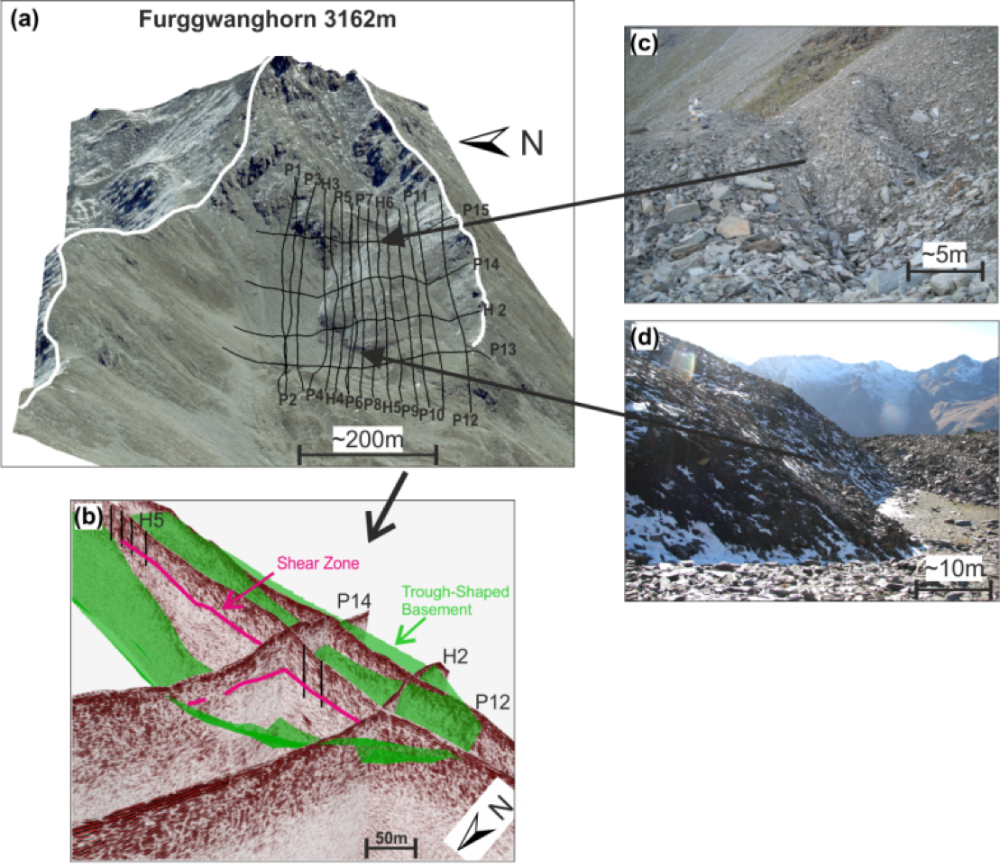

.. _rockglacier_index:

3D Helicopter GPR surveying a rock glacier
==========================================

.. raw:: html
    :file: ../../../underconstruction.html

- **Authors**: :ref:`agreen`, :ref:`kmerz`, and :ref:`hmaurer`
- **Reviewer**: :ref:`skang` and :ref:`doldenburg`

.. topic :: Prelude

    Extreme heterogeneity and rugged mountainous terrains characterized by steep slopes and bouldery surfaces make rock glaciers amongst the most difficult geological features to explore using surface-based geophysical techniques. Conventional ground-penetrating radar (GPR) surveys have produced valuable subsurface information for many rock glaciers, but usually only along sparse lines because of the generally challenging to treacherous recording conditions (:numref:`furggwanghorn_heligpr` c and d). Surface-based GPR surveys of other rock glaciers have failed to yield anything meaningful. In an attempt to provide useful subsurface information for a greater number of rock glaciers and to supply reliable images of their entire 3D structures, we conducted the first ever 3D GPR survey of a rock glacier using a helicopter mounted system. Helicopter GPR (H-GPR) has previously been employed for mapping conventional glaciers. Our results suggest that the H-GPR technique would be a practical means for exploring many other difficult to access terrains.

    Frontal view of the Furggwanghorn rock glacier showing the H-GPR lines (a).  Intersecting H‑GPR sections showing the trough shaped bedrock and major shear zone (b). Typical furrows and bouldery surface of the rock glacier (c) . Steep frontal slope (d).

    .. The primary paper from which this material is derived can be accessed `here <http://www.publish.csiro.au/EX/pdf/ASEG2016ab212>`_.

.. toctree::
    :maxdepth: 1

    setup
    properties
    survey
    dataprocessing
    interpretation
    synthesis
    lessons
