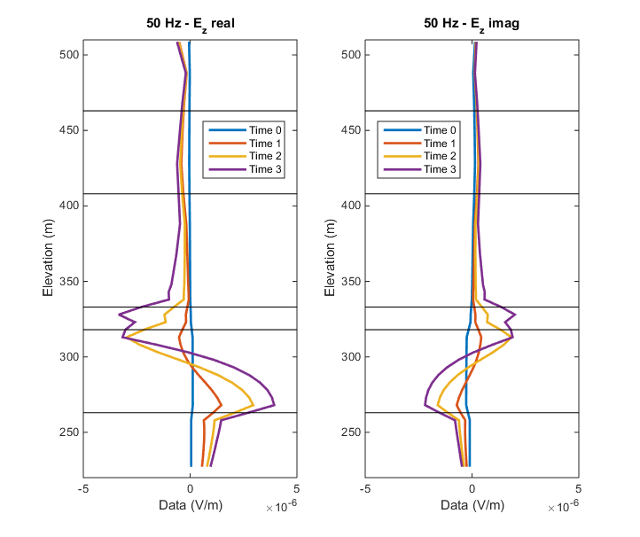
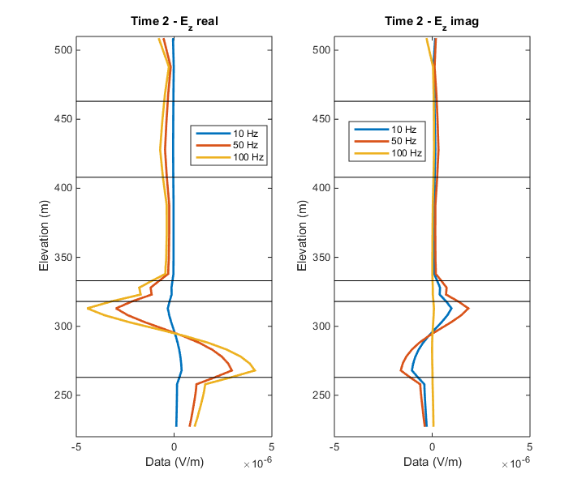

.. _sagd_data:

Data
====

        The data show changes over time, especially within the reservoir (between 320 and 260 m).

        The data show changes as frequency increases.

Because this is a synthetic example, the z-component of the electric field is :ref:`forward modeled <forward_modelling>` in 3D at each of the four time steps for the three selected frequencies using the :ref:`survey <sagd_survey>` and 2% Gaussian noise is added to the data.

:numref:`sagddata` shows the data from a single borehole location at 50 Hz. We notice that the data changes within the reservoir as time increases. Time 0 indicates when there is no steam present while more steam is injected into the reservoir at Times 1, 2, and 3. 

The data also change if the frequency increases, as indicated in :numref:`sagddata2`. By examining multiple frequencies, we obtain more information than when only the DC component (0 Hz) is collected.

In order to relate these changes in the data to changes in resistivity, we :ref:`invert <sagd_processing>` the data.
