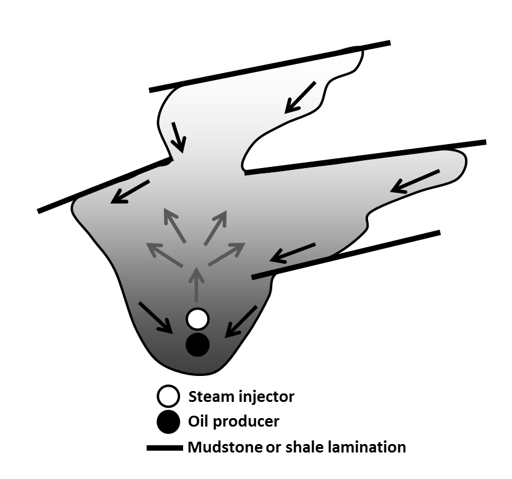

.. _sagd_index:

SAGD
====

.. raw:: html
        :file: ../../../underconstruction.html

- **Authors** :ref:`sdevriese`

.. topic :: Abstract

This case history is based on the thesis "Detecting and imaging time-lapse conductive changes using electromagnetic methods" by :cite:`Devriese2016`.

        A steam chamber that has irregularly grown due to heterogeneity. Figure modified from :cite:`Peacock2010`

Steam-assisted gravity drainage (SAGD) is a method for extracting heavy oil from the Athabasca oil sands in Alberta, Canada. This method uses steam to heat the oil, which then becomes movile and can be extracted. The research investigated the applicability of different electromagnetic surveys to monitor steam chamber growth and focuses on geologic region in the Athabasca oil sands. EM surveys can be a useful tool, in addition to the other monitoring techniques, because steaming causes a change in the resistivity of the oil reservoir.

The following paper provide additional information regarding this case history.

Background references:

- "Feasibility of electromagnetic methods to detect and image steam-assisted gravity drainage steam chambers" :cite:`DevrieseOldenburg2016`

- "Time-lapse three-dimensional electromagnetic inversion of growth-impeded SAGD steam chambers" :cite:`DevrieseOldenburg2015b`

.. toctree::
        :maxdepth: 1

        setup
        properties
        survey
        data
        processing
        interpretation
        synthesis

.. **References**

.. .. bibliography:: ../../references.bib
..      :style: alpha
..      :encoding: latex+latin
..      :filter: docname in docnames
               
