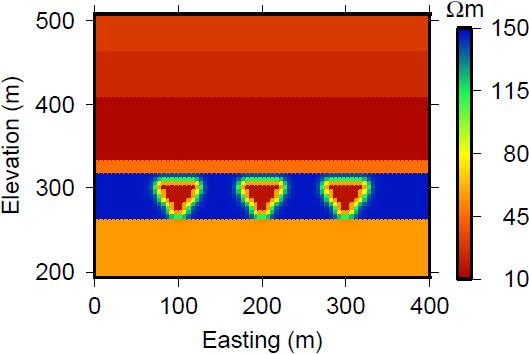

.. _sagd_properties:

Properties
==========

.. figure:: ./images/time1.png
        :figwidth: 40%
        :name: sagd2a
        :align: right

        A cross-section through the background resistivity model.

        A cross-section through the resistivity model containing 3 steam chambers.

The steam is injected into a resistive oil reservoir (:numref:`sagd2a`) and decreases its resistivity (:numref:`sagd2b`). The amount of change in the resistivity depends on a variety of reservoir parameters, including temperature, salinity, and wettability :cite:`mansure1993, martinez2012`.

In addition, the surrounding geologic layers have differing resistivities, as indicated in the table. The :ref:`Aspen <aspen_index>` case history describes an airborne EM method which was used to recover the resistivities of the upper geologic layers. 

The table below shows the resistivity values and thickness variations for each geologic layer and the steam chambers. A synthetic model was created with a single well pad that contains three sets of horizontal wells. An :ref:`EM survey <sagd_survey>` is used to monitor the growth of the steam chambers over time.

**Table 1:** The resistivity values and thickness variations for each goelogic layer and the steam chambers.

+-------------------------+-------------------------------+---------------+---------------------+
| Unit                    | Description                   | Thickness (m) | Resistivity (Ohm-m) |
+-------------------------+-------------------------------+---------------+---------------------+
| Quaternary deposits     | Glacial till, paleo-channels  | 60 - 100      | 29                  |
+-------------------------+-------------------------------+---------------+---------------------+
| Grand Rapids Formation  | Shales and sands              | 30 - 110      | 24                  |
+-------------------------+-------------------------------+---------------+---------------------+
| Clearwater Formation    | Shale                         | 65 - 90       | 12                  |
+-------------------------+-------------------------------+---------------+---------------------+
| Wabiskaw Formation      | Shales and sands              | 5             | 46                  |
+-------------------------+-------------------------------+---------------+---------------------+
| McMurray Formation      | Oil sands                     | 45 - 115      | 147                 |
+-------------------------+-------------------------------+---------------+---------------------+
| Steam                   | -                             | -             | 16                  |
+-------------------------+-------------------------------+---------------+---------------------+
| Devonian basemen        | Limestone                     | -             | 56                  |
+-------------------------+-------------------------------+---------------+---------------------+

