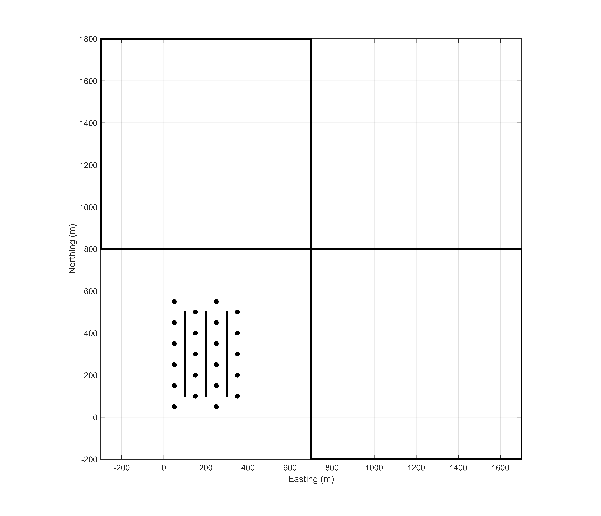

.. sagd_survey:

Survey
======

        Two surface transmitters, each 1 km by 1 km, at the surface are used individually and simultaneously to recover three SAGD steam chambers. For each survey, the z-component of the electric field is measured at receivers in boreholes (dots) that surround the three horizontal wells (black lines). Each boreholes has 33 receivers, spaced every 20 m. Receivers are spaced every 5 m in the bitumen reservoir.

Many EM surveys are possible and the choice of which survey to use is not easy or trivial. Here, we use a logistically-simple and cost-effective EM survey that has been shown to excite steam chambers :cite:`DevrieseOldenburg2016`. The survey consists of two large surface loops carrying harmonic waveforms at different frequencies: one to the east of the well pad and the other to the north. Each transmitter is 1 km by 1 km (:numref:`sagd3`). Because of the geometry, the EM fields couple differently with the steam chambers, and hence, the two surveys provide complementary information. 

The receiver locations are restricted to observation wells that are routinely drilled. Electrodes can be installed down-hole and measure the vertical electric field. Receivers are placed in 22 observation wells and spaced every 20 m, except in the reservoir where there are receivers every 5 m. This gives a total of 33 receivers in each well. Three frequencies were chosen based on skin depth: 10, 50, and 100 Hz.

:ref:`Data <sagd_data>` are collected at four different time steps to monitor the growth of the steam chambers over time. The time steps are (1) before SAGD starts, (2) at an early stage, (3) at a middle stage, and (4) at a late stage.

