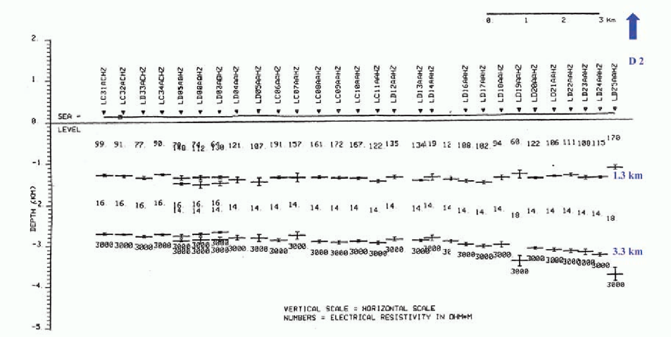
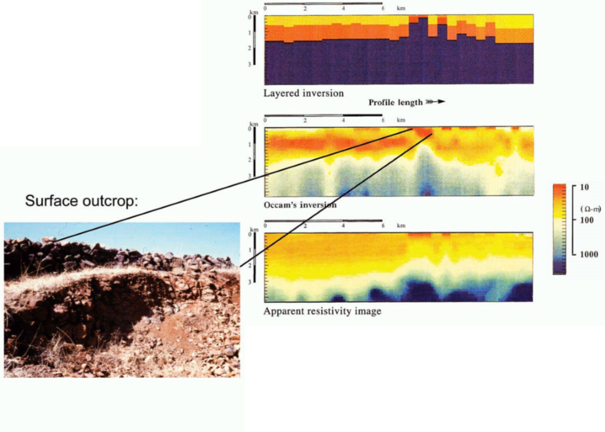
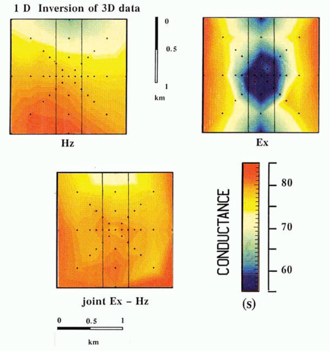
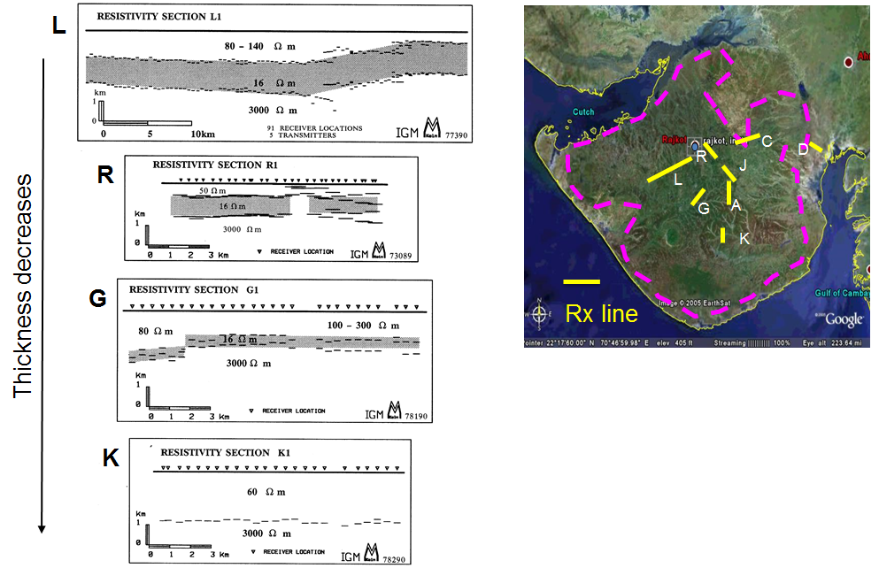
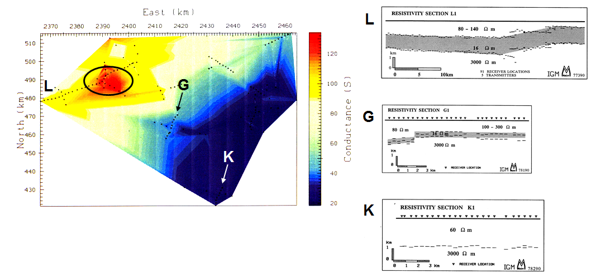

.. _saurashtra_processing_interpretation:

Processing and Interpretation
=============================

Stitched 1D Inversion
---------------------

:numref:`fig_saurashtra_1d_stitched` shows an example of one-dimensional stitched inversion using both electric and magnetic field measurements along an EW profile. The lower resistive Mesozoic sediments can be clearly seen under the more resistive Deccan trap basalt cover. The Mesozoic sediments also appear to be above a very resistive unit (later found to be basaltic in origin). The small error bars of the layer interfaces reflect the high data quality. Most inversions were run automatically overnight.

    Resistivity interpretation results for one EW profile showing the conductive sediments below the trap basalts. The small error bars indicate the 95% confidence interval and are influence in the inversion by the data errors. Well-derived layer boundaries from a well drilled a few kilometers northeast from the end of the profile at indicated on the right.
 
In a few locations, the 1D stitched inversion was insufficient in characterizing the local geology and a more sophisticated approach was needed. The top two panels in :numref:`fig_saurashtra_1d_outcrop` show the results of a layered and a smooth inversion, respectively (Constable et al., 1987). Notice the break in the horizontal structure near the middle. This break is also seen in the apparent resistivity (pseudo-section) image (Strack, 1992). Both inversions and the data image consistently show what seems to be a dyke-like 3D structure. The existence of the dyke was later confirmed by examining outcropping rock in the field at this location. A photo of the dyke-style structure can be seen at the left of :numref:`fig_saurashtra_1d_outcrop`.

    1D Stitched inversion and about dyke-like structure. Top) layered inversion. Middle) Occam's inversion. Bottom) apparent resistivity.

3D Modeling and 1D Inversion
----------------------------

The presence of dyke-like structures can be further investigated through synthetic 3D modeling. Here, we will focus on two objectives: first, confirmation that the anomaly observed in field-collect data can be explained by a resistive dyke and second, that the structure of the anomaly can be mapped using total conductance (vertically integrated conductivity). Further aspects such as vertical location of the anomaly and influence of the 3D anomaly on 1D inversion were investigated and supported the validity of the interpretation methodology. :numref:`fig_saurashtra_txrxlocations` shows a plan view of a conceptual model. The transmitter and receiver locations relative to the dyke are shown. Although the model is finite in extent, it can be considered infinite for practical purposes.

.. figure:: images/TxRxlocations.png
    :align: center
    :figwidth: 60%
    :name: fig_saurashtra_txrxlocations

    Synthetic model with dyke-like structure and transmitter-receiver configuration.

Subsequently, we generated a large set of model data for several profiles and used different inversion and modeling methods (Kriegshaeuser, 1992). Here, we have selected the one used by ONGC for the interpretation. :numref:`fig_saurashtra_conductance1` shows a plan view of the total conductance (vertically integrated conductivity) for the first and second layer across the dyke structure. The diagrams show the results after the 3D synthetic data were inverted with a 1D model (after adding noise). The top shows the inversion results for the vertical magnetic fields (top left) and electric fields (top right). The bottom shows the joint inversion results of both field components—the electric field, E, and the magnetic field, H. The electric field is clearly more sensitive to the resistor while the magnetic field does not see the resistor in the total conductance of layer 1 and 2; which is derived from the anomalous behavior of the total conductance over the 3D resistive anomaly. In fact, only the electric field alone clearly outlines the dyke. The Rajkot field data have two third electric field measurements, which is why you see the resistive dyke in the field data (Electric fields are more sensitive to resistors than magnetic fields). As a result, electric field data are capable of mapping the resistive structures associated with the type of anomaly observed in the data.

    Plan view of the total conductances for the first and second layer across the dyke structure. The diagrams show the results after the 3D synthetic data were inverted with a 1D model. On the top are vertical magnetic fields and electric fields shown respectively. The bottom shows the joint inversion results of both (After Kriegshaeuser, 1992).

Regional Interpretation
-----------------------

Through synthetic modeling, we have confirmed that LOTEM data are sensitive to both the Mesozoic sediments and volcanic basement. The results from several 2D inversions are shown in :numref:`fig_saurashtra_regional_interp`. Along profile L, the thickness of the Mesozoic sediments is quite large. However, as we move towards profiles in the SSE direction, the thickness of the Mesozoic sediments decreases. Along profile K, the inversion does not recover a Mesozoic sedimentary layer whatsoever. So overall, the thickness of the sediments generally decreases as one proceeds from north to south.

    Inversion results and regional interpretation of the Saurashtra peninsula.

One part of the final interpretation included the derivation of a total conductance map. These maps are used to estimate the amount of conductive sediments below the trap basalt. Before deriving the total conductance map, the data were corrected for 3D effects using the DC components of the electric field measurements (DC limits). :numref:`fig_saurashtra_regional_conductance` shows an interpolated total conductance map for the Saurashtra peninsula. The conductance map indicates a thickening of more conductive Mesozoic sediments below the Deccan trap basalts as one moves NNW.

    Total conductance map of the Saurashtra peninsula. The LOTEM stations are shown as black dots.

