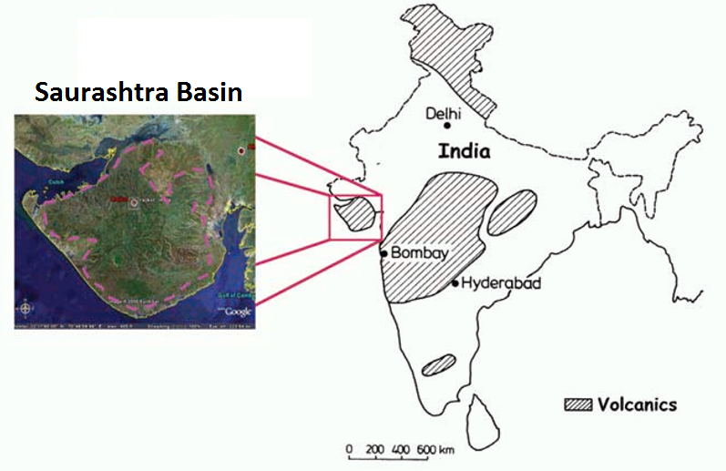

.. _saurashtra_setup:

Setup
=====

The Bombay High area in the Gulf of Cambay is an oil-producing region within India. An exploratory well within the Culch, a gulf north of the Saurashtra peninsula within the Saurashtra  basin (:numref:`fig_saurashtra_map`), also shows oil-producing potential. This has promoted the use of geophysical methods to map potential hydrocarbon reserves within the Saurashtra basin.

    Location of the Saurashtra basin and Saurashtra peninsula, India.

Seismic Imaging and the Deccan Trap Basalts
-------------------------------------------

The Saurashtra basin is marked by the Deccan trap flood basalts, which separate older Mesozoic sedimentary sequences from younger Tertiary sediments. These flood basalts act as a cap for hydrocarbon reservoirs within the Mesozoic era sediments. The interface between Tertiary sediments and the upper boundary of the Deccan trap basalts produces strong seismic reflections, making it an easy structure to image. However the anisotropy, heterogeneity and high seismic velocities of the Deccan trap basalts make imaging its base and the sedimentary units below very challenging with seismic methods. This has lead to significant difficulty in accurately delineating hydrocarbon resources within the Mesozoic era sediments. The Deccan trap flood basalts are also inter-bedded with thick layers (100s of metres) of fossil-bearing sedimentary rock which may contain additional reservoirs. The basement of the Saurashtra basin is comprised of dolerite dykes and basalts from the mid-Jurassic period.

Direct Current Resistivity Survey
---------------------------------

The inability of seismic methods to image sediments below the Deccan trap basalts has lead to the promotion of electromagnetic methods. In the 1980s, the ONGC performed a 2D direct-current resistivity (DCR) survey over the Saurashtra peninsula. This survey was able to recover the margins of the Deccan trap basalts and underlying Mesozoic sediments (:numref:`fig_resistivity_2d`). The survey was also able to outline the top margin of a very resistive basement layer. The recovered sedimentary thickness is quite thick and this motivates other surveys to verify this and also estimate the sedimentary thickness at other parts of the peninsula. 

.. figure:: images/Resistivity2D.png
    :align: center
    :figwidth: 80%
    :name: fig_resistivity_2d

    Resistivity section from 2D DC resistivity survey across the Saurashtra peninsula.

Goal
----

In this case history, a long-offset time-domain electromagnetic (LOTEM) survey is used to map Mesozoic sediments below the Deccan Trap basalts in northwestern India (:numref:`fig_resistivity_2d`). The key objective for the LOTEM survey is to determine the thickness of the basalts forming the Deccan traps and thickness of the underlying Mesozoic sediments which is a potential reservoir rock.  It is expected that this form of controlled-source electromagnetic method will be able to overcome the limitations seismic and DC resistivity methods.

