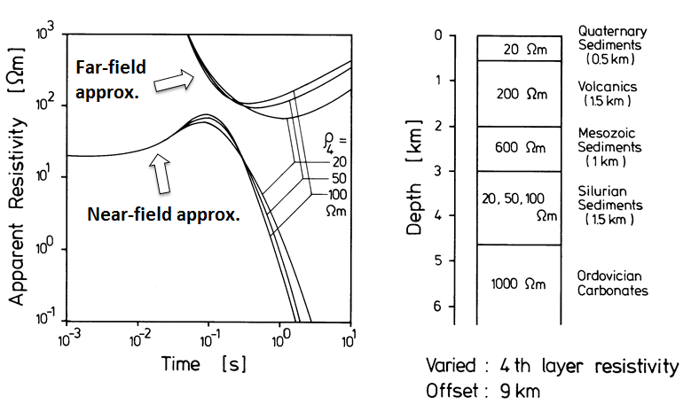
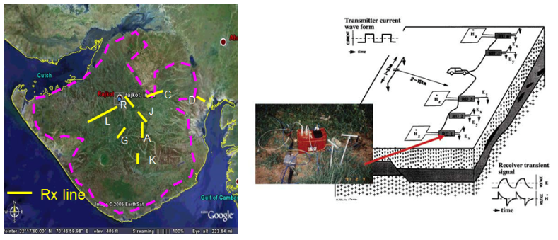

.. _saurashtra_survey_data:

Survey and Data
===============

LOTEM Survey Configuration
--------------------------

Long-offset time-domain electromagnetic (LOTEM) surveys use a grounded wire transmitter to produce the primary electromagnetic signal. Data are measured using both induction loop and electric field receivers (:numref:`fig_saurashtra_survey_config` a). The transmitter is kept stationary while the receivers are laid out in a spread that is moved in a manner similar to seismic surveys. Present configurations use second-generation 24-bit multichannel systems. At each site, one can mix the field components so that two components of the same type are always present at adjacent sites. This prevents data gaps and allows calibration across/along the spread to overcome near-surface statics, being a broadband system.
 
The induction current generates a secondary electromagnetic field, which is recorded as a time series and stacked. The LOTEM signals, as shown on the right of :numref:`fig_saurashtra_survey_config`, are recorded in raw form and then digitally processed pre-stack to get maximum signal-to-noise ratios; this includes prestack deconvolution (Strack and Vozoff, 1996). After prestack processing, the data are stacked and, after further poststack processing, converted into apparent resistivities which are then either inverted or directly imaged. Special care must be taken in all steps because preservation of the original data amplitude and timing is essential.

.. figure:: images/SurveyConfig.png
    :align: center
    :figwidth: 80%
    :name: fig_saurashtra_survey_config

    LOTEM system. a) Survey Configuration. b) Near-field and far-field apparent resistivity curves.

Sensitivity Analysis
--------------------

Before conducting a geophysical survey, you must be certain that the structures you want to characterize are sensitive to the proposed survey method. In this case, we must determine whether the basement and Mesozoic sediments lying under the Deccan trap basalts are sufficiently sensitive to LOTEM. If the Deccan trap basalts are too thick or the overlying rock/sediments are excessively conductive, recovery of the underlying Mesozoic sediments may prove difficult.
 
Synthetic modeling was used to determine whether the thickness of the Deccan trap basalts was problematic in recovering the underlying Mesozoic sedimentary unit. A 3 layer model was used to represent the regional geology (:numref:`fig_saurashtra_sensitivity1`). The Deccan trap basalts were assigned an electrical resistivity of 150 :math:`\Omega m`, the Mesozoic sediments were assigned a resistivity value of 20 :math:`\Omega m` and the basement was given a resistivity value of 1000 :math:`\Omega m`. The thickness of the Deccan trap basalt layer was then varied from 1.5 km to 2.0 km to 3.0 km. The width of the Mesozoic sediments was fixed at 3.0 km. Data were predicted using a transmitter-receiver offset of 10 km. Predicted data were subsequently converted to apparent resistivity values at each time channel using both a near-field and far-field approximation (:numref:`fig_saurashtra_sensitivity1`). The near-field approximation shows that the signal penetrates the Deccan trap basalts and that the underlying Mesozoic sediments are sensitive to the LOTEM. The far-field approximation shows that the basement is also sensitive to LOTEM, implying that it is possible to recover the upper and lower margins of sediments lying between the Deccan trap basalts and the basement.

.. figure:: images/sensitivity1.png
    :align: center
    :figwidth: 80%
    :name: fig_saurashtra_sensitivity1

    Apparent resistivity curves for synthetic 1D model to test the sensitivity of LOTEM to Mesozoic sediments and basement below Deccan trap basalts.

Because the geology of the Saurashtra peninsula is poorly resolved at depth, it is possible that the estimated thickness of the Mesozoic sediments and the depth of the basement from 2D DCR surveying is incorrect. The earth could be more complicated by having a Quaternary sedimentary layer at top. Also the  unit beneath the volcanics might be complex and the question is whether the conductive units can still produce a measurable effect. To test this, simulations were carried out. The thicknesses of the geologic units within the 1D layered Earth model were kept fixed. The conductivities are shown in the :numref:`fig_saurashtra_sensitivity2`). The resistivity of the Silurian sedimentary unit varied varied from 20 to 100 Ohm-m. Data were predicted using a transmitter-receiver offset of 9 km. Predicted data were subsequently converted to apparent resistivity values at each time channel using both a near-field and far-field approximation (:numref:`fig_saurashtra_sensitivity2`). The near-field approximation shows that even with the inclusion of a conductive overburden, the LOTEM signal is capable of penetrating through the Deccan trap basalts. Both approximations show that the Silurian sediment layer is sensitive to the LOTEM and that sedimentary units of varying type may be differentiated.

    Apparent resistivity curves for synthetic 1D model to test the sensitivity of LOTEM to possible Silurian age sediments.

LOTEM Survey over Saurashtra Peninsula
--------------------------------------

The data analyzed in this case study were acquired in the late 1980s during field work sponsored by the German government and India’s ONGC. The survey, covering around 400 sites in Gujarat, was carried out over three months. The acquisition parameters were based on forward numerical modeling of the survey response and the resistivities from a prior deep geoelectric sounding survey. Eight survey profiles (labeled A, C, D, G, J, K, L and R) were surveyed are shown in :numref:`fig_saurashtra_survey_map`.

    Locations of LOTEM profiles surveyed over the Saurashtra peninsula.

Quality Analysis of LOTEM Data
------------------------------

Synthetic modeling showed that LOTEM data were sensitive to the geological units we hope to resolve. However, certain geological units may be challenging to recover if the signal to noise ratio is insufficient. To assess the data quality, data from 4 stations (labeled 22, 23, 24 and 25) were converted to apparent resistivities using both the near-field and far-field approximations (:numref:`fig_saurashtra_data_quality`). At each station multiple time series were recorded and stacked. The :numref:`fig_saurashtra_data_quality` shows that up to 1 s, the data quality if very good. The similarity in resistivity curves among the 4 station indicates were are measuring good quality signals.

.. figure:: images/DataQuality.png
    :align: center
    :figwidth: 70%
    :name: fig_saurashtra_data_quality

    Apparent resistivity curves for 4 separate stations.

