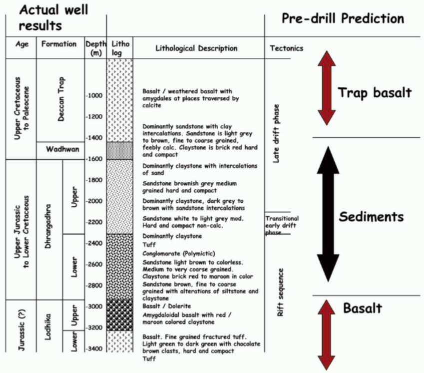

.. _saurashtra_synthesis:

Synthesis
=========

The data were integrated with gravity, deep seismic, and deep electrical sounding, and a well was drilled mostly on the LOTEM results and targeting the region of high electrical conductance. The interpretation from the well report is shown in :numref:`fig_saurashtra_well_log`. The agreement between the conductivity model recovered from inversion and the geologic information in the well is quite good. Basalts are in the well at the top and bottom of the profile and correspond to high resistivities. The interface boundaries determined by inversion are within 90–95% of the depth indicated from well logs. The case history shows that LOTEM is: 1) sensitive to the types of geological structures found at the Saurashtra basin, 2) capable of mapping the regional conductance, and 3) a viable method to obtain geophysical information from below basalt covers.

    Final interpretation from inversion of LOTEM data and confirmation with subsequent well-log data.

