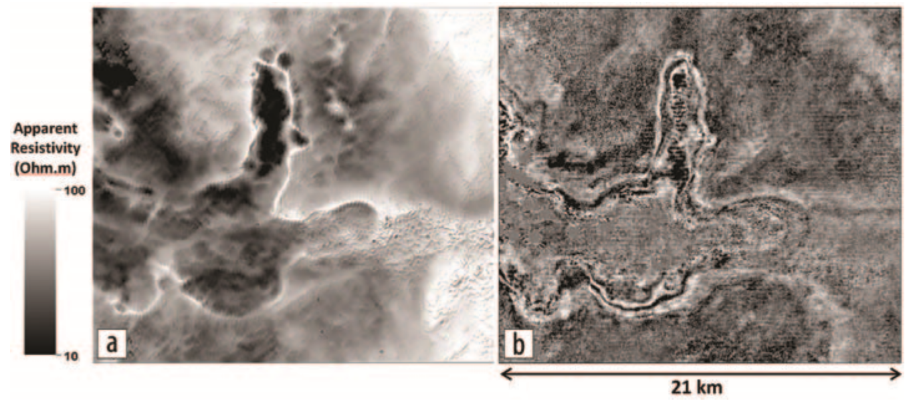

.. _wadi_sahba_data:

Data
====

The airborne system was flown along one line where ground-based TEM data were available. Soundings at corresponding locations were compared after performing an apparent resistivity transform (:numref:`fig_wadi_sahba_data_decays`). Results indicate overall consistency of the ground data and airborne data, with the former displaying usable measurements at shorter time intervals and the latter extending the data to the late times, often by one decade. HTEM data typically display more stable results than the corresponding ground-based TEM soundings, probably because of a more stable geometry of the transmitter-receiver loops.

.. figure:: images/DecayCurves.png
    :align: center
    :figwidth: 90%
    :name: fig_wadi_sahba_data_decays

    Comparison of helicopter-borne and ground-based TEM soundings at corresponding locations.

A concise representation of the acquired HTEM data is provided by :numref:`fig_wadi_sahba_data_apparentresistivity` a in which an apparent resistivity transform from the first time window after pulse shut-off is displayed in comparison to a shallow time slice at 164 ms of the stacked seismic cube after final processing (:numref:`fig_wadi_sahba_data_apparentresistivity` b). Distribution of the apparent resistivity matches structures displayed by the seismic amplitudes but at even higher resolution and without acquisition artifacts. Several details that are blurred or hidden on the seismic image become apparent on the resistivity map. The wadi area boundaries are sharply defined in the resistivity map as well as the parameter variations within the dune field located in the block's southeast quadrant. The area inside the wadi shows large variations of the apparent resistivity, suggesting the wadi interior structure to be more complex than a simple alluvial sediment infill. In addition, the HTEM data fill in the gaps created by surface access restrictions (e.g., farms) and dunes to complement the description of the near surface, which is largely undersampled by conventional seismic acquisition layouts.

    Comparison between (a) an apparent resistivity transform of HTEM data at first time chanel with (b) a seismic time slice at 164 ms.

