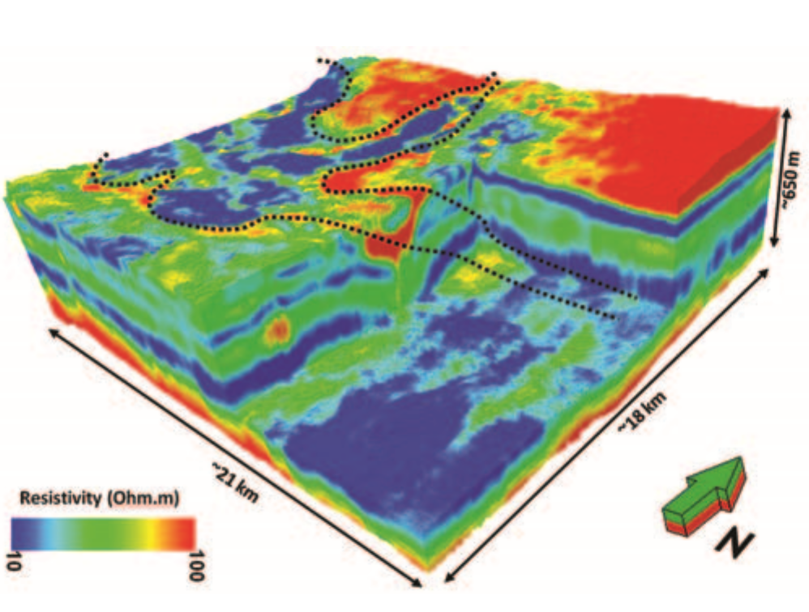

.. _wadi_sahba_index:

Wadi Sabha
==========

**Airborne and Ground Time-Domain EM results from the Albany Graphite Discovery**

- **Authors**: :ref:`dcolombo`, Gary McNeice, Diego Rovetta, Ernesto Sandoval-Curiel, Ersan Turkoglu and Armando Sena.
- **Editor**: :ref:`dccowan`, :ref:`doldenburg`, :ref:`skang` and :ref:`lheagy`.

.. topic :: Prelude

     This case history follows a comprehensive multi-physics and joint-inversion study of 3D non-seismic data over the wadi Sahba region off the coast of Qatar. The goal of this study was to accurately characterize complex near-surface structures and aid in the discovery of hydrocarbon reservoirs. The helicopter-borne TEM and MT data used for this study was collected in December, 2014.

**Special Thanks**

Thanks to the `Society of Exploration Geophysicists <http://www.seg.org/>`__ for permission to reproduce figures and adapt text from the source material, and thanks to Daniele Colombo of Saudi Aramco. This case history was adapted from the paper `"High-resolution velocity modeling by seismic-airborne TEM joint inversion: A new perspective for near-surface characterization" <http://library.seg.org/doi/abs/10.1190/tle35110977.1>`__.

**Abstract**

We discuss the use of helicopter-borne transient electromagnetic (HTEM) for a high-resolution spatial and vertical characterization of the near surface in a structure-controlled wadi in central Saudi Arabia. In this area, seismic data quality is poor, and seismic imaging suffers from a combination of scattering effects — due to swarms of faults reaching the surface — and large velocity variations occurring along subvertical boundaries between the wadi sediment infill and the surrounding carbonate plateaus. HTEM was selected from a suite of non-seismic methods for multiparameter velocity-model building to enhance the velocity estimation for the wadi and surrounding areas. HTEM data were modeled by performing spatially constrained 1D resistivity inversion to obtain a high-resolution image of the near surface with sensitivity to a depth of 400–500 m from the surface. Sharp boundaries of the wadi and fine vertical layering, obtained from the HTEM inversion, provide detailed information about the parameter variations in the near surface. A seismic-HTEM joint-inversion approach is developed using a cross-gradient structural operator to constrain the velocity inversion with the higher resolution HTEM data. Joint-inversion results provide sharp velocity reconstruction across the wadi boundaries and increase the dynamic range of the velocity variations when compared to a single-domain tomographic approach in which the HTEM contribution is ignored. Superior imaging results in both time and depth are derived from velocities estimated by the seismic-TEM joint-inversion approach.

.. toctree::
    :maxdepth: 1

    setup
    properties
    survey
    data
    processing_interpretation
    synthesis

