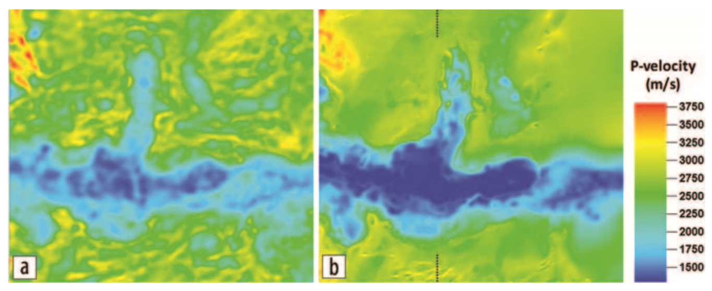
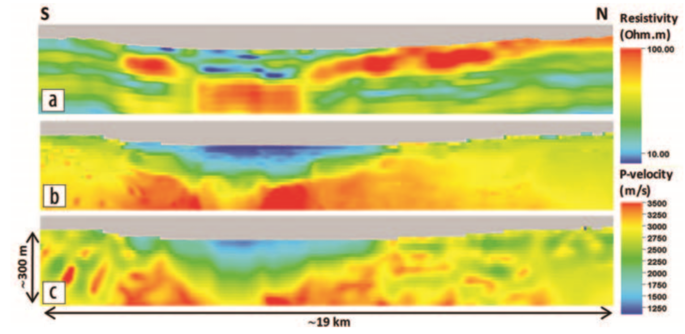

.. _wadi_sahba_processing_interpretation:

Processing and Interpretation
=============================

HTEM Data and Separate Inversion
--------------------------------

The individual multiphysics data sets were first processed and inverted separately to optimize corrections and noise removal, and to analyze the robustness of the different data sets and the consistency of the structural information they could provide. The results of such analysis provided evidence of strong structural similarity between the inverted resistivity and density and the existing seismic reflectivity and seismic tomography results (Colombo et al., 2015). The consistency of the information across different parameter domains and the resolution of the non-seismic data provided the necessary background for a quantitative integration approach based on multi-parameter joint inversion. The structural similarity with seismic and the dense spatial sampling of the helicopter-borne TEM data suggested they were the best candidates for joint inversion whereby we aim to capture the high-resolution structure details from resistivity measurements into the poorly resolved and noise-affected P-wave velocity model from inversion of FB traveltimes.

HTEM data processing consisted primarily of automatic elimination of outliers from the time-decay curves, masking of measurements above conductive infrastructure such as pipelines, tilt correction for transmitter and receiver loops, and system attitude accounted for in the forward modeling. Inversion was performed using a 1D inversion method with 3D spatial regularization (Rovetta et al., 2013). Acquisition geometry and the background horizontally layered geology suggest that a spatially constrained 1D inversion assumption is a reasonable choice (Viezzoli et al., 2008), further justified by the gain in computing speed and by the volume of data involved. Analysis of the horizontal components of the transient also indicates that the 3D effects are negligible. HTEM inversion results are shown in :numref:`fig_wadi_sahba_result_1`, where the deep roots of the wadi become evident in an otherwise subhorizontal stratified geology.

Our aim is to capture the high-resolution structural details of resistivity shown in Figure 5  into the poorly resolved and noise-affected P-wave velocity model that is obtained by inverting first break traveltimes. There many approaches by which this joint or cooperative inversion can be carried out. We outline ours in the following section.

.. figure:: images/Thumbnail.png
    :align: center
    :figwidth: 90%
    :name: fig_wadi_sahba_result_1

    HTEM inversion results of the study area with the outline of the wadi indicated by a dashed line. The resistivity distribution indicates the presence of deep roots below the wadi in an otherwise horizontally layered geology.

Joint-Inversion of Seismic and HTEM Data
----------------------------------------

The methodology for the joint inversion of HTEM and seismic data at wadi Sabha is outlined in the formative paper. The paper examined both simultaneous joint inversion and cooperative joint inversion approaches. As both approaches produced similar results, we will only discuss the outcome of the cooperative joint inversion. The simultaneous inversion of both slowness (Ms) and resistivity (Mrho) is made possible by connecting these two physical properties through empirical rock-physics relationships. For the cooperative joint inversion approach, the inversion result from one data type is used to guide the inversion of another. In this case, the resistivity model obtained through the inversion of HTEM data can be used to assist in the inversion of the travel time data.

The joint inversion imposes conditions which assume that slowness and resistivity structures are correlated, despite not knowing the exact nature of the correlation. This is accomplished by introducing a cross-gradient regularization term which must be minimized. Minimization of the cross-gradient functional corresponds to the minimization of the difference in direction of the model gradients independent of the corresponding sign. This property allows for correlated and/or anti-correlated features in the cross-gradient calculation, as long as they share common structure boundaries. In this study, the resistivity model from the HTEM inversion was used to evaluate the cross-gradient regularization in the inversion of the travel time data. The resistivity model was also used as a reference model in the travel time inversion in order to better constrain near-surface features.

A shallow depth slice of the velocity field from the cooperative inversion results (:numref:`fig_wadi_sahba_result_2` b) is compared to the velocity distribution obtained by traveltime inversion alone (:numref:`fig_wadi_sahba_result_2` a) where the same travel time input data set is inverted without the use of structural regularization to the resistivity model. The velocity model from joint inversion displays sharper velocity variations between the wadi and the surrounding plateau with a larger range of velocities. The velocity model from joint inversion also displays smoother, more stable velocity values in the plateau area where horizontal layering is expected.

    P-wave velocity distributions at 340 m elevation (MSL) derived from (a) stand-alone tomography and (b) joint inversion with resistivity as reference model through cross-gradient regularization. Both inversion results are shown at a common rms seismic traveltime misfit of 32.8 ms.

A cross section of the velocity and resistivity models (:numref:`fig_wadi_sahba_result_3`) shows the footprint of the resistivity distribution in the joint-inversion velocity model providing overall sharper spatial resolution and larger dynamic range when compared to the results of the standalone traveltime inversion. This can be explained by the mechanism of regularization imposed on the noisy traveltime data that, in the case of stand-alone inversion, is provided by a Laplacian smoothness regularization acting on the velocity model and, in the case of the cooperative inversion, is provided by the cross-gradient structural constraint linking the velocity model to a high-resolution and stable resistivity distribution. The cooperative joint-inversion scheme allows us to combine at the same time an effective regularization of the noise with a boost in the model resolution.

    Cross section through the wadi area comparing (a) the resistivity model from HTEM inversion, (b) the P-wave velocity model from cooperative joint inversion of first-arrival traveltimes and HTEM resisitivity model, and (c) the P-wave velocity from stand-alone traveltime inversion.

