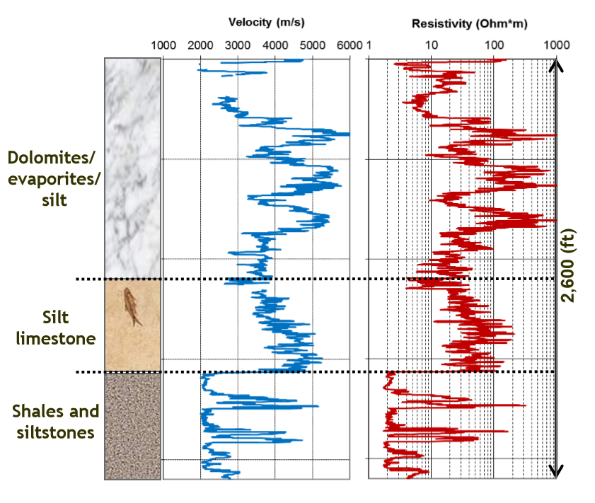

.. _wadi_sahba_properties:

Properties
==========

The diagnostic physical properties for this case history are electrical resistivity/conductivity and seismic velocity. Multiple well-logs have been collected within the Wadi Sahba region; however the raw data are not discussed here. Well-log physical property data from a single well is illustrated it :numref:`fig_wadi_sahba_properties`. As we can see, the sedimentary rocks which comprise the Wadi Sahba region display significant variations in both seismic velocity and electrical resistivity.

    Representative physical properties at Wadi Sahba.

