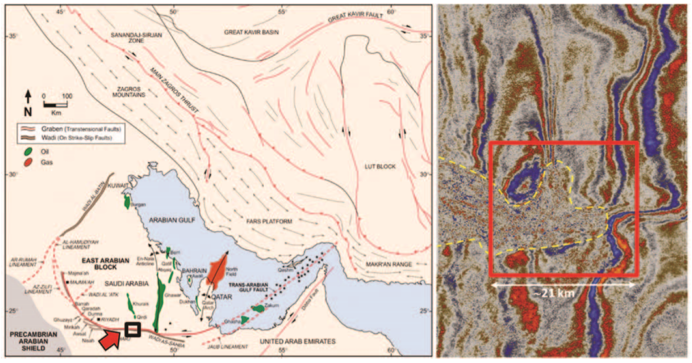

.. _wadi_sahba_setup:

Setup
=====

Motivation
----------

Oil and gas exploration in the Middle East has shifted from major structures (e.g., most supergiant fields) to stratigraphic traps and low-relief structures. These prospects can be a few kilometers long and present closures with an expression of a few tens of milliseconds (e.g., 20–30 ms) in the time domain or 30–40 m relief in the depth domain. Such features can be generated easily on a seismic time section by poorly corrected near-surface anomalies such as those introduced by karsts or collapse structures, dunes, and wadis (:numref:`fig_wadi_sahba_setup_seismic`). Accurate near-surface velocity modeling and corrections become the single most important step for correct seismic imaging to reduce exploration risk. Emphasis is placed on long-wavelength near-surface features that often cannot be resolved with conventional 3D seismic acquisition geometries that severely undersample the near surface. In addition to the low fold at shallow depths, production seismic also suffers from poor sampling in dune and farmed areas where vibrators typically cannot operate. Presence of scatterers and velocity inversions in the near surface add to the problem and often undermine the capability of conventional seismic data to effectively image shallow anomalies. Selected high-resolution non-seismic methods can complement seismic effectively in the characterization of the near surface by filling the gaps and enhancing sensitivity to geologic features that are not properly sampled by seismic methods (e.g., low-velocity features and velocity inversions). Examples are the high horizontal resolution of precision gravity methods to map voids or low-density materials (e.g., dunes), and the sensitivity of time/frequency electromagnetic methods to map resistivity variations, where velocity inversions are typically transitions from high- to low-resistivity formations (high velocity to low velocity).

.. figure:: images/SeismicSection.png
    :align: center
    :figwidth: 90%
    :name: fig_wadi_sahba_setup_seismic

    Examples of long wavelength distortions in land seismic data in Saudi Arabia after statics corrections, including (a) sand dune distortions, (b) karsting at around 500 m in depth, and (c) the effect of a deep wadi (example discussed in the present paper).

Considering Non-Seismic Methods
-------------------------------

The practical implementation of high-resolution non-seismic methods in the context of seismic exploration requires the following conditions: dense spatial sampling (comparable or superior to seismic), efficient and robust quantitative integration with seismic, speed of execution, and cost management (e.g., non-seismic methods have a complementary nature and must represent a fraction of the seismic total cost). Such requirements are typically met by airborne systems and, for the specific problem of near-surface investigation, by helicopter-borne systems. By combining low flying altitude and low cruising speed, these methods are able to provide the required spatial sampling, sensitivity to small anomalies, and accuracy of measurements needed for accurate near-surface characterization.

Airborne electromagnetic (AEM) systems are widely applied in mineral and groundwater exploration and are capable of acquiring several thousand kilometers of flying lines in a short time with exceptional spatial sampling. In the early 2000s, helicopter transient EM systems (HTEM) were introduced and have developed rapidly over the past 15 years (see Allard, 2007, for an overview of the available systems and their development history). Five years after the introduction of HTEM, advancements such as increased source moment and reduced system noise, along with their superior terrain contouring and lower cost, made these the most commonly flown AEM systems (Nabighian and Macnae, 2005). The introduction of dual-moment sources (S⊘rensen and Auken, 2004; Chen et al., 2013) has given HTEM systems the increased bandwidth to replace ground TEM investigations in many situations. The increased data density, uniform spatial sampling, and data consistency have reduced the need for ground follow-up (Taylor, 2005). The availability of reliable and accurate EM helicopter-borne methods opens the road to a new set of applications important for near-surface characterization.

Additional Challenges
---------------------

Having addressed the requirements of cost management and of dense and accurate measurements, the next challenge is provided by the establishment of robust processing and integration of multiphysics data. Quantitative, semiautomatic joint-inversion techniques (Colombo and De Stefano, 2007; Colombo et al., 2013) are needed, especially for 3D data sets, to enable a unified approach of seismic and non-seismic methods for near-surface analysis. Preprocessing of the non-seismic data should be fast and reliable. A fraction of the time needed by the seismic data processing should be used for the preprocessing and inversion of the non-seismic data, and, more importantly, the non-seismic results should be provided in a timely manner to be used as an additional tool for the near-surface velocity modeling at the beginning of the seismic processing sequence. Joint-inversion algorithms must be robust and semi-automatic to allow execution even by geophysicists with limited experience with non-seismic methods.

To follow, we describe the acquisition of helicopter-borne TEM over a geologically complex wadi area in central Saudi Arabia characterized by high noise in the seismic data where joint inversion of TEM and seismic first-break (FB) traveltimes was performed to aid the velocity modeling of the near surface. The example represents the realization of the aforementioned conditions to provide effective multiphysics near-surface solutions for seismic imaging.

Survey Area and Geological Background
-------------------------------------

The area under investigation is located along a major structure-controlled elongated depression (wadi) known as wadi Sahba. The system is part of the southern extension of the Central Arabian Graben System delimiting the East Arabian Block to the west (:numref:`fig_wadi_sahba_setup_map`). The seismic data quality in the wadi is extremely poor due to strong scattering effects probably caused by patterns of flower faults reaching the surface (Weijermars, 1998). Other complications to seismic imaging derive from the strong velocity contrasts between soft sediments present in the wadi and carbonate formations outcropping on the surrounding plateau. The presence of farmland, where vibrators cannot operate, also produces uneven sampling and acquisition gaps inside the wadi. The wadi area itself is of great relevance from an exploration point of view as it lies at the intersection of three major reservoirs in the Mesozoic and Paleozoic sections, the extents of which are obscured by the overlying wadi structure.

    Structural map from Weijermars (1998) showing the location of the study area (left) and a snapshot of existing seismic (time slice at 1 s) with the outline of the wadi (dashed line) and of the 3D study detailed in the present paper (red solid line).

