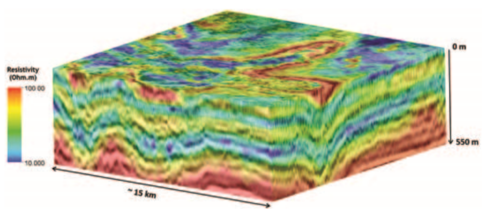

.. _wadi_sahba_synthesis:

Synthesis
=========

Wadi Sahba is considered one of the most challenging areas for seismic imaging in Saudi Arabia. A combination of effects, such as scattering and attenuation, severely degrade the seismic quality. Complex near-surface velocity distributions related to shallow fault structures add further challenges for seismic imaging. In this context, accurate estimation of the near-surface complexities and deep imaging challenges have been addressed by acquisition and processing of HTEM data and by development of a robust joint-inversion workflow with seismic data. The derived high-resolution velocity model was used to correct for the near surface and to enhance seismic imaging in time domain. The joint-inversion velocity model was also used for prestack depth imaging, which provided enhanced continuity of deeper structures below the wadi.

A close examination of the depth-migrated seismic in the section close to the surface is shown in :numref:`fig_wadi_sahba_seismic_cube` where the HTEM resistivity model is co-rendered with the seismic cube image. Despite the lack of fold in the seismic data and the presence of noise, it is possible to appreciate the fidelity by which the HTEM resistivity model is matching the fine details provided by the depth-domain seismic volume. Faults, horst and graben-like structures, and undisturbed horizontal layering are all well imaged by the resistivity distribution from HTEM to match the structures imaged by seismic. The capability of HTEM methods to image conductors (most likely related to velocity inversions) shall be further exploited in future development of joint-inversion techniques with seismic, perhaps through exploiting seismic waveforms, to provide robust and detailed images of an extended section of the near surface to be used for seismic imaging processes in time and depth domains.

    Seismic cube from 3D prestack depth migration with co-rendered
resistivity from HTEM inversion. The resistivity distribution provides the fine
description of the near-surface structures and layering as inferred from the
depth-domain seismic images.

Additional Comments
-------------------

The techniques and procedures described here for the imaging of wadi Sahba contain all the elements to streamline the application of multi-physics in challenging seismic exploration areas. The requirements of dense spatial sampling, efficient and robust quantitative integration with seismic, speed of execution, and cost management are all met by helicopter-borne EM techniques and by robust joint-inversion workflows.

Near-surface velocity modeling is very challenging in arid environments typical of the Middle East. Recent exploration trends, placing emphasis on low-relief structures and stratigraphic traps, call for novel and robust solutions for the near-surface problem. Production 3D seismic utilizing sparse cross-spread acquisition geometries produce severe undersampling of the problematic near surface. Propagation of seismic waves through the near surface is also affected by additional problems related to scattering, attenuation, poor signal penetration, and velocity inversions, which produce noise and problematic analysis of first-arrival seismic phases. For these reasons, velocity-analysis workflows often are unable to resolve near-surface velocity anomalies, causing severe distortions in the seismic images. Helicopter-borne EM methods (time and frequency domain) are ideally suited to provide accurate and cost-effective near-surface characterization based on the resistivity parameter distribution. Robust joint-inversion approaches provide the tools for multiphysics data integration to obtain high-resolution velocity models of the near surface. Achievement of this goal is subject to the existence of robust and semiautomatic quantitative integration schemes such as the described joint-inversion method. The rapid evolution of airborne EM methods and of efficient quantitative multiphysics integration approaches are likely to provide the oil and gas exploration industry with a completely new range of competitive solutions to solve the near-surface problem in a variety of geologic environments.

