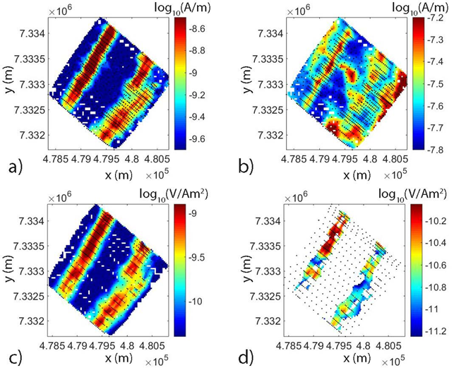

.. _westplains_data:

Data
====

Observed data from 2003 VTEM and 2005 RESOLVE surveys are shown below in :numref:`AEMdata_westplains` with down-sampled data locations shown as black dots. The images show imaginary z-component H-field measurements from the lowest frequency (385 Hz) and highest frequency (115,000 Hz) as well as z-component dB/dt data from the earliest (150 us) and latest time channel (3180 us). Note that time-domain measurements below :math:`5 \times 10^{-12}` V/Am :math:`\! ^2` are removed for noise concern purposes. The data plots show that both surveys do an excellent job detecting the three main conductive units, however the RESOLVE survey does a better job at detecting near surface features such as clay layers in shallow lakes, which are more conductive than the background. The 2005 RESOLVE system utilizes a much higher frequency compared to the equivalent earliest time channel in the 2003 VTEM system and as a result, the frequency domain data has a higher sensitivity to near-surface objects compared to the time-domain measurements. 

    West Plains observed AEM data.  a) Imaginary z-component H-field at 385 Hz. b) Imaginary z-component H-field at 115000 Hz. c) z-component dB/dt at 150 :math:`\mu s`. d) z-component dB/dt at 3180 :math:`\mu s`.

