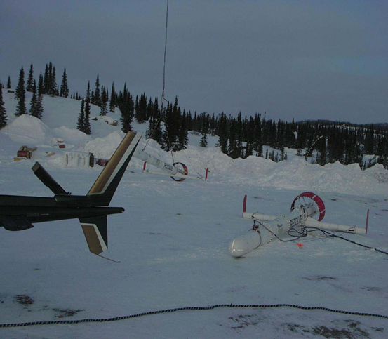

.. _westplains_index:

West Plains
===========

**A review of time and frequency domain airborne electromagnetic data sets over the West Plains orogenic gold region of the Committee Bay Greenstone Belt.**

- **Authors**: :ref:`mikemcm`.
- **Editor**: :ref:`dccowan`

.. topic :: Prelude

    This case history describes the inversion of VTEM and RESOLVE airborne datasets to characterize an orogenic gold deposit within the Committee Bay Greenstone Belt, Nunavut, Canada. VTEM data were collected in 2003 while RESOLVE data were collected in 2005.

**Special Thanks**

Thanks to the `Society of Exploration Geophysicists <http://seg.org>`__ for permission to reproduce figures and adapt text from the source material. The material found here has been adapted primarily from the paper `"3D parametric hybrid inversion of time-domain airborne electromagnetic data" <https://doi.org/10.1190/geo2015-0141.1>`__ (:cite:`McMillan2014`).

**Abstract**

    Description.

West Plains is an active orogenic gold exploration project, located in the South-West portion of the Archean Committee Bay greenstone belt, Nunavut Canada, owned by Auryn Resources Inc. In 2003 and 2005, two overlapping airborne electromagnetic (AEM) surveys were acquired with a time-domain VTEM and a frequency-domain RESOLVE system. The economic gold mineralization is hosted in conductive komatiite units within a resistive background, a scenario well suited for AEM data. The surveys were beneficial for garnering a better understanding of the 3D geometries of the target conductors and highlighted a scenario where a parametric inversion could provide additional insights. Overall the inferences gained from the AEM data helped provide new interpretations of the target region and will be helpful to guide future drill programs in the area.

**Contents**

.. toctree::
    :maxdepth: 1

    setup
    properties
    survey
    data
    processing
    interpretation_synthesis

